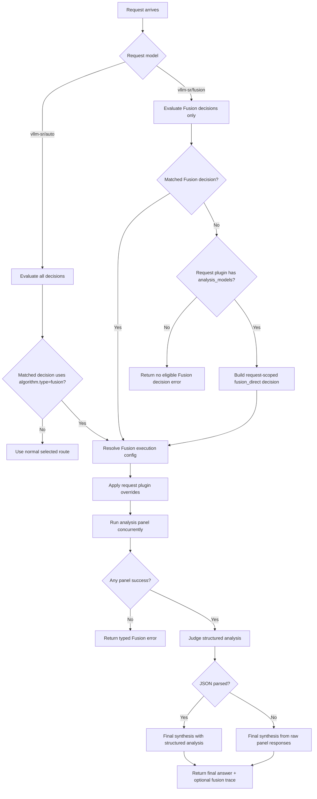

# Fusion

## Overview

`fusion` is a **looper** algorithm for multi-model deliberation. It fans a prompt out to an analysis panel, asks a judge model for structured analysis, and then asks the judge/calling model to produce the final answer.

It aligns to `config/algorithm/looper/fusion.yaml`.

The same runtime also supports a direct Fusion model slug through `global.integrations.looper.fusion.model_names`. The built-in default is `vllm-sr/fusion`; add `openrouter/fusion` there only when you intentionally want an OpenRouter-compatible alias. Direct Fusion is still signal-driven: vLLM-SR evaluates the request against Fusion-capable decisions and then executes the matched decision's judge and panel policy.

## Key Advantages

- Runs analysis models concurrently instead of choosing only one model.
- Produces structured judge analysis before final synthesis.
- Keeps Fusion policy inside vLLM-SR decisions: `vllm-sr/auto` can choose any route, while `vllm-sr/fusion` intelligently chooses among Fusion routes only.
- Lets clients override the judge and analysis panel per request with `plugins[].id = fusion`.
- Degrades on partial panel failures while preserving failed model metadata.

## Algorithm Principle

Fusion executes a three-stage flow:

1. **Panel**: dispatch the original request to the configured analysis models in parallel.
2. **Judge analysis**: ask the judge model for structured JSON covering consensus, contradictions, partial coverage, unique insights, and blind spots.
3. **Final synthesis**: ask the judge/calling model to write the user-facing answer using the panel responses and structured analysis.

## Execution Flow



## What Problem Does It Solve?

Some prompts benefit from multiple independent attempts and a judge pass rather than a single route decision. `fusion` makes that orchestration a router-owned policy, so clients can use it through the same chat completions endpoint. Unlike a fixed provider-side Fusion endpoint, `vllm-sr/fusion` first uses vLLM-SR signals and decision priority to pick the right Fusion route for the request.

## When to Use

- You want a panel of models to inspect the same prompt.
- Contradictions or blind spots matter more than lowest latency.
- A route should return one final answer but retain panel evidence for debugging.
- Clients need an OpenRouter-style request override for panel composition.

## Known Limitations

- Fusion costs multiple model calls per request.
- Streaming is emitted after panel and judge phases complete.
- The first implementation does not include OpenRouter web search/fetch parity.
- Final quality depends on the configured judge/calling model.

## Configuration

Decision-level Fusion:

```yaml
algorithm:
  type: fusion
  fusion:
    model: qwen3-32b
    analysis_models:
      - qwen3-8b
      - qwen3-32b
    max_concurrent: 2
    max_completion_tokens: 512
    temperature: 0.2
    include_analysis: true
    include_intermediate_responses: true
    on_error: skip
    judge_prompt_version: fusion-v1
```

Automatic routing aliases:

```yaml
global:
  router:
    auto_model_names:
      - vllm-sr/auto
      - auto
      - MoM
```

`vllm-sr/auto` evaluates all decisions. If the matched decision uses `algorithm.type=fusion`, the request enters Fusion; otherwise it follows the matched non-Fusion route.

Direct Fusion slug registration:

```yaml
global:
  integrations:
    looper:
      endpoint: http://localhost:8899/v1/chat/completions
      fusion:
        model_names:
          - vllm-sr/fusion
```

`global.integrations.looper.fusion` only registers direct request model names. It does not own route policy, a default route, judge selection, panel selection, concurrency, templates, or error handling.

The judge model, analysis panel, concurrency, templates, and error policy belong under `routing.decisions[].algorithm.fusion`. Direct slug calls evaluate only Fusion-capable decisions, so `vllm-sr/fusion` cannot silently fall back to a normal single-model route. Request-level `plugins[].id = fusion` can still override the decision panel for one call; if no Fusion decision matched, a plugin override with `analysis_models` can provide a request-only panel.

To expose an OpenRouter-compatible alias, opt in explicitly:

```yaml
global:
  integrations:
    looper:
      fusion:
        model_names:
          - vllm-sr/fusion
          - openrouter/fusion
```

Request-level override:

```json
{
  "model": "vllm-sr/fusion",
  "messages": [{"role": "user", "content": "..."}],
  "plugins": [{
    "id": "fusion",
    "model": "qwen3-32b",
    "analysis_models": ["qwen3-8b", "qwen3-32b"]
  }]
}
```

### Parameters

| Parameter | Type | Default | Description |
|-----------|------|---------|-------------|
| `model_names` | list[string] | `["vllm-sr/fusion"]` | Direct request model slugs that trigger Fusion execution |
| `model` | string | first analysis model | Judge/calling model used for analysis and final synthesis |
| `analysis_models` | list[string] | `modelRefs` | Panel models for parallel analysis |
| `max_concurrent` | int | panel size | Maximum concurrent panel calls |
| `max_completion_tokens` | int | request default | Max completion tokens applied to Fusion subrequests |
| `temperature` | float | request default | Temperature applied to Fusion subrequests |
| `include_analysis` | bool | `true` | Include structured judge analysis in the response trace |
| `include_intermediate_responses` | bool | `true` | Include raw panel responses in the response trace |
| `on_error` | string | `skip` | `skip` partial panel failures or `fail` on the first panel error |
| `analysis_template` | string | built-in | Custom judge analysis prompt with `{{original}}` and `{{responses}}` |
| `synthesis_template` | string | built-in | Custom final prompt with `{{original}}`, `{{responses}}`, and `{{analysis}}` |
| `judge_prompt_version` | string | `fusion-v1` | Version marker included in Fusion response trace |
| `grounding` | object | disabled | Optional grounding-aware synthesis (see below) |

## Grounding-Aware Synthesis

By default the judge reads raw panel text with no grounding oracle. Grounding-aware synthesis scores each panel response for **faithfulness** *before* the judge runs, then uses those scores to guide synthesis toward the better-grounded responses. It makes **no extra LLM calls** — it uses local encoder models (the hallucination/groundedness detector and an NLI entailment model).

Reference selection (what each answer is scored against):

- `context` — score answers against provided RAG/tool context via the detector (strongest, but only when the request carries context such as system/tool messages).
- `panel` — score answers against each other via cross-model NLI; the panel acts as its own mutual reference (no external dependency, works on any query).
- `hybrid` (default) — use `context` when the request carries it, otherwise `panel`.

Policy (how the scores are used):

- `weight` (default) — keep every response and instruct the judge to weight each panel answer by its score, while explicitly protecting a correct lone dissenter.
- `annotate` — keep every response and pass the scores to the judge as notes, without a weighting instruction.
- `filter` — hard-drop responses scoring below `min_score` (always keeping `min_keep`); only this policy uses `min_score`/`min_keep`.

> Grounding measures faithfulness/consistency, not truth. With no authoritative source it can down-weight the least-supported responses, not certify correctness. **Hard-dropping** the least mutually-consistent response (the `filter` policy) measurably *hurts* on contested factual questions — three models can be confidently wrong together while the lone dissenter is right — so the default is `weight`. See `bench/grounded_fusion/FINDINGS.md` for the evaluation behind this default.

Requires the hallucination detector (and, for the `panel`/cross-model path, the NLI model) to be configured under `global` hallucination mitigation. If the backends are unavailable, `on_error: skip` falls back to plain Fusion.

```yaml
algorithm:
  type: fusion
  fusion:
    model: qwen3-32b
    analysis_models: [qwen3-8b, qwen3-32b]
    grounding:
      enabled: true
      reference: hybrid          # hybrid | context | panel
      policy: weight             # weight | annotate | filter
      min_score: 0.0             # filter policy only: drop below this (0-1)
      min_keep: 1                # filter policy only: keep at least this many
      nli_contradiction_penalty: 1.0
      on_error: skip             # skip (fall back to plain fusion) | fail
      early_exit_enabled: false  # panel mode only: skip analysis when panel is unanimous
      early_exit_min_consistency: 0.0  # every response must score >= this (0-1)
```

When enabled, the Fusion response `trace.grounding` records the reference mode, the `policy`, and per-response `score`, `flagged_spans`, and whether each was `dropped` (only under the `filter` policy).

### Grounding parameters

| Parameter | Type | Default | Description |
|-----------|------|---------|-------------|
| `enabled` | bool | `false` | Enable grounding-aware synthesis |
| `reference` | string | `hybrid` | `hybrid`, `context`, or `panel` |
| `policy` | string | `weight` | `weight` (soft-weight, keep all), `annotate` (notes, keep all), or `filter` (hard-drop) |
| `min_score` | float | `0.0` | `filter` policy only: drop responses scoring below this (0–1) |
| `min_keep` | int | `1` | `filter` policy only: keep at least this many top-scoring responses |
| `nli_contradiction_penalty` | float | `1.0` | Weight of a peer contradiction in the `panel` reference |
| `on_error` | string | `skip` | `skip` (fall back to plain Fusion) or `fail` |
| `early_exit_enabled` | bool | `false` | Panel-agreement early-exit: skip the analysis judge call when the panel is unanimous |
| `early_exit_min_consistency` | float | `0.0` | Every panel response must score ≥ this (0–1) for early-exit; `panel` reference only |

### Panel-agreement early-exit

Fusion normally runs two judge calls — a structured *analysis* pass and a *synthesis* pass. When the panel already agrees, the analysis pass adds little. With `early_exit_enabled: true`, Fusion skips the analysis call and synthesizes directly **only when every panel response scores at or above `early_exit_min_consistency`** under `panel`-mode cross-model NLI. Because it requires unanimity, a single dissenter keeps the full two-pass pipeline — early-exit never trades away a minority view; it only saves a judge call on consensus queries. It applies to `panel` reference only (the mode that measures cross-model agreement). Executions that take this path are counted by the `vsr_fusion_early_exit_total` metric.

## Adaptive escalation

Fusion is expensive (N panel calls + analysis + synthesis). Adaptive escalation makes a fusion decision pay that cost **only for hard queries**: the full panel runs only when the request matched one of `hard_complexity_rules` (the existing binary complexity signal — no new classifier); otherwise the query is treated as easy and answered with a single judge-model call.

```yaml
algorithm:
  type: fusion
  fusion:
    model: qwen3-32b
    analysis_models: [qwen3-8b, qwen3-32b]
    escalation:
      enabled: true
      hard_complexity_rules: ["reasoning_complexity:hard"]
```

| Parameter | Type | Default | Description |
|-----------|------|---------|-------------|
| `enabled` | bool | `false` | Enable adaptive escalation |
| `hard_complexity_rules` | list | `[]` | Complexity rule labels (e.g. `reasoning_complexity:hard`) that mark a query as hard enough for the full panel; required when enabled |

Easy queries that skip the panel are counted by `vsr_fusion_escalation_bypass_total`. This complements decision-level routing: you can also route only hard traffic to a fusion decision with a `complexity` rule, but escalation lets a single fusion decision serve both cheaply.

### Observability

The Fusion looper exports Prometheus metrics on the router `/metrics` endpoint:

| Metric | Type | Labels | Description |
|--------|------|--------|-------------|
| `vsr_fusion_requests_total` | counter | `decision`, `status` | Fusion executions by outcome (`success`/`error`) |
| `vsr_fusion_request_duration_seconds` | histogram | `decision` | End-to-end fusion latency |
| `vsr_fusion_stage_duration_seconds` | histogram | `stage` | Per-stage latency (`panel`/`grounding`/`analysis`/`synthesis`) |
| `vsr_fusion_panel_models_total` | counter | `model`, `status` | Per panel-model outcome (`success`/`failed`) |
| `vsr_fusion_grounding_score` | histogram | `reference_mode`, `policy` | Distribution of per-response groundedness scores |
| `vsr_fusion_grounding_dropped_total` | counter | `policy` | Panel responses dropped by grounding |
| `vsr_fusion_early_exit_total` | counter | `decision` | Executions that took the panel-agreement early-exit |
| `vsr_fusion_escalation_bypass_total` | counter | `decision` | Executions that skipped the panel via adaptive escalation |
| `vsr_fusion_request_tokens_total` | counter | `decision`, `type` | Tokens consumed per fusion request (`prompt`/`completion`) |

### Streaming behavior (limitation)

When a client requests `stream: true`, Fusion still emits a valid SSE (`text/event-stream`) response, but it is **not token-by-token streamed**: the full panel → analysis → synthesis pipeline completes first, then the finished answer is chunked into SSE events. Time-to-first-token therefore equals the full pipeline latency. This is not specific to Fusion — every looper returns a buffered body because the router replies to the request path with a single Envoy ExtProc `ImmediateResponse`, and Fusion synthesizes its own answer (there is no upstream stream to forward). Use [adaptive escalation](#adaptive-escalation) and [early-exit](#panel-agreement-early-exit) to reduce that latency on easy/consensus queries. True incremental streaming would require an architectural change to the looper↔ExtProc response contract and is tracked as future work.
