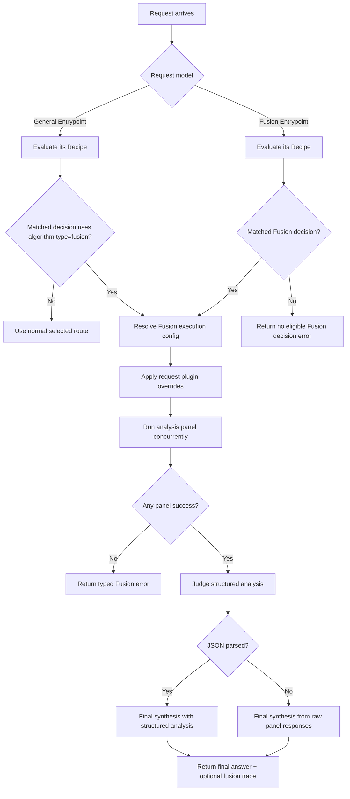

# Fusion

## Overview

`fusion` asks several models to analyze a request and a judge model to
synthesize one final answer.

Expose Fusion through an Entrypoint alias such as `vllm-sr/fusion`. The
Entrypoint assigns the panel to each Fusion decision; the first Model in the
highest-priority tier performs judge and final-synthesis work.

## Key Advantages

- Runs analysis models concurrently instead of choosing only one model.
- Produces structured judge analysis before final synthesis.
- Keeps Fusion policy inside vLLM-SR decisions: `vllm-sr/auto` can choose any route, while `vllm-sr/fusion` intelligently chooses among Fusion routes only.
- Lets clients override trace flags and grounding policy per request with
  `plugins[].id = fusion`, without changing the authorized Model set.
- Degrades on partial panel failures while preserving failed model metadata.

## Algorithm Principle

Fusion executes a three-stage flow:

1. **Panel**: dispatch the original request to the configured analysis models in parallel.
2. **Judge analysis**: ask the judge model for structured JSON covering consensus, contradictions, partial coverage, unique insights, and blind spots.
3. **Final synthesis**: ask the judge/calling model to write the user-facing answer using the panel responses and structured analysis.

## Execution Flow


```mermaid
flowchart TD
    A[Request arrives] --> B{Request model}
    B -- General Entrypoint --> C[Evaluate its Recipe]
    B -- Fusion Entrypoint --> D[Evaluate its Recipe]
    C --> E{Matched decision uses algorithm.type=fusion?}
    D --> F{Matched Fusion decision?}
    E -- No --> G[Use normal selected route]
    E -- Yes --> H[Resolve Fusion execution config]
    F -- Yes --> H
    F -- No --> J[Return no eligible Fusion decision error]
    H --> L[Apply request plugin overrides]
    L --> M[Run analysis panel concurrently]
    M --> N{Any panel success?}
    N -- No --> O[Return typed Fusion error]
    N -- Yes --> P[Judge structured analysis]
    P --> Q{JSON parsed?}
    Q -- Yes --> R[Final synthesis with structured analysis]
    Q -- No --> S[Final synthesis from raw panel responses]
    R --> T[Return final answer + optional fusion trace]
    S --> T
```

## What Problem Does It Solve?

Some prompts benefit from multiple independent attempts and a judge pass rather than a single route decision. `fusion` keeps that orchestration in Router policy, so clients can use it through the same chat completions endpoint. Unlike a fixed provider-side Fusion endpoint, `vllm-sr/fusion` first uses vLLM-SR signals and decision priority to pick the right Fusion route for the request.

## When to Use

- You want a panel of models to inspect the same prompt.
- Contradictions or blind spots matter more than lowest latency.
- A route should return one final answer but retain panel evidence for debugging.
- Clients need an OpenRouter-style request override for panel composition.

## Known Limitations

- Fusion costs multiple model calls per request.
- Streaming is emitted after panel and judge phases complete.
- The current Fusion path does not include OpenRouter web search or fetch.
- Final quality depends on the configured judge/calling model.

## Configuration

Decision-level Fusion:

```yaml
routing:
  decisions:
    - name: deliberation
      description: Compare candidate answers and synthesize one response.
      priority: 100
      output_contract: Preserve any explicit output format exactly.
      algorithm:
        type: fusion
        fusion:
          max_concurrent: 2
          max_completion_tokens: 512
          round_timeout_seconds: 90
```

`output_contract` is decision-scoped prompt text. Use it for benchmark or
application format requirements that should apply across Fusion, Flow, and ReMoM
instead of hard-coding task-specific prompts into an algorithm.
Use `output_contract_spec` for typed router-executable normalization and
post-processing such as choice extraction, terminal-action JSON normalization,
or reference dereferencing. Extraction defaults to exact `content` matching;
use `extract.sources` or `extract.mode: json_object` only when the decision
explicitly permits a wider parser.

Minimal algorithm configuration:

```yaml
algorithm:
  type: fusion
  fusion:
    max_concurrent: 2
    max_completion_tokens: 512
    round_timeout_seconds: 90
    min_successful_responses: 1
    temperature: 0.2
    include_analysis: true
    include_intermediate_responses: true
    on_error: skip
    judge_prompt_version: fusion-v1
```

Entrypoint assignment:

```yaml
entrypoints:
  - model_names: [vllm-sr/fusion]
    recipe: deliberation
    assignments:
      deliberation:
        models:
          - model: local/judge
            priority: 0
          - model: local/panel
            priority: 0
```

The Recipe contains orchestration policy only. The Entrypoint is the sole
authority for the public alias and concrete Models. Request overrides cannot
add Models outside this assignment.

Request-level override:

```json
{
  "model": "vllm-sr/fusion",
  "messages": [{"role": "user", "content": "..."}],
  "plugins": [{
    "id": "fusion",
    "max_concurrent": 2,
    "max_completion_tokens": 1024,
    "round_timeout_seconds": 90,
    "min_successful_responses": 1,
    "include_analysis": true,
    "include_intermediate_responses": true,
    "grounding": {
      "enabled": true,
      "reference": "hybrid",
      "policy": "weight"
    }
  }]
}
```

### Parameters

| Parameter | Type | Default | Description |
|-----------|------|---------|-------------|
| `max_concurrent` | int | panel size | Maximum concurrent panel calls |
| `max_completion_tokens` | int | request default | Max completion tokens applied to Fusion subrequests |
| `round_timeout_seconds` | int | wait for all | Stop waiting for a panel round after this many seconds |
| `min_successful_responses` | int | panel size | Continue once this many panel responses succeed |
| `temperature` | float | request default | Temperature applied to Fusion subrequests |
| `include_analysis` | bool | `true` | Include structured judge analysis in the response trace |
| `include_intermediate_responses` | bool | `true` | Include raw panel responses in the response trace |
| `on_error` | string | `skip` | `skip` partial panel failures or `fail` on the first panel error |
| `analysis_template` | string | built-in | Custom judge analysis prompt with `{{original}}` and `{{responses}}` |
| `synthesis_template` | string | built-in | Custom final prompt with `{{original}}`, `{{responses}}`, and `{{analysis}}` |
| `judge_prompt_version` | string | `fusion-v1` | Version marker included in Fusion response trace |
| `grounding` | object | disabled | Optional grounding-aware synthesis (see below) |

Best practice:

- Keep the Entrypoint assignment stable and version it whenever panel
  membership, weights, or fallback order changes.
- Use Recipe settings for orchestration policy and request overrides only for
  bounded, non-authority-changing experiments.

## Grounding-Aware Synthesis

By default the judge reads raw panel text with no grounding oracle. Grounding-aware synthesis scores each panel response for **faithfulness** *before* the judge runs, then uses those scores to guide synthesis toward the better-grounded responses. It makes **no extra LLM calls** — it uses local encoder models (the hallucination/groundedness detector and an NLI entailment model).

Reference selection (what each answer is scored against):

- `context` — score answers against provided RAG/tool context via the detector (strongest, but only when the request carries context such as system/tool messages).
- `panel` — score answers against each other via cross-model NLI; the panel acts as its own mutual reference (no external dependency, works on any query).
- `hybrid` (default) — use `context` when the request carries it, otherwise `panel`.

Policy (how the scores are used):

- `weight` (default) — keep every response and instruct the judge to weight each panel answer by its score, while explicitly protecting a correct lone dissenter.
- `annotate` — keep every response and pass the scores to the judge as notes, without a weighting instruction.
- `filter` — hard-drop responses scoring below `min_score` (always keeping `min_keep`); only this policy uses `min_score`/`min_keep`.

> Grounding measures faithfulness/consistency, not truth. With no authoritative source it can down-weight the least-supported responses, not certify correctness. **Hard-dropping** the least mutually-consistent response (the `filter` policy) measurably *hurts* on contested factual questions — three models can be confidently wrong together while the lone dissenter is right — so the default is `weight`. See `bench/grounded_fusion/FINDINGS.md` for the evaluation behind this default.

Requires the hallucination detector (and, for the `panel`/cross-model path, the NLI model) to be configured under `global` hallucination mitigation. If the backends are unavailable, `on_error: skip` falls back to plain Fusion.

```yaml
algorithm:
  type: fusion
  fusion:
    grounding:
      enabled: true
      reference: hybrid          # hybrid | context | panel
      policy: weight             # weight | annotate | filter
      min_score: 0.0             # filter policy only: drop below this (0-1)
      min_keep: 1                # filter policy only: keep at least this many
      nli_contradiction_penalty: 1.0
      on_error: skip             # skip (fall back to plain fusion) | fail
```

When enabled, the Fusion response `trace.grounding` records the reference mode, the `policy`, and per-response `score`, `flagged_spans`, and whether each was `dropped` (only under the `filter` policy).

### Grounding parameters

| Parameter | Type | Default | Description |
|-----------|------|---------|-------------|
| `enabled` | bool | `false` | Enable grounding-aware synthesis |
| `reference` | string | `hybrid` | `hybrid`, `context`, or `panel` |
| `policy` | string | `weight` | `weight` (soft-weight, keep all), `annotate` (notes, keep all), or `filter` (hard-drop) |
| `min_score` | float | `0.0` | `filter` policy only: drop responses scoring below this (0–1) |
| `min_keep` | int | `1` | `filter` policy only: keep at least this many top-scoring responses |
| `nli_contradiction_penalty` | float | `1.0` | Weight of a peer contradiction in the `panel` reference |
| `on_error` | string | `skip` | `skip` (fall back to plain Fusion) or `fail` |

Panel responses and the original request are sent to the judge model. Treat all
panel and judge providers as one data boundary, and disable intermediate traces
when they would expose sensitive content. See a complete example:
[`config/fragments/algorithm/looper/fusion.yaml`](https://github.com/vllm-project/semantic-router/blob/main/config/fragments/algorithm/looper/fusion.yaml).
