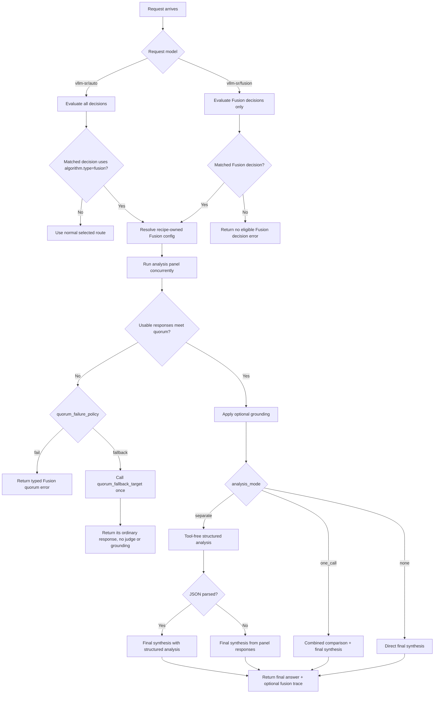

# Fusion

## Overview

`fusion` asks several models to answer a request and a judge model to synthesize
one final answer. The recipe-owned `analysis_mode` chooses whether the judge
uses a separate structured analysis call, combines analysis and synthesis in
one call, or synthesizes directly. The compatibility default is `separate`.

The same runtime also supports a direct Fusion model slug through `global.integrations.looper.fusion.model_names`. The built-in default is `vllm-sr/fusion`; add `openrouter/fusion` there only when you intentionally want an OpenRouter-compatible alias. Direct Fusion is still signal-driven: vLLM-SR evaluates the request against Fusion-capable decisions and then executes the matched decision's judge and panel policy.

## Key Advantages

- Runs analysis models concurrently instead of choosing only one model.
- Supports explicit `separate`, `one_call`, and `none` judge execution modes.
- Keeps Fusion policy inside vLLM-SR decisions: `vllm-sr/auto` can choose any route, while `vllm-sr/fusion` intelligently chooses among Fusion routes only.
- Keeps judge, panel, budget, prompt, trace, fallback, and grounding policy
  under recipe ownership.
- Continues after partial panel failures only when the remaining usable
  responses meet quorum, while preserving failed model metadata.

## Algorithm Principle

Fusion always executes the panel first, then follows the decision's explicit
analysis mode:

| Mode | Judge stages after the panel | Judge calls |
|------|------------------------------|-------------|
| `separate` | Tool-free structured JSON analysis, then tool-capable final synthesis | 2 |
| `one_call` | One tool-capable call that compares the panel, resolves contradictions, and returns the final answer | 1 |
| `none` | One tool-capable call that synthesizes directly from the panel without requesting a distinct analysis artifact | 1 |

`include_analysis` controls only whether an available structured analysis is
included in the Fusion trace. It never selects a mode or changes the number of
model calls.

A panel response is usable only when its assistant `content` or
`reasoning_content` is non-empty after trimming whitespace. Fusion checks
`min_successful_responses` against those usable responses before grounding,
judge analysis, or final synthesis. `on_error: skip` skips an individual failed
or unusable response; it does not allow synthesis below quorum.

When Router Replay is enabled, a below-quorum failure records the aggregate
panel token usage on the Replay record and stores the required count, usable
count, and ordered per-attempt model, state, and reported token usage under
`route_diagnostics.fusion_quorum`. These diagnostics do not store panel answer
content, reasoning, prompt data, raw response bodies, or error text.

## Execution Flow


```mermaid
flowchart TD
    A[Request arrives] --> B{Request model}
    B -- vllm-sr/auto --> C[Evaluate all decisions]
    B -- vllm-sr/fusion --> D[Evaluate Fusion decisions only]
    C --> E{Matched decision uses algorithm.type=fusion?}
    D --> F{Matched Fusion decision?}
    E -- No --> G[Use normal selected route]
    E -- Yes --> H[Resolve recipe-owned Fusion config]
    F -- Yes --> H
    F -- No --> J[Return no eligible Fusion decision error]
    H --> M[Run analysis panel concurrently]
    M --> N{Usable responses meet quorum?}
    N -- No --> O{quorum_failure_policy}
    O -- fail --> O1[Return typed Fusion quorum error]
    O -- fallback --> O2[Call quorum_fallback_target once]
    O2 --> O3[Return its ordinary response, no judge or grounding]
    N -- Yes --> P[Apply optional grounding]
    P --> Q{analysis_mode}
    Q -- separate --> R[Tool-free structured analysis]
    R --> S{JSON parsed?}
    S -- Yes --> T[Final synthesis with structured analysis]
    S -- No --> U[Final synthesis from panel responses]
    Q -- one_call --> V[Combined comparison + final synthesis]
    Q -- none --> W[Direct final synthesis]
    T --> X[Return final answer + optional fusion trace]
    U --> X
    V --> X
    W --> X
```

## What Problem Does It Solve?

Some prompts benefit from multiple independent attempts and a judge pass rather than a single route decision. `fusion` keeps that orchestration in Router policy, so clients can use it through the same chat completions endpoint. Unlike a fixed provider-side Fusion endpoint, `vllm-sr/fusion` first uses vLLM-SR signals and decision priority to pick the right Fusion route for the request.

## When to Use

- You want a panel of models to inspect the same prompt.
- Contradictions or blind spots matter more than lowest latency.
- A route should return one final answer but retain panel evidence for debugging.

## Known Limitations

- Fusion costs multiple model calls per request.
- Streaming is emitted after panel and judge phases complete.
- The current Fusion path does not include OpenRouter web search or fetch.
- Final quality depends on the configured judge/calling model.

## Configuration

Decision-level Fusion:

```yaml
routing:
  decisions:
    - name: deliberation
      description: Compare candidate answers and synthesize one response.
      priority: 100
      output_contract: Preserve any explicit output format exactly.
      modelRefs:
        - model: qwen3-32b
        - model: deepseek-worker
      algorithm:
        type: fusion
        fusion:
          model: qwen3-32b
          analysis_models:
            - qwen3-32b
            - deepseek-worker
          analysis_mode: separate
          analysis_overrides:
            - model: qwen3-32b
              temperature: 0.15
              max_completion_tokens: 512
            - model: deepseek-worker
              temperature: 0.2
              max_completion_tokens: 384
```

`output_contract` is decision-scoped prompt text. Use it for benchmark or
application format requirements that should apply across Fusion, Flow, and ReMoM
instead of hard-coding task-specific prompts into an algorithm.
Use `output_contract_spec` for typed router-executable normalization and
post-processing such as choice extraction, terminal-action JSON normalization,
or reference dereferencing. Extraction defaults to exact `content` matching;
use `extract.sources` or `extract.mode: json_object` only when the decision
explicitly permits a wider parser.

Minimal algorithm configuration:

```yaml
algorithm:
  type: fusion
  fusion:
    model: qwen3-32b
    analysis_models:
      - qwen3-8b
      - qwen3-32b
    analysis_mode: separate
    analysis_overrides:
      - model: qwen3-8b
        temperature: 0.2
        max_completion_tokens: 384
      - model: qwen3-32b
        temperature: 0.15
        max_completion_tokens: 512
    max_concurrent: 2
    max_completion_tokens: 512
    round_timeout_seconds: 90
    min_successful_responses: 1
    temperature: 0.2
    include_analysis: true
    include_intermediate_responses: true
    on_error: skip
    quorum_failure_policy: fail
    judge_prompt_version: fusion-v1
```

Automatic routing aliases:

```yaml
global:
  router:
    auto_model_names:
      - vllm-sr/auto
      - auto
      - MoM
```

`vllm-sr/auto` evaluates all decisions. If the matched decision uses `algorithm.type=fusion`, the request enters Fusion; otherwise it follows the matched non-Fusion route.

Direct Fusion slug registration:

```yaml
global:
  integrations:
    looper:
      endpoint: http://localhost:8899/v1/chat/completions
      max_response_bytes_mb: 32 # optional; caps a single upstream response body (default 32 MiB)
      fusion:
        model_names:
          - vllm-sr/fusion
```

`global.integrations.looper.fusion` only registers direct request model names. It does not own route policy, a default route, judge selection, panel selection, concurrency, templates, or error handling.

The judge model, analysis panel, analysis mode, sampling settings, concurrency,
token and time budgets, quorum, templates, prompt version, trace visibility,
error policy, and grounding policy belong under
`routing.decisions[].algorithm.fusion`. Direct slug calls evaluate only
Fusion-capable decisions, so `vllm-sr/fusion` cannot silently fall back to a
normal single-model route. The public HTTP path executes the selected recipe
policy and does not expose Fusion execution overrides through
`plugins[].id = fusion`.

To expose an OpenRouter-compatible alias, opt in explicitly:

```yaml
global:
  integrations:
    looper:
      fusion:
        model_names:
          - vllm-sr/fusion
          - openrouter/fusion
```

### Parameters

| Parameter | Type | Default | Description |
|-----------|------|---------|-------------|
| `model_names` | list[string] | `["vllm-sr/fusion"]` | Direct request model slugs that trigger Fusion decision matching |
| `model` | string | first analysis model | Recipe-owned judge/calling model used for analysis and final synthesis |
| `analysis_models` | list[string] | `modelRefs` | Recipe-owned panel models for parallel analysis |
| `analysis_mode` | string | `separate` | Recipe-owned judge execution: `separate`, `one_call`, or `none` |
| `minimum_candidates` | int | unset | Minimum distinct decision `modelRefs` required after Recipe materialization and context eligibility filtering |
| `analysis_overrides` | list[object] | none | Recipe-owned per-panel-model `temperature` and `max_completion_tokens`, keyed by `model` |
| `max_concurrent` | int | panel size | Recipe-owned maximum concurrent panel calls |
| `max_completion_tokens` | int | request default | Recipe-owned max completion tokens applied to Fusion subrequests |
| `round_timeout_seconds` | int | wait for all | Recipe-owned panel round timeout in seconds |
| `min_successful_responses` | int | panel size | Recipe-owned quorum of responses with non-empty assistant content or reasoning after trimming whitespace |
| `temperature` | float | request default | Recipe-owned temperature applied to Fusion subrequests |
| `include_analysis` | bool | `true` | Recipe-owned visibility for an available structured judge analysis; this does not control execution |
| `include_intermediate_responses` | bool | `true` | Recipe-owned visibility for raw panel responses |
| `on_error` | string | `skip` | Recipe-owned handling: `skip` individual failed or unusable panel responses while enforcing quorum, or `fail` on the first such response |
| `quorum_failure_policy` | string | `fail` | Panel-level behavior when usable responses fall below `min_successful_responses`: `fail` returns a typed quorum failure, `fallback` routes the request to `quorum_fallback_target`. Recipe-owned; requests cannot override it |
| `quorum_fallback_target` | string | none | Concrete provider model to route to when `quorum_failure_policy: fallback`. Required by, and only valid with, that policy |
| `analysis_template` | string | built-in | Recipe-owned separate-analysis prompt with `{{original}}` and `{{responses}}`; rejected outside `separate` |
| `synthesis_template` | string | built-in | Recipe-owned terminal prompt for every mode, with `{{original}}`, `{{responses}}`, and `{{analysis}}`; analysis is empty outside `separate` |
| `judge_prompt_version` | string | `fusion-v1` | Recipe-owned version marker included in Fusion response trace |
| `grounding` | object | disabled | Recipe-owned optional grounding-aware synthesis (see below) |

Best practice:

- Keep `analysis_mode: separate` until matched-budget evaluation supports a
  deliberate opt-in to a reduced-call mode.
- Keep `analysis_models` stable per decision, and use decision
  `analysis_overrides` for model-specific tuning.
- Put every Fusion execution-policy and trace-visibility change in the recipe.
- Keep `min_successful_responses` at or below the effective panel size. Invalid
  quorums are rejected; the Router does not lower them automatically.
- A partial panel continues only when its usable responses still satisfy
  `min_successful_responses`; otherwise Fusion applies its configured
  `quorum_failure_policy` without running grounding or any judge call.
- Keep the two error contracts distinct. `on_error` decides whether collection
  continues after *one* panel attempt fails; `quorum_failure_policy` decides what
  the *panel as a whole* does when it ends below quorum.
- **`on_error: fail` takes precedence.** It aborts the panel on the first failed
  or unusable attempt, before `quorum_failure_policy` is evaluated: no fallback
  call is made, no judge call is made, and no quorum disposition is recorded.
  The request fails with the underlying attempt error.
- With the default `on_error: skip`, a failed or unusable attempt is recorded as
  evidence while collection continues. If the panel then ends below quorum, the
  quorum policy decides that outcome. This is the branch a `fallback` target is
  for.
- An internal round timeout can also produce a below-quorum outcome that the
  quorum policy handles, under either `on_error` value. Caller cancellation and
  an exhausted caller deadline never dispatch a fallback: the request the answer
  would serve no longer exists, so spending another call on it is pointless.
- `quorum_failure_policy` selects what happens instead of that error. It defaults
  to `fail`, preserving the behavior above. Note that `min_successful_responses`
  itself defaults to the full panel size, so a Fusion decision that sets neither
  field requires every panel model to produce a usable response. Set
  `min_successful_responses` explicitly, or configure a `fallback` target, to
  tolerate partial panel failure.

### Below-quorum fallback

When the panel ends below `min_successful_responses`, `quorum_failure_policy`
decides the outcome:

```yaml
algorithm:
  type: fusion
  fusion:
    model: qwen3-32b
    analysis_models: [qwen3-8b, qwen3-32b, mistral-7b]
    min_successful_responses: 2
    quorum_failure_policy: fallback
    quorum_fallback_target: large-primary
```

`fallback` issues one recovery call to `quorum_fallback_target` and returns that
answer instead of synthesizing from an under-strength panel. The judge and
grounding stages are skipped: there is no panel to deliberate over.

The target is validated when the configuration loads. It must be declared in
`routing.modelCards`, use an OpenAI-compatible API format, be chat-capable text
modality, have a provider backend, and not be one of the decision's own
`analysis_models`. It must also be a concrete provider model: `vllm-sr/auto`,
an entrypoint name, or a Fusion, Flow, or ReMoM slug is rejected, because
falling back into a composite path would re-enter the same panel.

The capability check is fail-closed. When the effective panel declares
capabilities, the target must declare its own and cover every one of them, so a
fallback cannot silently drop a capability the panel was chosen for. A target
that declares nothing is rejected rather than assumed capable: absent metadata
does not establish compatibility, and accepting it would let any target pass
validation by omitting its declaration.

When the panel declares no capabilities there is no requirement to meet, so a
target declaring none is accepted. The rule constrains what the panel needs, not
metadata completeness in general.

At request time the fallback reuses the standard stage gate, so it is refused
when the request no longer fits the target's context window.

A successfully recovered quorum failure returns the fallback target's ordinary
protocol response. The caller does not receive a new response field: the trace
extension is omitted, because the fallback bypasses the judge and there is no
deliberation to report. The evidence is operator-facing and reaches Router
Replay, metrics, and structured logs instead.

When Router Replay is enabled for the matched decision, the bounded outcome is
recorded there with the required quorum, usable count, per-attempt failure
classes, the selected policy, the fallback target, and a terminal disposition.
Metrics and the structured log events are emitted regardless. Two log events
carry the outcome, one per layer:

| Event | Emitted when |
| --- | --- |
| `fusion_panel_quorum_failed` | The algorithm decided what to do with the below-quorum panel. Diagnostic only; it carries no metric |
| `fusion_quorum_terminal_outcome` | The response boundary settled the outcome. This is where every quorum metric is emitted |

| Disposition | Meaning |
| --- | --- |
| `quorum_failed` | Policy was `fail`; a typed quorum error was returned |
| `fallback_served` | Fallback answered and protocol encoding succeeded, so the response was returned to Envoy. The Router sees no delivery acknowledgement, so this does not assert what the client received |
| `fallback_failed` | Fallback was attempted and failed |
| `fallback_response_failed` | Fallback answered but its response could not be built |
| `response_encode_failed` | The response was built but protocol translation rejected it, so an error was returned instead |
| `budget_exhausted` | Fallback did not fit the target's context window |
| `cancelled` | The caller cancelled or timed out; no fallback was attempted |

Exactly one disposition is recorded per below-quorum panel, and one layer
records it. The algorithm decides which disposition applies, but the response
boundary is the only place a quorum sample is emitted, because it is the only
layer that knows whether protocol encoding succeeded. A fallback that answers
and then fails to encode is therefore recorded as `response_encode_failed`
rather than as a success. `fallback_ready` is the internal handoff state
carrying an answered fallback to that boundary, and never appears as a
disposition in metrics or Replay.

Accounting includes every panel attempt that was paid for plus the fallback
call, each exactly once, including when the fallback itself fails.

Each below-quorum panel emits one bounded set of metrics, so the full outcome is
alertable without log parsing:

| Metric | Labels | Records |
| --- | --- | --- |
| `llm_fusion_quorum_failure_total` | `decision`, `policy`, `disposition` | one sample per below-quorum panel |
| `llm_fusion_quorum_fallback_total` | `decision`, `target`, `disposition` | fallback routing outcomes |
| `llm_fusion_quorum_required_responses` | `decision` | the quorum that was required |
| `llm_fusion_quorum_usable_responses` | `decision` | how many usable responses arrived |
| `llm_fusion_panel_attempt_total` | `decision`, `state` | per-attempt failure classes |

All label values are closed enumerations or configuration-derived names, so
cardinality is bounded by the recipe rather than by traffic.

Because a below-quorum panel is a recipe-owned quality boundary, these fields
are not part of the request-level `plugins[].id = fusion` surface. A client
cannot select the policy or redirect the fallback target, and cannot restate
`min_successful_responses` to make the panel easier to satisfy: a Fusion recipe
owns every execution control, leaving requests only the trace-visibility
choices.

The fallback answers the client directly, so unlike a panel member it keeps the
request's tool contract: tools stay enabled and a tool-only reply is a valid
fallback answer.

## Mode Contracts

The built-in prompts and stage boundaries are deliberately distinct:

- `separate` asks for compact structured JSON without tools. An analysis
  transport failure is logged and final synthesis continues from the panel. A
  parse failure can appear as raw `parse_failed` trace evidence when
  `include_analysis` is enabled. Final synthesis remains terminal and can use
  request tools.
- `one_call` makes no structured-analysis artifact. Its single terminal prompt
  asks the judge to compare the panel, resolve contradictions, and synthesize
  the client answer in one call. A failure is terminal.
- `none` makes no structured-analysis artifact. Its single terminal prompt
  asks the judge to synthesize directly from the panel without requesting a
  separate or combined analysis. A failure is terminal.

For every mode, `synthesis_template` replaces the complete built-in terminal
prompt. `{{analysis}}` renders as an empty string in `one_call` and `none`.
Config validation rejects a non-empty `analysis_template` in those modes rather
than silently ignoring it.

Fusion usage aggregates the full panel cost and every successful judge
response. Reported iterations are the configured panel attempts plus two judge
calls for `separate`, or plus one judge call for `one_call` and `none`.

The effective `analysis_mode` is recorded in Fusion's internal trace carried by
`looper.Response.IntermediateResponses`. A mode value alone does not add a
top-level `fusion` member to the public response. The public trace envelope
keeps its existing predicate: it is emitted only when analysis or intermediate
responses are enabled, a panel model failed, or grounding evidence exists.
Public mode-trace transport remains deferred to
[issue #3378](https://github.com/vllm-project/semantic-router/issues/3378).

## Grounding-Aware Synthesis

By default the judge reads raw panel text with no grounding oracle. Grounding-aware synthesis scores each panel response for **faithfulness** *before* the judge runs, then uses those scores to guide synthesis toward the better-grounded responses. It makes **no extra LLM calls** — it uses local encoder models (the hallucination/groundedness detector and an NLI entailment model).

Reference selection (what each answer is scored against):

- `context` — score answers against provided RAG/tool context via the detector (strongest, but only when the request carries context such as system/tool messages).
- `panel` — score answers against each other via cross-model NLI; the panel acts as its own mutual reference (no external dependency, works on any query).
- `hybrid` (default) — use `context` when the request carries it, otherwise `panel`.

Policy (how the scores are used):

- `weight` (default) — keep every response and instruct the judge to weight each panel answer by its score, while explicitly protecting a correct lone dissenter.
- `annotate` — keep every response and pass the scores to the judge as notes, without a weighting instruction.
- `filter` — hard-drop responses scoring below `min_score` (always keeping `min_keep`); only this policy uses `min_score`/`min_keep`.

The usable-response quorum is checked on the original panel before grounding.
If the `filter` policy later removes responses, Fusion does not run a second
quorum check on the reduced judge input.

> Grounding measures faithfulness/consistency, not truth. With no authoritative source it can down-weight the least-supported responses, not certify correctness. **Hard-dropping** the least mutually-consistent response (the `filter` policy) measurably *hurts* on contested factual questions — three models can be confidently wrong together while the lone dissenter is right — so the default is `weight`. See `bench/grounded_fusion/FINDINGS.md` for the evaluation behind this default.

Requires the hallucination detector (and, for the `panel`/cross-model path, the NLI model) to be configured under `global` hallucination mitigation. If the backends are unavailable, `on_error: skip` falls back to plain Fusion.

```yaml
algorithm:
  type: fusion
  fusion:
    model: qwen3-32b
    analysis_models: [qwen3-8b, qwen3-32b]
    grounding:
      enabled: true
      reference: hybrid          # hybrid | context | panel
      policy: weight             # weight | annotate | filter
      min_score: 0.0             # filter policy only: drop below this (0-1)
      min_keep: 1                # filter policy only: keep at least this many
      nli_contradiction_penalty: 1.0
      on_error: skip             # skip (fall back to plain fusion) | fail
```

When enabled, the Fusion response `trace.grounding` records the reference mode, the `policy`, and per-response `score`, `flagged_spans`, and whether each was `dropped` (only under the `filter` policy).

### Grounding parameters

| Parameter | Type | Default | Description |
|-----------|------|---------|-------------|
| `enabled` | bool | `false` | Enable grounding-aware synthesis |
| `reference` | string | `hybrid` | `hybrid`, `context`, or `panel` |
| `policy` | string | `weight` | `weight` (soft-weight, keep all), `annotate` (notes, keep all), or `filter` (hard-drop) |
| `min_score` | float | `0.0` | `filter` policy only: drop responses scoring below this (0–1) |
| `min_keep` | int | `1` | `filter` policy only: keep at least this many top-scoring responses |
| `nli_contradiction_penalty` | float | `1.0` | Weight of a peer contradiction in the `panel` reference |
| `on_error` | string | `skip` | `skip` (fall back to plain Fusion) or `fail` |

Panel responses and the original request are sent to the judge model. Treat all
panel and judge providers as one data boundary, and disable intermediate traces
when they would expose sensitive content. See a complete example:
[`config/fragments/algorithm/looper/fusion.yaml`](https://github.com/vllm-project/semantic-router/blob/main/config/fragments/algorithm/looper/fusion.yaml).
