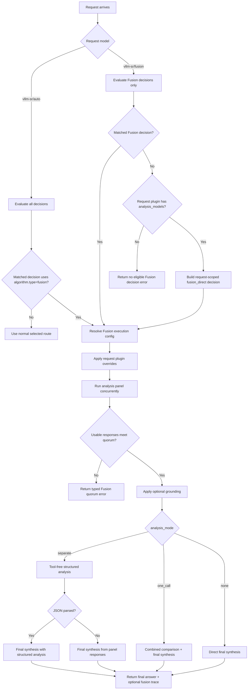

# Fusion

## Overview

`fusion` asks several models to answer a request and a judge model to synthesize
one final answer. The recipe-owned `analysis_mode` chooses whether the judge
uses a separate structured analysis call, combines analysis and synthesis in
one call, or synthesizes directly. The compatibility default is `separate`.

The same runtime also supports a direct Fusion model slug through `global.integrations.looper.fusion.model_names`. The built-in default is `vllm-sr/fusion`; add `openrouter/fusion` there only when you intentionally want an OpenRouter-compatible alias. Direct Fusion is still signal-driven: vLLM-SR evaluates the request against Fusion-capable decisions and then executes the matched decision's judge and panel policy.

## Key Advantages

- Runs analysis models concurrently instead of choosing only one model.
- Supports explicit `separate`, `one_call`, and `none` judge execution modes.
- Keeps Fusion policy inside vLLM-SR decisions: `vllm-sr/auto` can choose any route, while `vllm-sr/fusion` intelligently chooses among Fusion routes only.
- Lets clients override the judge, analysis panel, templates, trace flags, and
  grounding policy per request with `plugins[].id = fusion`, while keeping
  `analysis_mode` under recipe ownership.
- Continues after partial panel failures only when the remaining usable
  responses meet quorum, while preserving failed model metadata.

## Algorithm Principle

Fusion always executes the panel first, then follows the decision's explicit
analysis mode:

| Mode | Judge stages after the panel | Judge calls |
|------|------------------------------|-------------|
| `separate` | Tool-free structured JSON analysis, then tool-capable final synthesis | 2 |
| `one_call` | One tool-capable call that compares the panel, resolves contradictions, and returns the final answer | 1 |
| `none` | One tool-capable call that synthesizes directly from the panel without requesting a distinct analysis artifact | 1 |

`include_analysis` controls only whether an available structured analysis is
included in the Fusion trace. It never selects a mode or changes the number of
model calls.

A panel response is usable only when its assistant `content` or
`reasoning_content` is non-empty after trimming whitespace. Fusion checks
`min_successful_responses` against those usable responses before grounding,
judge analysis, or final synthesis. `on_error: skip` skips an individual failed
or unusable response; it does not allow synthesis below quorum.

When Router Replay is enabled, a below-quorum failure records the aggregate
panel token usage on the Replay record and stores the required count, usable
count, and ordered per-attempt model, state, and reported token usage under
`route_diagnostics.fusion_quorum`. These diagnostics do not store panel answer
content, reasoning, prompt data, raw response bodies, or error text.

## Execution Flow


```mermaid
flowchart TD
    A[Request arrives] --> B{Request model}
    B -- vllm-sr/auto --> C[Evaluate all decisions]
    B -- vllm-sr/fusion --> D[Evaluate Fusion decisions only]
    C --> E{Matched decision uses algorithm.type=fusion?}
    D --> F{Matched Fusion decision?}
    E -- No --> G[Use normal selected route]
    E -- Yes --> H[Resolve Fusion execution config]
    F -- Yes --> H
    F -- No --> I{Request plugin has analysis_models?}
    I -- No --> J[Return no eligible Fusion decision error]
    I -- Yes --> K[Build request-scoped fusion_direct decision]
    K --> H
    H --> L[Apply request plugin overrides]
    L --> M[Run analysis panel concurrently]
    M --> N{Usable responses meet quorum?}
    N -- No --> O[Return typed Fusion quorum error]
    N -- Yes --> P[Apply optional grounding]
    P --> Q{analysis_mode}
    Q -- separate --> R[Tool-free structured analysis]
    R --> S{JSON parsed?}
    S -- Yes --> T[Final synthesis with structured analysis]
    S -- No --> U[Final synthesis from panel responses]
    Q -- one_call --> V[Combined comparison + final synthesis]
    Q -- none --> W[Direct final synthesis]
    T --> X[Return final answer + optional fusion trace]
    U --> X
    V --> X
    W --> X
```

## What Problem Does It Solve?

Some prompts benefit from multiple independent attempts and a judge pass rather than a single route decision. `fusion` keeps that orchestration in Router policy, so clients can use it through the same chat completions endpoint. Unlike a fixed provider-side Fusion endpoint, `vllm-sr/fusion` first uses vLLM-SR signals and decision priority to pick the right Fusion route for the request.

## When to Use

- You want a panel of models to inspect the same prompt.
- Contradictions or blind spots matter more than lowest latency.
- A route should return one final answer but retain panel evidence for debugging.
- Clients need an OpenRouter-style request override for panel composition.

## Known Limitations

- Fusion costs multiple model calls per request.
- Streaming is emitted after panel and judge phases complete.
- The current Fusion path does not include OpenRouter web search or fetch.
- Final quality depends on the configured judge/calling model.

## Configuration

Decision-level Fusion:

```yaml
routing:
  decisions:
    - name: deliberation
      description: Compare candidate answers and synthesize one response.
      priority: 100
      output_contract: Preserve any explicit output format exactly.
      modelRefs:
        - model: qwen3-32b
        - model: deepseek-worker
      algorithm:
        type: fusion
        fusion:
          model: qwen3-32b
          analysis_models:
            - qwen3-32b
            - deepseek-worker
          analysis_mode: separate
          analysis_overrides:
            - model: qwen3-32b
              temperature: 0.15
              max_completion_tokens: 512
            - model: deepseek-worker
              temperature: 0.2
              max_completion_tokens: 384
```

`output_contract` is decision-scoped prompt text. Use it for benchmark or
application format requirements that should apply across Fusion, Flow, and ReMoM
instead of hard-coding task-specific prompts into an algorithm.
Use `output_contract_spec` for typed router-executable normalization and
post-processing such as choice extraction, terminal-action JSON normalization,
or reference dereferencing. Extraction defaults to exact `content` matching;
use `extract.sources` or `extract.mode: json_object` only when the decision
explicitly permits a wider parser.

Minimal algorithm configuration:

```yaml
algorithm:
  type: fusion
  fusion:
    model: qwen3-32b
    analysis_models:
      - qwen3-8b
      - qwen3-32b
    analysis_mode: separate
    analysis_overrides:
      - model: qwen3-8b
        temperature: 0.2
        max_completion_tokens: 384
      - model: qwen3-32b
        temperature: 0.15
        max_completion_tokens: 512
    max_concurrent: 2
    max_completion_tokens: 512
    round_timeout_seconds: 90
    min_successful_responses: 1
    temperature: 0.2
    include_analysis: true
    include_intermediate_responses: true
    on_error: skip
    judge_prompt_version: fusion-v1
```

Automatic routing aliases:

```yaml
global:
  router:
    auto_model_names:
      - vllm-sr/auto
      - auto
      - MoM
```

`vllm-sr/auto` evaluates all decisions. If the matched decision uses `algorithm.type=fusion`, the request enters Fusion; otherwise it follows the matched non-Fusion route.

Direct Fusion slug registration:

```yaml
global:
  integrations:
    looper:
      endpoint: http://localhost:8899/v1/chat/completions
      max_response_bytes_mb: 32 # optional; caps a single upstream response body (default 32 MiB)
      fusion:
        model_names:
          - vllm-sr/fusion
```

`global.integrations.looper.fusion` only registers direct request model names. It does not own route policy, a default route, judge selection, panel selection, concurrency, templates, or error handling.

The judge model, analysis panel, analysis mode, concurrency, templates, and
error policy belong under `routing.decisions[].algorithm.fusion`. Direct slug
calls evaluate only Fusion-capable decisions, so `vllm-sr/fusion` cannot
silently fall back to a normal single-model route. Request-level
`plugins[].id = fusion` can still override the decision panel for one call; if
no Fusion decision matched, a plugin override with `analysis_models` can
provide a request-only panel. Requests cannot override `analysis_mode` or
weaken the recipe's execution contract.

`analysis_overrides` are keyed by `model` and merge field-wise with decision-level settings. In practice, if decision config sets `{temperature: 0.2}` for `panel-a` and request override sets only `{max_completion_tokens: 100}`, `panel-a` keeps `temperature: 0.2` and adds `max_completion_tokens: 100`.

To expose an OpenRouter-compatible alias, opt in explicitly:

```yaml
global:
  integrations:
    looper:
      fusion:
        model_names:
          - vllm-sr/fusion
          - openrouter/fusion
```

Request-level override:

```json
{
  "model": "vllm-sr/fusion",
  "messages": [{"role": "user", "content": "..."}],
  "plugins": [{
    "id": "fusion",
    "model": "qwen3-32b",
    "analysis_models": ["qwen3-8b", "qwen3-32b"],
    "analysis_overrides": [
      {"model": "qwen3-8b", "max_completion_tokens": 320},
      {"model": "qwen3-32b", "temperature": 0.1}
    ],
    "max_concurrent": 2,
    "max_completion_tokens": 1024,
    "round_timeout_seconds": 90,
    "min_successful_responses": 1,
    "include_analysis": true,
    "include_intermediate_responses": true,
    "grounding": {
      "enabled": true,
      "reference": "hybrid",
      "policy": "weight"
    }
  }]
}
```

### Parameters

| Parameter | Type | Default | Description |
|-----------|------|---------|-------------|
| `model_names` | list[string] | `["vllm-sr/fusion"]` | Direct request model slugs that trigger Fusion execution |
| `model` | string | first analysis model | Judge/calling model used for analysis and final synthesis |
| `analysis_models` | list[string] | `modelRefs` | Panel models for parallel analysis |
| `analysis_mode` | string | `separate` | Recipe-owned judge execution: `separate`, `one_call`, or `none` |
| `minimum_candidates` | int | unset | Minimum distinct decision `modelRefs` required after Recipe materialization and context eligibility filtering |
| `analysis_overrides` | list[object] | none | Per-panel-model `temperature` and `max_completion_tokens`, keyed by `model`. Request-level entries merge field-wise onto the decision entry for the same model, so setting one field keeps the decision value for the other |
| `max_concurrent` | int | panel size | Maximum concurrent panel calls |
| `max_completion_tokens` | int | request default | Max completion tokens applied to Fusion subrequests |
| `round_timeout_seconds` | int | wait for all | Stop waiting for a panel round after this many seconds |
| `min_successful_responses` | int | panel size | Continue only after this many responses contain non-empty assistant content or reasoning after trimming whitespace |
| `temperature` | float | request default | Temperature applied to Fusion subrequests |
| `include_analysis` | bool | `true` | Include an available structured judge analysis in the response trace; this does not control execution |
| `include_intermediate_responses` | bool | `true` | Include raw panel responses in the response trace |
| `on_error` | string | `skip` | `skip` individual failed or unusable panel responses while still enforcing quorum, or `fail` on the first such response |
| `analysis_template` | string | built-in | Custom separate-analysis prompt with `{{original}}` and `{{responses}}`; rejected outside `separate` |
| `synthesis_template` | string | built-in | Complete terminal prompt for every mode, with `{{original}}`, `{{responses}}`, and `{{analysis}}`; analysis is empty outside `separate` |
| `judge_prompt_version` | string | `fusion-v1` | Version marker included in Fusion response trace |
| `grounding` | object | disabled | Optional grounding-aware synthesis (see below) |

Best practice:

- Keep `analysis_mode: separate` until matched-budget evaluation supports a
  deliberate opt-in to a reduced-call mode.
- Keep `analysis_models` stable per decision, and use `analysis_overrides` for model-specific tuning.
- Use decision-level overrides for your baseline and request-level overrides only for one-off experiments.
- Prefer sparse request overrides (set only the field you need) to preserve decision defaults through field-wise merge.
- Keep `min_successful_responses` at or below the effective panel size. Invalid
  quorums are rejected; the Router does not lower them automatically.
- A partial panel continues only when its usable responses still satisfy
  `min_successful_responses`; otherwise Fusion returns an error without running
  grounding or either judge call.

## Mode Contracts

The built-in prompts and stage boundaries are deliberately distinct:

- `separate` asks for compact structured JSON without tools. An analysis
  transport failure is logged and final synthesis continues from the panel. A
  parse failure can appear as raw `parse_failed` trace evidence when
  `include_analysis` is enabled. Final synthesis remains terminal and can use
  request tools.
- `one_call` makes no structured-analysis artifact. Its single terminal prompt
  asks the judge to compare the panel, resolve contradictions, and synthesize
  the client answer in one call. A failure is terminal.
- `none` makes no structured-analysis artifact. Its single terminal prompt
  asks the judge to synthesize directly from the panel without requesting a
  separate or combined analysis. A failure is terminal.

For every mode, `synthesis_template` replaces the complete built-in terminal
prompt. `{{analysis}}` renders as an empty string in `one_call` and `none`.
Config validation rejects a non-empty `analysis_template` in those modes rather
than silently ignoring it.

Fusion usage aggregates the full panel cost and every successful judge
response. Reported iterations are the configured panel attempts plus two judge
calls for `separate`, or plus one judge call for `one_call` and `none`.

The effective `analysis_mode` is recorded in Fusion's internal trace carried by
`looper.Response.IntermediateResponses`. A mode value alone does not add a
top-level `fusion` member to the public response. The public trace envelope
keeps its existing predicate: it is emitted only when analysis or intermediate
responses are enabled, a panel model failed, or grounding evidence exists.
Public mode-trace transport remains deferred to
[issue #3378](https://github.com/vllm-project/semantic-router/issues/3378).

## Grounding-Aware Synthesis

By default the judge reads raw panel text with no grounding oracle. Grounding-aware synthesis scores each panel response for **faithfulness** *before* the judge runs, then uses those scores to guide synthesis toward the better-grounded responses. It makes **no extra LLM calls** — it uses local encoder models (the hallucination/groundedness detector and an NLI entailment model).

Reference selection (what each answer is scored against):

- `context` — score answers against provided RAG/tool context via the detector (strongest, but only when the request carries context such as system/tool messages).
- `panel` — score answers against each other via cross-model NLI; the panel acts as its own mutual reference (no external dependency, works on any query).
- `hybrid` (default) — use `context` when the request carries it, otherwise `panel`.

Policy (how the scores are used):

- `weight` (default) — keep every response and instruct the judge to weight each panel answer by its score, while explicitly protecting a correct lone dissenter.
- `annotate` — keep every response and pass the scores to the judge as notes, without a weighting instruction.
- `filter` — hard-drop responses scoring below `min_score` (always keeping `min_keep`); only this policy uses `min_score`/`min_keep`.

The usable-response quorum is checked on the original panel before grounding.
If the `filter` policy later removes responses, Fusion does not run a second
quorum check on the reduced judge input.

> Grounding measures faithfulness/consistency, not truth. With no authoritative source it can down-weight the least-supported responses, not certify correctness. **Hard-dropping** the least mutually-consistent response (the `filter` policy) measurably *hurts* on contested factual questions — three models can be confidently wrong together while the lone dissenter is right — so the default is `weight`. See `bench/grounded_fusion/FINDINGS.md` for the evaluation behind this default.

Requires the hallucination detector (and, for the `panel`/cross-model path, the NLI model) to be configured under `global` hallucination mitigation. If the backends are unavailable, `on_error: skip` falls back to plain Fusion.

```yaml
algorithm:
  type: fusion
  fusion:
    model: qwen3-32b
    analysis_models: [qwen3-8b, qwen3-32b]
    grounding:
      enabled: true
      reference: hybrid          # hybrid | context | panel
      policy: weight             # weight | annotate | filter
      min_score: 0.0             # filter policy only: drop below this (0-1)
      min_keep: 1                # filter policy only: keep at least this many
      nli_contradiction_penalty: 1.0
      on_error: skip             # skip (fall back to plain fusion) | fail
```

When enabled, the Fusion response `trace.grounding` records the reference mode, the `policy`, and per-response `score`, `flagged_spans`, and whether each was `dropped` (only under the `filter` policy).

### Grounding parameters

| Parameter | Type | Default | Description |
|-----------|------|---------|-------------|
| `enabled` | bool | `false` | Enable grounding-aware synthesis |
| `reference` | string | `hybrid` | `hybrid`, `context`, or `panel` |
| `policy` | string | `weight` | `weight` (soft-weight, keep all), `annotate` (notes, keep all), or `filter` (hard-drop) |
| `min_score` | float | `0.0` | `filter` policy only: drop responses scoring below this (0–1) |
| `min_keep` | int | `1` | `filter` policy only: keep at least this many top-scoring responses |
| `nli_contradiction_penalty` | float | `1.0` | Weight of a peer contradiction in the `panel` reference |
| `on_error` | string | `skip` | `skip` (fall back to plain Fusion) or `fail` |

Panel responses and the original request are sent to the judge model. Treat all
panel and judge providers as one data boundary, and disable intermediate traces
when they would expose sensitive content. See a complete example:
[`config/fragments/algorithm/looper/fusion.yaml`](https://github.com/vllm-project/semantic-router/blob/main/config/fragments/algorithm/looper/fusion.yaml).
