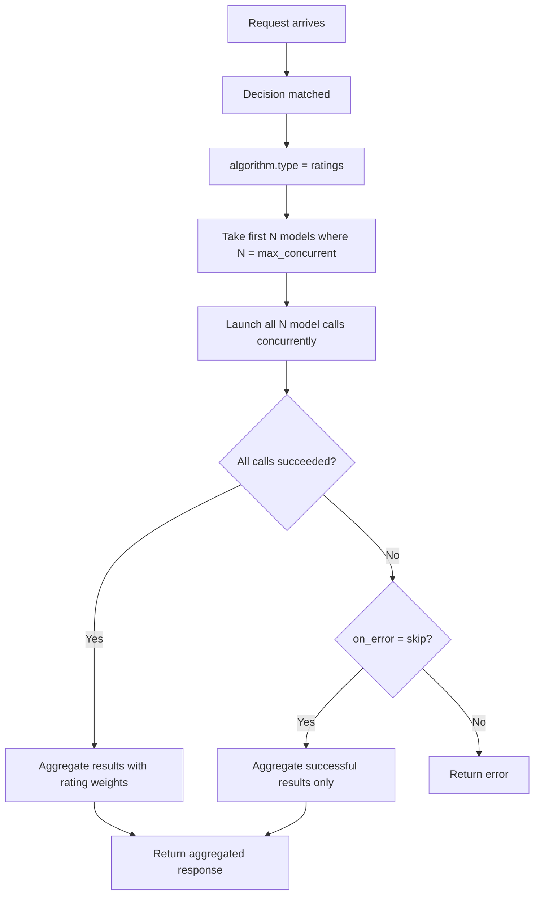

# Ratings

## Overview

`ratings` is a **looper** algorithm that coordinates multiple candidates with bounded concurrency. It executes several candidate models and aggregates their results, using route-level rating signals for coordination.

It aligns to `config/algorithm/looper/ratings.yaml`.

## Key Advantages

- Supports multi-model execution with a bounded concurrency cap.
- Keeps rating-aware orchestration local to one route.
- Makes error-handling behavior explicit.
- Useful for A/B evaluation and ensemble strategies.

## Algorithm Principle

Ratings executes multiple candidate models concurrently (up to `max_concurrent`) and aggregates results:

1. **Fan-out**: Launch up to `max_concurrent` model calls in parallel.
2. **Collect**: Gather all responses (or handle errors per `on_error` policy).
3. **Aggregate**: Combine results using rating-based weighting.
4. **Return**: Return the aggregated response.

## Execution Flow



## What Problem Does It Solve?

Some routes need more than one candidate to participate in a response, but still need bounded fan-out and predictable aggregation behavior. `ratings` exposes that controlled multi-model coordination as router policy instead of custom orchestration in the caller.

## When to Use

- More than one candidate should run inside the same route.
- Route-level ratings should influence the loop.
- Concurrency needs a hard upper bound.
- You want ensemble-style multi-model responses.

## Known Limitations

- Running multiple models concurrently increases cost.
- Aggregation quality depends on the rating signal quality.
- No built-in conflict resolution for contradictory responses.
- `max_concurrent` limits parallelism — all models beyond the cap are excluded.

## Configuration

```yaml
algorithm:
  type: ratings
  ratings:
    max_concurrent: 3            # Maximum parallel model calls
    on_error: skip               # skip or fail
```

### Parameters

| Parameter | Type | Default | Description |
|-----------|------|---------|-------------|
| `max_concurrent` | int | — | Maximum number of concurrent model calls |
| `on_error` | string | `skip` | Behavior on failure: `skip` or `fail` |
