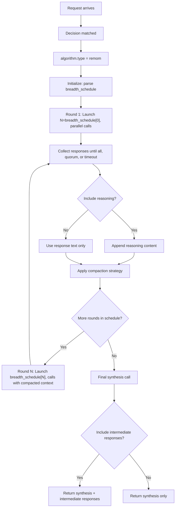

# ReMoM (Reasoning for Mixture of Models)

## Overview

`remom` is a **looper** algorithm for breadth-controlled multi-model orchestration with intelligent synthesis. It performs multi-round parallel reasoning and synthesizes the best answer from all responses.

It aligns to `config/algorithm/looper/remom.yaml`.

The runtime also supports a direct ReMoM model slug through
`global.integrations.looper.remom.model_names`. The built-in default is
`vllm-sr/remom`. Direct ReMoM calls evaluate only decisions with
`algorithm.type=remom`, matching the direct Fusion and Flow model surfaces.

**Inspired by**: [PaCoRe](https://arxiv.org/abs/2601.05593) — extended to support mixture of models.

## Key Advantages

- Multi-round parallel reasoning with configurable breadth schedule.
- Intelligent synthesis from multiple model responses.
- Model distribution strategies: `weighted`, `equal`, `round_robin`, or `first_only`.
- Compaction strategy to manage token budgets across rounds.
- Optional quorum and round timeout controls to avoid waiting on provider long tails.
- Customizable synthesis templates.

## Algorithm Principle

ReMoM orchestrates multiple rounds of parallel model calls:

1. **Round 1**: Launch `breadth_schedule[0]` parallel calls across candidate models.
2. **Compaction**: Optionally compact intermediate responses (full or last_n_tokens).
3. **Round 2**: Launch `breadth_schedule[1]` calls, feeding compacted responses as context.
4. **Final Synthesis**: One final call synthesizes all intermediate results into a coherent answer.

The breadth schedule controls how many calls happen per round. For example `[32, 4]` means 32 calls in round 1, 4 in round 2, then 1 final synthesis call.

## Execution Flow



## Model Distribution Strategies

| Strategy | Description |
|----------|-------------|
| `weighted` | Distribute calls proportional to model weights in `modelRefs` |
| `equal` | Distribute calls equally across all candidate models |
| `round_robin` | Cycle through candidate models in configured order |
| `first_only` | All calls go to the first (highest-weight) model |

## What Problem Does It Solve?

Some tasks benefit from parallel exploration and later synthesis rather than one-shot selection of a single model. `remom` gives the router a breadth-controlled way to explore multiple reasoning paths and merge them into one final answer.

## When to Use

- One route should coordinate multiple models over several passes.
- You need a configurable breadth schedule instead of one-step escalation.
- Intermediate responses should be included or excluded explicitly.
- Multi-round reasoning with synthesis produces better answers than single-shot.

## Known Limitations

- High token consumption: each round generates multiple responses.
- Synthesis quality depends on the synthesis template and model capability.
- Longer latency due to sequential round execution.
- Requires careful tuning of breadth_schedule to balance quality vs. cost.

## Configuration

Register the direct model slug:

```yaml
global:
  integrations:
    looper:
      endpoint: http://localhost:8899/v1/chat/completions
      max_response_bytes_mb: 32 # optional; caps a single upstream response body (default 32 MiB)
      remom:
        model_names:
          - vllm-sr/remom
```

Configure a ReMoM decision:

```yaml
routing:
  decisions:
    - name: reasoning_panel
      output_contract: Preserve any explicit output format exactly.
      output_contract_spec:
        type: reference_selection
        reference:
          source: candidate_responses
          id_format: index
        extract:
          mode: exact
          sources: [content]
        postprocess:
          - type: dereference_selected_reference
      modelRefs:
        - model: qwen3-32b
        - model: deepseek-worker
      algorithm:
        type: remom
        remom:
          breadth_schedule: [3, 2]
          model_distribution: weighted
```

`output_contract` is decision-scoped prompt text. Use it for benchmark or
application format requirements that should apply across ReMoM, Fusion, and
Flow instead of hard-coding task-specific prompts into an algorithm.
`output_contract_spec` is the typed router-executable contract for post-processing
and normalization; keep runtime behavior there instead of encoding it as
prompt-text heuristics. Extraction defaults to exact `content` matching; use
`extract.sources` or `extract.mode: json_object` only when the decision
explicitly permits a wider parser.

Algorithm-only fragment:

```yaml
algorithm:
  type: remom
  remom:
    breadth_schedule: [3, 2]            # Parallel calls before final synthesis
    model_distribution: weighted         # weighted, equal, round_robin, or first_only
    temperature: 0.7                     # Temperature for model calls
    include_reasoning: false             # Include reasoning in synthesis
    compaction_strategy: full            # full or last_n_tokens
    compaction_tokens: 1000              # Tokens to keep for last_n_tokens
    synthesis_template: ""               # Custom synthesis template (optional)
    max_concurrent: 3                    # Max concurrent calls per round
    round_timeout_seconds: 120           # Optional round-level wait cap
    min_successful_responses: 2          # Optional early-success quorum
    shuffle_seed: 42                     # Seed for response shuffling
    include_intermediate_responses: false # Include intermediate responses in output
    max_responses_per_round: null        # Limit responses per round
    on_error: skip                       # skip or fail
```

### Parameters

| Parameter | Type | Default | Description |
|-----------|------|---------|-------------|
| `breadth_schedule` | list[int] | **required** | Parallel calls before the final synthesis call (e.g., `[3, 2]`) |
| `model_distribution` | string | `weighted` | Strategy: `weighted`, `equal`, `round_robin`, `first_only` |
| `temperature` | float | `1.0` | Temperature for model calls |
| `include_reasoning` | bool | `false` | Include reasoning content in synthesis prompts |
| `compaction_strategy` | string | `full` | Strategy: `full` or `last_n_tokens` |
| `compaction_tokens` | int | `1000` | Tokens to keep for `last_n_tokens` compaction |
| `synthesis_template` | string | — | Custom synthesis prompt template |
| `max_concurrent` | int | — | Maximum concurrent model calls per round |
| `round_timeout_seconds` | int | — | Maximum seconds to wait for a round before using partial responses when `on_error: skip` |
| `min_successful_responses` | int | — | Return from a parallel round after this many successful responses |
| `shuffle_seed` | int | `42` | Random seed for response shuffling |
| `include_intermediate_responses` | bool | `true` | Include intermediate responses in output |
| `max_responses_per_round` | int | — | Maximum responses to keep per round |
| `on_error` | string | `skip` | Behavior on failure: `skip` or `fail` |
