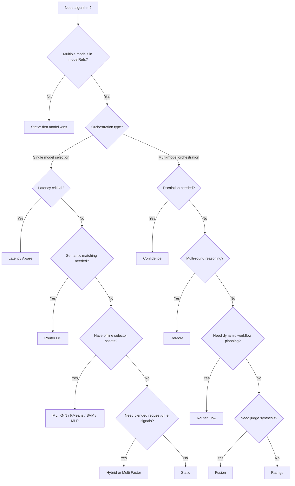

# Algorithm

## Overview

Latest algorithm tutorials mirror the fragment catalog under `config/algorithm/`.

Algorithms only matter after a decision matches and exposes multiple candidate models in `modelRefs`. The router then uses `decision.algorithm` to choose or coordinate those candidates.

## Key Advantages

- Separates route eligibility from model selection policy.
- Lets one decision keep several candidate models without inlining ranking logic.
- Supports both one-model ranking and multi-model orchestration.
- Mirrors the repo fragment tree exactly: one tutorial page per algorithm under `config/algorithm/selection/` and `config/algorithm/looper/`.

## What Problem Does It Solve?

Once a route matches, the router still needs a principled way to choose among candidate models. Without an algorithm layer, teams either hard-code one winner or duplicate ranking logic across routes.

Algorithms solve that by making the post-match selection policy explicit and reusable.

## When to Use

Use `algorithm/` when:

- `modelRefs` contains more than one candidate
- route policy depends on latency, feedback, semantic fit, or online exploration
- one decision should orchestrate several models instead of choosing exactly one
- you want model choice to evolve without changing the decision rule itself

## Configuration

In canonical v0.3 YAML, algorithms live inside each matched decision:

```yaml
routing:
  decisions:
    - name: computer-science-reasoning
      rules:
        operator: AND
        conditions:
          - type: domain
            name: "computer science"
      modelRefs:
        - model: qwen2.5:7b
        - model: qwen3:14b
      algorithm:
        type: router_dc
        router_dc:
          temperature: 0.07
```

The repo now keeps one tutorial page per algorithm.

## Algorithm Comparison

### Selection Algorithms (single model from candidates)

| Algorithm | Type | Feedback | Personalization | Key Paper | Best For |
|-----------|------|----------|-----------------|-----------|----------|
| **[Static](./selection/static)** | Fixed | No | No | — | Simplest possible selection, curated ordering |
| **[Router DC](./selection/router-dc)** | Semantic | Yes | No | [Dual Contrastive (2409.19886)](https://arxiv.org/abs/2409.19886) | Query-to-model semantic matching |
| **[AutoMix](./selection/automix)** | POMDP | Via logprob | No | [AutoMix (2310.12963)](https://arxiv.org/abs/2310.12963) | Cost-quality cascaded routing |
| **[Hybrid](./selection/hybrid)** | Composite | Yes (3 sub) | No | [Hybrid LLM (2404.14618)](https://arxiv.org/abs/2404.14618) | Blending multiple ranking signals |
| **[KNN](./selection/knn)** | ML (Rust) | No (offline) | No | — | Interpretable example-based routing |
| **[KMeans](./selection/kmeans)** | ML (Rust) | No (offline) | No | — | Cluster-based routing |
| **[SVM](./selection/svm)** | ML (Rust) | No (offline) | No | — | Decision boundary classification |
| **[MLP](./selection/mlp)** | ML (GPU) | No (offline) | No | — | Non-linear neural network routing |
| **[Latency Aware](./selection/latency-aware)** | Metrics | No | No | — | Fastest model selection by TPOT/TTFT |

### Looper Algorithms (multi-model orchestration)

| Algorithm | Description | Key Feature |
|-----------|-------------|-------------|
| **[Confidence](./looper/confidence)** | Small-to-large escalation | Logprob-based confidence evaluation |
| **[Fusion](./looper/fusion)** | Parallel panel deliberation | Judge analysis + final synthesis |
| **[Router Flow](./looper/workflows)** | Micro-agent workflows behind one model name | Static role plans or dynamic planner-generated execution |
| **[Ratings](./looper/ratings)** | Bounded concurrent execution | Concurrency cap + rating aggregation |
| **[ReMoM](./looper/remom)** | Multi-round parallel reasoning | Breadth schedule + intelligent synthesis |

## Algorithm Decision Guide



### Selection Algorithms

Conversation and session protection is configured as Router Learning, not as a
decision algorithm. See [Protection](../learning/protection). There is no
`algorithm/selection/session-aware` tutorial in the clean v0.3 surface because
`algorithm.type: session_aware` is not a supported public algorithm.

- [AutoMix](./selection/automix)
- [Hybrid](./selection/hybrid)
- [KMeans](./selection/kmeans)
- [KNN](./selection/knn)
- [Latency Aware](./selection/latency-aware)
- [MLP](./selection/mlp)
- [Multi Factor](./selection/multi-factor)
- [Router DC](./selection/router-dc)
- [Static](./selection/static)
- [SVM](./selection/svm)

Future feedback-driven model-choice strategies belong under
[Router Learning](../learning/adaptations), not `decision.algorithm`. The
current Router Learning strategy is `routing_sampling`.

### Looper Algorithms

- [Confidence](./looper/confidence)
- [Fusion](./looper/fusion)
- [Router Flow](./looper/workflows)
- [Ratings](./looper/ratings)
- [ReMoM](./looper/remom)
