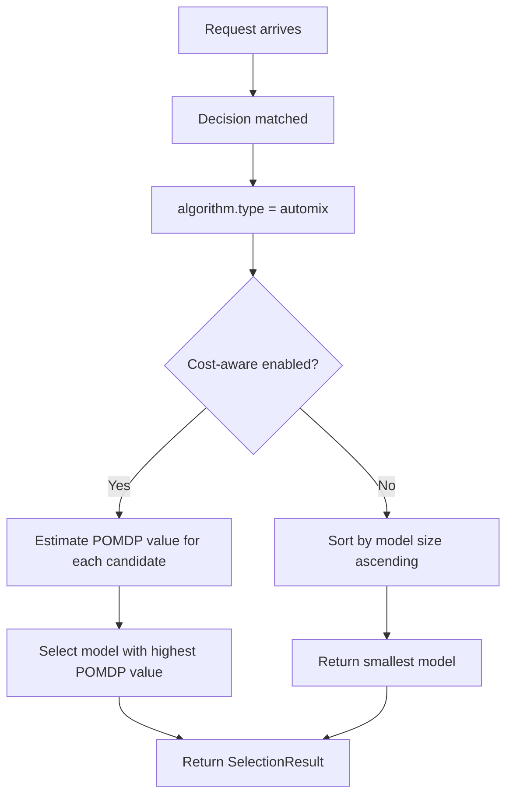
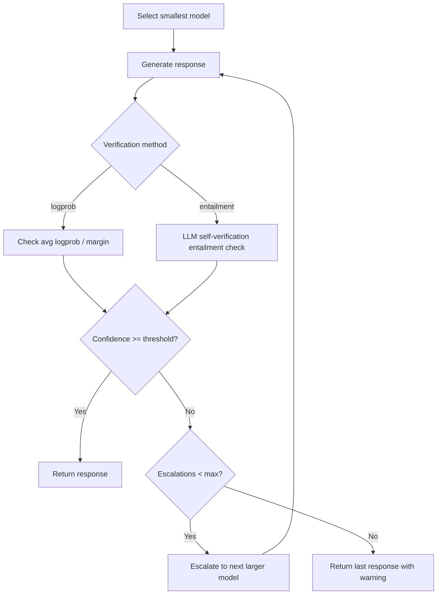

# AutoMix

## Overview

`automix` is a selection algorithm that optimizes cost-quality tradeoff using **POMDP (Partially Observable Markov Decision Process)** based cascaded routing with self-verification.

It aligns to `config/algorithm/selection/automix.yaml`.

**Paper**: [Automatically Mixing Language Models](https://arxiv.org/abs/2310.12963) (NeurIPS 2024)

## Key Advantages

- Routes to smaller/cheaper models first, escalates only when needed.
- Self-verification via entailment checking or logprob confidence.
- POMDP-based decision framework for optimal cost-quality routing.
- Supports particle filtering for belief state updates.
- Keeps verification behavior local to the decision that needs it.

## Algorithm Principle

AutoMix implements a **3-step cascaded routing** approach:

1. **Generate**: Start with the smallest/cheapest model in `modelRefs`.
2. **Self-Verify**: The same model verifies its own answer via entailment check or logprob analysis.
3. **Route**: If verification confidence is below threshold, escalate to the next larger model.

The POMDP framework models the router's uncertainty about model capability as a **belief state** $b_t$, which is updated via particle filtering after each interaction:

$$b_{t+1} = \text{Update}(b_t, o_t, a_t)$$

Where $o_t$ is the observation (verification result) and $a_t$ is the action (chosen model). The optimal policy maximizes:

$$\pi^* = \arg\max_\pi \mathbb{E}\left[\sum_{t=0}^{\infty} \gamma^t (P_t - \lambda C_t)\right]$$

Where $P_t$ is performance, $C_t$ is cost, and $\lambda$ (`cost_lambda`) controls the tradeoff.

## Select Flow (Pre-selection Mode)



## Cascade Flow (Verification + Escalation)



## What Problem Does It Solve?

Some routes need dynamic cost-quality optimization instead of always picking the same model or applying a fixed heuristic cascade. `automix` keeps self-verification and escalation policy inside the router so it can spend more only when the expected quality gain is worth it.

## When to Use

- One route has several candidate models with different cost and quality profiles.
- Escalation should stop after a bounded number of retries.
- The route should stay cost-aware instead of always choosing the strongest model.
- You want POMDP-based optimal routing vs. simple threshold rules.

## Known Limitations

- Cascaded mode (with verification) adds latency — each verification step is an extra inference.
- Self-verification via entailment requires a separate LLM endpoint (`verifier_server_url`).
- POMDP particle filtering adds computational overhead for belief updates.
- Without sufficient historical data, POMDP beliefs may not converge.

## Configuration

```yaml
algorithm:
  type: automix
  automix:
    verification_threshold: 0.7       # Self-verification confidence threshold
    max_escalations: 2                # Maximum escalation attempts
    cost_aware_routing: true          # Enable cost-quality optimization
    cost_quality_tradeoff: 0.3        # Balance: 0=pure quality, 1=pure cost
    discount_factor: 0.95             # POMDP discount factor (γ)
    use_logprob_verification: true    # Use logprobs for confidence
    enable_self_verification: false   # LLM-based entailment verification
    verification_samples: 5           # Samples for confidence (k in paper)
    use_pomdp_router: true            # Full POMDP routing (vs simple threshold)
    belief_particles: 100             # Number of POMDP particles
    cost_lambda: 0.5                  # POMDP cost-performance tradeoff
    verifier_server_url: ""           # AutoMix verification server URL
    enable_cascade: false             # Enable full cascade execution mode
```

### Parameters

| Parameter | Type | Default | Description |
|-----------|------|---------|-------------|
| `verification_threshold` | float | `0.7` | Confidence threshold for self-verification (0–1) |
| `max_escalations` | int | `2` | Maximum escalation attempts |
| `cost_aware_routing` | bool | `true` | Enable cost-quality tradeoff optimization |
| `cost_quality_tradeoff` | float | `0.3` | Cost-quality balance (0=quality, 1=cost) |
| `discount_factor` | float | `0.95` | POMDP discount factor γ (0–1) |
| `use_logprob_verification` | bool | `true` | Use logprobs for confidence estimation |
| `enable_self_verification` | bool | `false` | Enable LLM-based entailment verification |
| `verification_samples` | int | `5` | Number of verification samples (k) |
| `verification_temperature` | float | `0.7` | Temperature for verification sampling |
| `use_pomdp_router` | bool | `true` | Full POMDP routing vs. simple threshold |
| `belief_particles` | int | `100` | Number of POMDP belief particles |
| `cost_lambda` | float | `0.5` | POMDP cost-performance tradeoff λ |
| `verifier_server_url` | string | — | URL of AutoMix self-verification server |
| `enable_cascade` | bool | `false` | Enable full cascade execution mode |
