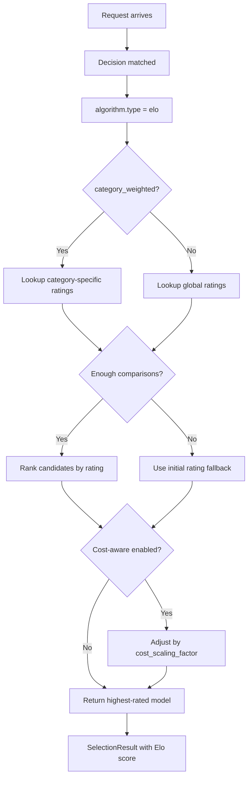
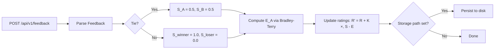

# Elo

## Overview

`elo` is a feedback-driven selection algorithm that ranks candidate models using an Elo-style rating system based on pairwise comparisons.

It aligns to `config/algorithm/selection/elo.yaml`.

**Paper**: [RouteLLM: Simple and Effective LLM Routing](https://arxiv.org/abs/2406.18665) — uses the **Bradley-Terry model** for pairwise preference learning.

## Key Advantages

- Reuses historical pairwise feedback instead of only current-request heuristics.
- Ratings improve over time as more comparisons arrive (online learning).
- Supports category-aware weighting for routes with distinct workloads.
- Configurable time decay to gradually forget stale comparisons.
- Optional cost-aware selection to balance quality vs. price.

## Algorithm Principle

Elo rating is built on the **Bradley-Terry model**, which estimates the probability that model A is preferred over model B:

$$P(A \succ B) = \frac{1}{1 + 10^{(R_B - R_A) / 400}}$$

After each pairwise comparison, ratings are updated:

$$R_A' = R_A + K \cdot (S_A - E_A)$$

Where:

- $K$ is the learning rate (`k_factor`, default 32)
- $S_A$ is the actual outcome (1 = win, 0 = loss, 0.5 = tie)
- $E_A = P(A \succ B)$ is the expected score

When `category_weighted` is enabled, each decision maintains **independent per-category ratings**, so a model's performance in "math" doesn't affect its "coding" rating.

## Select Flow



## Feedback Flow



### Feedback API

Submit pairwise feedback to update Elo ratings:

```bash
curl -X POST http://localhost:8000/api/v1/feedback \
  -H "Content-Type: application/json" \
  -d '{
    "query": "Solve: 2x + 5 = 15",
    "winner_model": "gpt-4",
    "loser_model": "llama-3.2-3b",
    "decision_name": "math_reasoning"
  }'
```

Feedback fields:

| Field | Required | Description |
|-------|----------|-------------|
| `query` | Yes | Original query text |
| `winner_model` | Yes | Preferred model name |
| `loser_model` | No | Rejected model (for pairwise) |
| `tie` | No | Both models performed equally |
| `decision_name` | No | Category context for category-weighted Elo |
| `user_id` | No | User identifier for per-user tracking |
| `confidence` | No | Feedback confidence (0.0-1.0) |

## What Problem Does It Solve?

When model quality shifts over time, static priority lists and one-shot heuristics become stale. `elo` lets the router learn from pairwise feedback so candidate ranking reflects observed wins instead of frozen assumptions.

## When to Use

- You collect route-level feedback or quality comparisons.
- Ranking should improve over time as more comparisons arrive.
- One route sees repeatable workloads where a rating system is useful.
- You want online learning without retraining.

## Known Limitations

- Requires sufficient pairwise comparisons before ratings stabilize (controlled by `min_comparisons`).
- Cold start: new models begin at `initial_rating` regardless of actual capability.
- No semantic understanding of queries — purely feedback-driven.

## Configuration

```yaml
algorithm:
  type: elo
  elo:
    initial_rating: 1500          # Starting rating for new models
    k_factor: 32                  # Learning rate (higher = more volatile)
    category_weighted: true       # Per-category Elo ratings
    decay_factor: 0.0             # Time decay for old comparisons (0 = none)
    min_comparisons: 5            # Minimum comparisons before rating is stable
    cost_scaling_factor: 0.0      # Cost consideration (0 = ignore)
    storage_path: /var/lib/vsr/elo_ratings.json  # Persist ratings
    auto_save_interval: 1m        # Auto-save frequency
```

### Parameters

| Parameter | Type | Default | Description |
|-----------|------|---------|-------------|
| `initial_rating` | float | `1500` | Starting Elo rating for new models |
| `k_factor` | float | `32` | Rating volatility (range 1–100) |
| `category_weighted` | bool | `true` | Enable per-category ratings |
| `decay_factor` | float | `0.0` | Time decay for old comparisons (0–1) |
| `min_comparisons` | int | `5` | Minimum comparisons for stable rating |
| `cost_scaling_factor` | float | `0.0` | Cost penalty per $1M tokens (0 = ignore) |
| `storage_path` | string | — | File path to persist Elo ratings |
| `auto_save_interval` | string | `1m` | Auto-save interval (e.g. `5m`, `30s`) |
