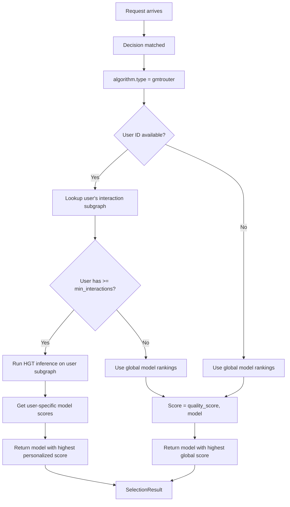
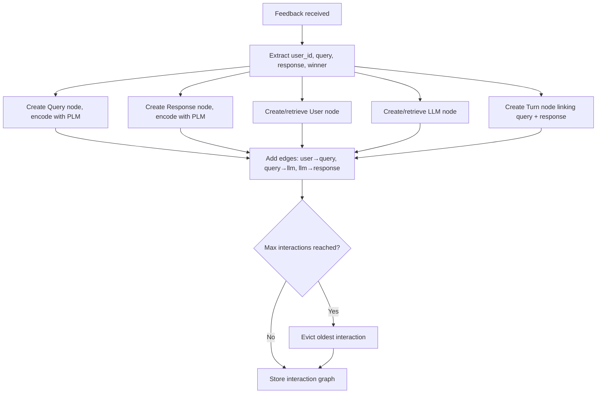

# GMT Router

## Overview

`gmtrouter` is a personalized selection algorithm that uses a **heterogeneous graph neural network (GNN)** to learn user preferences from multi-turn interactions.

It aligns to `config/algorithm/selection/gmtrouter.yaml`.

**Paper**: [GMTRouter: Personalized LLM Router over Multi-turn User Interactions](https://arxiv.org/abs/2511.08590)

## Key Advantages

- Supports per-user or per-tenant personalization based on interaction history.
- Models user-LLM interactions as a heterogeneous graph with 5 node types.
- Uses **HGT (Heterogeneous Graph Transformer)** message passing for preference learning.
- Captures rich relational dependencies between users and LLMs.
- Learns from few-shot interaction data via inductive training.

## Algorithm Principle

GMTRouter models interactions as a **heterogeneous graph** with 5 node types:

| Node Type | Description | Embedding |
|-----------|-------------|-----------|
| **User** | Individual users | Zero-initialized, learned via message passing |
| **LLM** | Model capabilities | PLM-encoded from model descriptions |
| **Query** | User queries | PLM-encoded from query text |
| **Response** | Model responses | PLM-encoded from response text |
| **Turn** | Virtual aggregation nodes | Per-round interaction summary |

The graph uses **HGT (Heterogeneous Graph Transformer)** layers for message passing:

$$h_v^{(l+1)} = \text{HGT}^{(l)}(h_v^{(l)}, \{h_u^{(l)} \mid u \in \mathcal{N}(v)\})$$

Each HGT layer uses type-specific attention mechanisms to handle heterogeneous edge types (user→query, query→llm, llm→response, etc.).

**Inductive training**: For a new user, sample $k$ interaction histories (`history_sample_size`), construct the sub-graph, and run HGT inference to predict the best model.

## Select Flow



## Graph Construction (UpdateFeedback)



## When to Use

- The route should adapt to user or tenant history.
- You have multi-turn interaction data for personalization.
- Static or feedback-only ranking is not enough.
- You need to capture user-specific model preferences.

## Known Limitations

- **Scalability**: HGT message passing has O(N²) complexity for N nodes in the subgraph. Large interaction histories can be expensive.
- **Cold start**: New users need at least `min_interactions_for_personalization` interactions before personalization kicks in.
- **Memory**: Graph storage grows with number of users × interactions per user.
- **PLM dependency**: Node embeddings for query/response/LLM require a pretrained language model.

## Configuration

```yaml
algorithm:
  type: gmtrouter
  gmtrouter:
    enable_personalization: true              # Enable user-specific learning
    history_sample_size: 5                    # Sample k interactions for inference
    embedding_dimension: 768                  # Node embedding dimension
    num_gnn_layers: 2                         # HGT layers (L in paper)
    attention_heads: 8                        # Attention heads per HGT layer
    max_interactions_per_user: 100            # Limit stored interactions per user
    min_interactions_for_personalization: 3   # Min interactions before personalization
    feedback_types: [rating, ranking]         # Supported feedback types
    model_path: models/gmtrouter.pt           # Path to pre-trained model weights
    storage_path: /var/lib/vsr/gmt_graph.json # Persist interaction graph
```

### Parameters

| Parameter | Type | Default | Description |
|-----------|------|---------|-------------|
| `enable_personalization` | bool | `true` | Enable user-specific preference learning |
| `history_sample_size` | int | `5` | Number of interactions to sample for inference (k) |
| `embedding_dimension` | int | `768` | Dimension of node embeddings |
| `num_gnn_layers` | int | `2` | Number of HGT layers |
| `attention_heads` | int | `8` | Attention heads per HGT layer |
| `max_interactions_per_user` | int | `100` | Maximum stored interactions per user |
| `min_interactions_for_personalization` | int | `3` | Minimum interactions before personalization |
| `feedback_types` | list | `[rating, ranking]` | Supported feedback types |
| `model_path` | string | — | Path to pre-trained GMTRouter model weights |
| `storage_path` | string | — | Path to persist interaction graph |

## Feedback

GMTRouter's `UpdateFeedback()` builds the interaction graph incrementally:

```bash
curl -X POST http://localhost:8000/api/v1/feedback \
  -H "Content-Type: application/json" \
  -d '{
    "query": "Explain quantum entanglement",
    "response": "Quantum entanglement is a phenomenon...",
    "winner_model": "gpt-4",
    "user_id": "user-123",
    "session_id": "session-456",
    "decision_name": "science"
  }'
```

Key feedback fields for GMTRouter:

| Field | Importance | Description |
|-------|-----------|-------------|
| `user_id` | **Critical** | Identifies the user for personalization |
| `session_id` | Important | Links multi-turn interactions |
| `query` | Important | Encoded as Query node in the graph |
| `response` | Important | Encoded as Response node (Paper G4) |
| `winner_model` | Important | Used for LLM node and edge weight |
