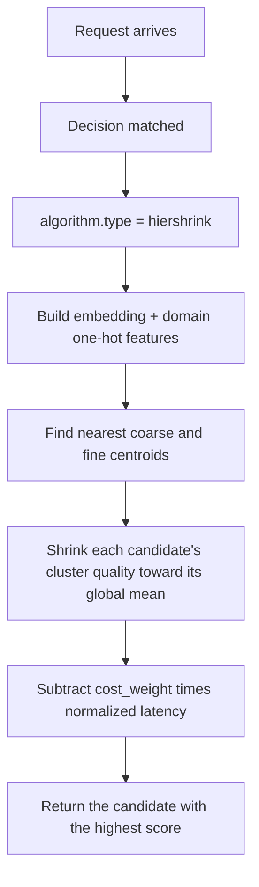

# HierShrink

## Overview

`hiershrink` routes from sparse quality observations. It needs no model
training and no GPU. A candidate with a few dozen scored queries can join a
decision without retraining the selector.

**Implementation**: pure Go in the Router. Python fits the K-means centroids
and exports the artifact.

## Algorithm Principle

For one candidate model $m$ and one query $x$:

- $\bar y_m$ is the mean quality of $m$ over all its observations.
- $b_1$ is the quality of $m$ in the coarse cluster of $x$, shrunk toward
  $\bar y_m$:

$$b_1 = \frac{n_c\, \bar y_{m,c} + \lambda_1 \bar y_m}{n_c + \lambda_1}$$

- $b_2$ is the same estimate one level finer, shrunk toward $b_1$:

$$b_2 = \frac{n_f\, \bar y_{m,f} + \lambda_2 b_1}{n_f + \lambda_2}$$

- The selector returns $\arg\max_m \; b_2 - w \cdot \text{cost}_m$.

$n_c$ and $n_f$ are the observation counts of $m$ in the coarse and fine
clusters of $x$. $\lambda_1 = \lambda_2 = 24$ are fixed. With few observations
the estimate is the global mean; with many it is the fine-cluster mean.
$\text{cost}_m$ is the mean latency of $m$, divided by the largest mean latency
among the candidates. $w$ is the artifact `cost_weight` (default `0`).

The estimator is a hierarchical m-estimate (Cestnik, ECAI 1990) on the
cluster routing table of UniRoute (Jitkrittum et al., ICLR 2026).

## Select Flow



## What Problem Does It Solve?

`knn`, `kmeans`, `svm`, and `mlp` need every candidate scored on a large set
of queries. A new model with a few dozen scored queries gets poor routes from
them. `hiershrink` trusts a cluster estimate only as far as its observation
count allows, and uses the model's global mean for the rest.

## When to Use

- A candidate has only a few dozen scored queries.
- Candidates enter or leave the pool often.
- You want a learned policy without a training job.

## Known Limitations

- A candidate without records in the artifact is skipped. If no candidate has
  records, selection fails.
- Centroids are fixed at export time. A new embedding model needs a new
  artifact.
- The cost term uses observed latency, not price.

## Configuration

```yaml
algorithm:
  type: hiershrink
```

### Global ML Settings

```yaml
global:
  router:
    model_selection:
      ml:
        embedding_dim: 768
        hiershrink:
          pretrained_path: .cache/ml-models/hiershrink_model.json
```

### Parameters

| Parameter | Type | Default | Description |
|-----------|------|---------|-------------|
| `pretrained_path` | string | — | Path to the HierShrink artifact (JSON format) |

### Artifact

| Field | Description |
|-------|-------------|
| `coarse_centroids` | K-means centroids at the coarse level (default 20) |
| `fine_centroids` | K-means centroids at the fine level (default 100) |
| `cost_weight` | Weight $w$ of the normalized latency cost |
| `training` | Scored observations: feature vector, model, quality, latency |

## Training

```bash
cd src/training/model_selection/ml_model_selection
python train.py --data-file benchmark.jsonl --output-dir models/ --algorithm hiershrink
```

Training only fits the centroids. The Router aggregates the observations when
it loads the artifact. See a complete example:
[`config/fragments/algorithm/selection/hiershrink.yaml`](https://github.com/vllm-project/semantic-router/blob/main/config/fragments/algorithm/selection/hiershrink.yaml).
