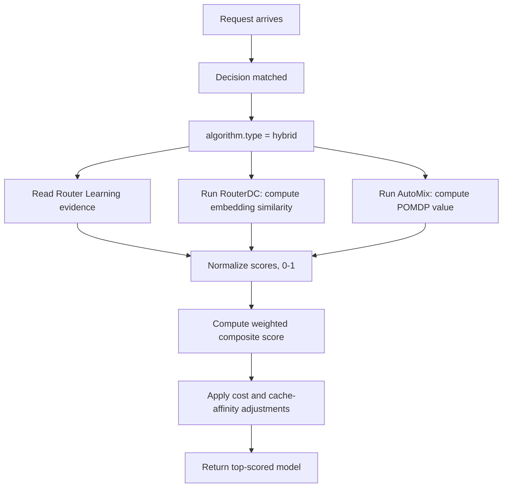

# Hybrid

## Overview

`hybrid` is a composite selection algorithm that combines multiple ranking
signals, such as Router-DC embedding similarity, AutoMix value estimates,
Router Learning evidence, and cost, into one weighted score.

It aligns to `config/algorithm/selection/hybrid.yaml`.

**Paper**: [Hybrid LLM: Cost-Efficient Quality-Aware Query Routing](https://arxiv.org/abs/2404.14618)

## Key Advantages

- Blends multiple selectors instead of committing to only one.
- Makes weighting explicit and easy to audit.
- Supports gradual migration between request-time ranking policies and
  Router Learning evidence.
- Cost-aware scoring to balance quality and operational expense.

## Algorithm Principle

Hybrid computes a weighted composite score for each candidate model:

$$S(m) = w_{\text{learning}} \cdot \hat{R}_{\text{learning}}(m) + w_{\text{rdc}} \cdot \hat{R}_{\text{rdc}}(m) + w_{\text{amix}} \cdot \hat{R}_{\text{amix}}(m) - w_{\text{cost}} \cdot \hat{C}(m)$$

When `normalize_scores` is enabled (default), each component is min-max normalized to [0, 1] before combination, ensuring fair weighting regardless of scale differences.

`quality_gap_threshold` is retained in the selector contract for data-driven upgrade policy experiments, while the current online selector uses the weighted composite score directly for the final pick.

## Select Flow



## Component Selectors

The Hybrid selector internally instantiates three sub-selectors:

| Component | Source | What it provides |
|-----------|--------|-----------------|
| Router Learning evidence | Learning snapshots | Feedback-derived ratings or reward evidence |
| `RouterDCSelector` | Model descriptions | Semantic query-model similarity |
| `AutoMixSelector` | POMDP solver | Cost-quality optimal value estimate |

Each component shares the same `SelectionContext` and runs independently.

## What Problem Does It Solve?

No single ranking signal is reliable for every workload: pure cost, pure similarity, or pure feedback each misses part of the routing picture. `hybrid` combines multiple selectors into one auditable score so routes can balance semantic fit, historical quality, and operational cost.

## When to Use

- One route should combine several ranking signals.
- You want a weighted transition between older and newer selectors.
- No single selector captures all relevant information.
- The final choice should reflect both quality and operational cost.

## Known Limitations

- Higher computational cost than any single selector (runs 3 sub-selectors per request).
- Weight tuning requires domain knowledge — suboptimal weights can degrade performance.
- `quality_gap_threshold` is exposed for compatibility with lookup-table and upgrade-policy work, but it does not currently run an MLP escalation pass.

## Configuration

```yaml
algorithm:
  type: hybrid
  hybrid:
    experience_weight: 0.3              # Feedback-derived experience evidence
    router_dc_weight: 0.3        # Weight for embedding similarity
    automix_weight: 0.2          # Weight for POMDP value
    cost_weight: 0.2             # Weight for cost consideration
    quality_gap_threshold: 0.1   # Reserved quality-gap threshold
    normalize_scores: true       # Normalize component scores to [0,1]
```

### Parameters

| Parameter | Type | Default | Description |
|-----------|------|---------|-------------|
| `experience_weight` | float | `0.3` | Weight for feedback-derived experience evidence (0-1) |
| `router_dc_weight` | float | `0.3` | Weight for RouterDC embedding similarity (0–1) |
| `automix_weight` | float | `0.2` | Weight for AutoMix POMDP value (0–1) |
| `cost_weight` | float | `0.2` | Weight for cost consideration (0–1) |
| `quality_gap_threshold` | float | `0.1` | Reserved quality-gap threshold for upgrade-policy experiments |
| `normalize_scores` | bool | `true` | Normalize component scores before combination |

## Feedback

Hybrid does not own feedback state. Online model-choice experience belongs
under `global.router.learning.adaptation`; Hybrid may consume read-only
learning evidence when that integration is available.
