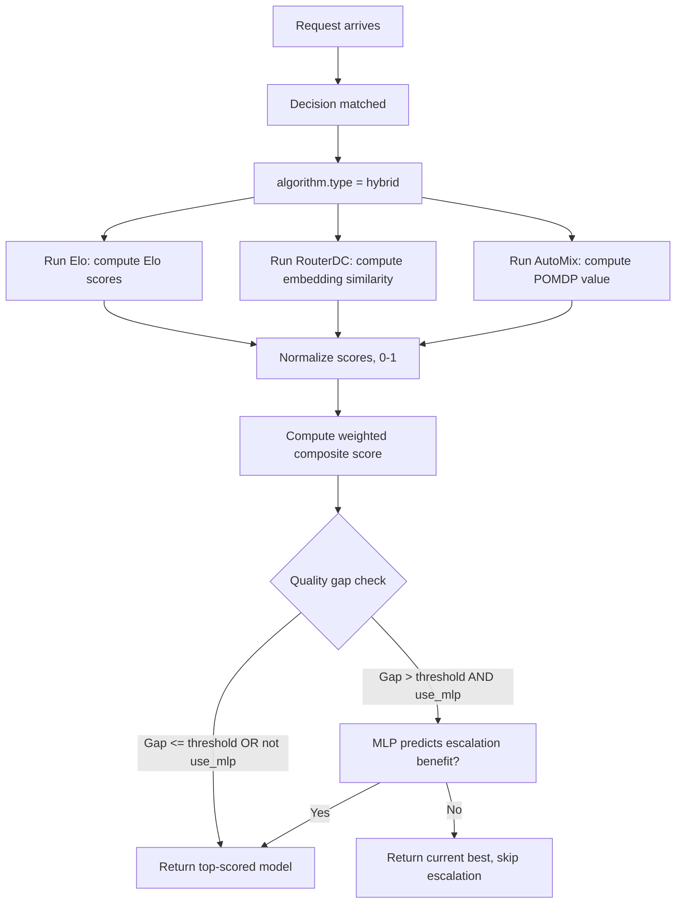

# Hybrid

## Overview

`hybrid` is a composite selection algorithm that combines multiple ranking signals — Elo ratings, Router-DC embedding similarity, AutoMix POMDP values, and cost — into one weighted score.

It aligns to `config/algorithm/selection/hybrid.yaml`.

**Paper**: [Hybrid LLM: Cost-Efficient Quality-Aware Query Routing](https://arxiv.org/abs/2404.14618)

## Key Advantages

- Blends multiple selectors instead of committing to only one.
- Makes weighting explicit and easy to audit.
- Supports gradual migration between ranking policies (e.g., transition from static to Elo).
- Optional MLP-based quality gap prediction for advanced use cases.
- Cost-aware scoring to balance quality and operational expense.

## Algorithm Principle

Hybrid computes a weighted composite score for each candidate model:

$$S(m) = w_{\text{elo}} \cdot \hat{R}_{\text{elo}}(m) + w_{\text{rdc}} \cdot \hat{R}_{\text{rdc}}(m) + w_{\text{amix}} \cdot \hat{R}_{\text{amix}}(m) - w_{\text{cost}} \cdot \hat{C}(m)$$

When `normalize_scores` is enabled (default), each component is min-max normalized to [0, 1] before combination, ensuring fair weighting regardless of scale differences.

If `use_mlp` is enabled and the quality gap between the top two candidates exceeds `quality_gap_threshold`, an MLP model predicts whether escalation would actually improve quality before triggering it.

## Select Flow



## Component Selectors

The Hybrid selector internally instantiates three sub-selectors:

| Component | Source | What it provides |
|-----------|--------|-----------------|
| `EloSelector` | Feedback history | Historical pairwise comparison scores |
| `RouterDCSelector` | Model descriptions | Semantic query-model similarity |
| `AutoMixSelector` | POMDP solver | Cost-quality optimal value estimate |

Each component shares the same `SelectionContext` and runs independently.

## What Problem Does It Solve?

No single ranking signal is reliable for every workload: pure cost, pure similarity, or pure feedback each misses part of the routing picture. `hybrid` combines multiple selectors into one auditable score so routes can balance semantic fit, historical quality, and operational cost.

## When to Use

- One route should combine several ranking signals.
- You want a weighted transition between older and newer selectors.
- No single selector captures all relevant information.
- The final choice should reflect both quality and operational cost.

## Known Limitations

- Higher computational cost than any single selector (runs 3 sub-selectors per request).
- Weight tuning requires domain knowledge — suboptimal weights can degrade performance.
- MLP quality gap prediction requires a pre-trained MLP model.

## Configuration

```yaml
algorithm:
  type: hybrid
  hybrid:
    elo_weight: 0.3              # Weight for Elo rating
    router_dc_weight: 0.3        # Weight for embedding similarity
    automix_weight: 0.2          # Weight for POMDP value
    cost_weight: 0.2             # Weight for cost consideration
    quality_gap_threshold: 0.1   # Threshold for MLP escalation check
    normalize_scores: true       # Normalize component scores to [0,1]
    use_mlp: false               # Enable MLP quality gap prediction
```

### Parameters

| Parameter | Type | Default | Description |
|-----------|------|---------|-------------|
| `elo_weight` | float | `0.3` | Weight for Elo rating contribution (0–1) |
| `router_dc_weight` | float | `0.3` | Weight for RouterDC embedding similarity (0–1) |
| `automix_weight` | float | `0.2` | Weight for AutoMix POMDP value (0–1) |
| `cost_weight` | float | `0.2` | Weight for cost consideration (0–1) |
| `quality_gap_threshold` | float | `0.1` | Quality gap to trigger escalation check (0–1) |
| `normalize_scores` | bool | `true` | Normalize component scores before combination |
| `use_mlp` | bool | `false` | Enable MLP-based quality gap prediction |

## Feedback

Hybrid forwards `UpdateFeedback()` to all three component selectors (Elo, RouterDC, AutoMix) so each can learn independently from the same feedback signal.
