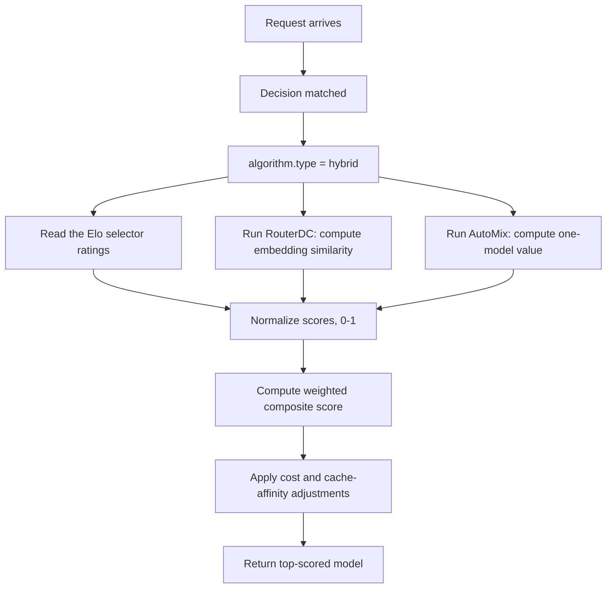

# Hybrid

## Overview

`hybrid` combines Elo ratings, Router-DC description similarity, AutoMix's
one-model value estimate, and cost into one weighted candidate score.

**Paper**: [Hybrid LLM: Cost-Efficient Quality-Aware Query Routing](https://arxiv.org/abs/2404.14618)

## Key Advantages

- Blends multiple selectors instead of committing to only one.
- Makes weighting explicit and easy to audit.
- Makes it possible to introduce one component gradually by changing its
  weight.
- Cost-aware scoring to balance quality and operational expense.

## Algorithm Principle

Hybrid first min-max normalizes the available Elo, Router-DC, and AutoMix
scores when `normalize_scores` is enabled. It combines those components using
their relative weights, renormalized across the components that returned data.
It then applies a multiplicative bonus to cheaper models when cost adjustment
is enabled. Cost is therefore a second-stage adjustment, not another linear
term in the component average.

## Select Flow


```mermaid
flowchart TD
    A[Request arrives] --> B[Decision matched]
    B --> C[algorithm.type = hybrid]
    C --> D[Read the Elo selector ratings]
    C --> E[Run RouterDC: compute embedding similarity]
    C --> F[Run AutoMix: compute one-model value]
    D --> G[Normalize scores, 0-1]
    E --> G
    F --> G
    G --> H[Compute weighted composite score]
    H --> I[Apply cost and cache-affinity adjustments]
    I --> J[Return top-scored model]
```

## Component Selectors

The Hybrid selector internally instantiates three sub-selectors:

| Component | Source | What it provides |
|-----------|--------|-----------------|
| `EloSelector` | Its own in-memory ratings | Relative model rating |
| `RouterDCSelector` | Model descriptions | Semantic query-model similarity |
| `AutoMixSelector` | One-shot request path | Cost-quality value estimate |

Each component shares the same `SelectionContext` and runs independently.

## What Problem Does It Solve?

No single ranking signal is reliable for every workload: pure cost, pure similarity, or pure feedback each misses part of the routing picture. `hybrid` combines multiple selectors into one auditable score so routes can balance semantic fit, historical quality, and operational cost.

## When to Use

- One route should combine several ranking signals.
- You want a weighted transition between older and newer selectors.
- No single selector captures all relevant information.
- The final choice should reflect both quality and operational cost.

## Known Limitations

- Higher computational cost than any single selector (runs 3 sub-selectors per request).
- Weight tuning requires domain knowledge — suboptimal weights can degrade performance.

## Configuration

```yaml
algorithm:
  type: hybrid
  hybrid:
    experience_weight: 0.3       # Elo component weight
    router_dc_weight: 0.3        # Weight for embedding similarity
    automix_weight: 0.2          # Weight for AutoMix's one-model value
    cost_weight: 0.2             # Weight for cost consideration
    normalize_scores: true       # Normalize component scores to [0,1]
```

### Parameters

| Parameter | Type | Default | Description |
|-----------|------|---------|-------------|
| `experience_weight` | float | `0.3` | Weight for the Elo selector score (0–1) |
| `router_dc_weight` | float | `0.3` | Weight for RouterDC embedding similarity (0–1) |
| `automix_weight` | float | `0.2` | Weight for AutoMix's one-model value estimate (0–1) |
| `cost_weight` | float | `0.2` | Weight for cost consideration (0–1) |
| `quality_gap_threshold` | float | `0.1` | Accepted for compatibility; it has no effect in the current online selector |
| `normalize_scores` | bool | `true` | Normalize component scores before combination |

## Feedback

Hybrid does not read Router Learning snapshots or
`global.router.learning.adaptation`. Its Elo, Router-DC, and AutoMix components
own separate in-memory state, and the current Router Learning outcome endpoint
does not feed that state automatically.

Request text is embedded for Router-DC and AutoMix components. Missing model
descriptions, pricing, or initialized component state make the corresponding component
less informative, so tune weights against the data actually available. The
complete example is
[`config/fragments/algorithm/selection/hybrid.yaml`](https://github.com/vllm-project/semantic-router/blob/main/config/fragments/algorithm/selection/hybrid.yaml).
