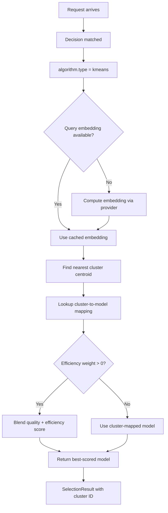

# KMeans

## Overview

`kmeans` is a selection algorithm that uses **cluster-based routing** to assign queries to candidate models. It partitions the query embedding space into clusters and maps each cluster to the best-performing model.

It aligns to `config/algorithm/selection/kmeans.yaml`.

**Implementation**: Rust via [Linfa](https://github.com/rust-ml/linfa) (`linfa-clustering`).

## Key Advantages

- Efficient inference: O(k×d) per query (k = clusters, d = embedding dimension).
- Natural grouping of query patterns into clusters.
- Works well when prompt traffic naturally falls into recurring categories.
- Efficiency weight parameter allows quality vs. throughput tradeoff.

## Algorithm Principle

1. **Training**: K-Means partitions training queries into `num_clusters` clusters using Lloyd's algorithm.
2. **Cluster-Model Assignment**: Each cluster is mapped to the best-performing model based on historical outcome quality.
3. **Inference**: New queries are embedded and assigned to the nearest cluster centroid. The cluster's mapped model is selected.

$$m^* = \arg\min_{c} \| \text{embed}(q) - \mu_c \|^2 \implies \text{model}(c^*)$$

When `efficiency_weight` > 0, the scoring blends cluster assignment with model efficiency:

$$\text{score}(m) = (1 - w) \cdot \text{quality}(m, c) + w \cdot \text{efficiency}(m)$$

## Select Flow



## What Problem Does It Solve?

Some prompt traffic naturally falls into recurring regions where the same model tends to win, but per-request learned ranking would be unnecessary overhead. `kmeans` turns those recurring regions into cluster-to-model assignments for fast, stable routing.

## When to Use

- Prompt traffic naturally groups into repeatable classes (e.g., math, coding, creative writing).
- You have a cluster-based selector for candidate models.
- You need efficient O(k×d) inference per request.
- Quality-weighted cluster assignment is sufficient (vs. non-linear MLP boundaries).

## Known Limitations

- Requires pre-training: clusters must be learned from historical data.
- Fixed number of clusters — too few loses granularity, too many overfits.
- Cannot adapt to new query patterns without retraining.
- Centroid-based assignment ignores cluster shape/size.

## Configuration

```yaml
algorithm:
  type: kmeans
  kmeans:
    num_clusters: 8                            # Number of clusters
    efficiency_weight: 0.0                     # Quality vs. efficiency tradeoff
    pretrained_path: .cache/ml-models/kmeans_model.json  # Pre-trained model
```

### Global ML Settings (optional)

```yaml
model_selection:
  ml:
    models_path: ".cache/ml-models"
    embedding_dim: 768
    kmeans:
      num_clusters: 8
      efficiency_weight: 0.0
      pretrained_path: .cache/ml-models/kmeans_model.json
```

### Parameters

| Parameter | Type | Default | Description |
|-----------|------|---------|-------------|
| `num_clusters` | int | `8` | Number of K-Means clusters |
| `efficiency_weight` | float | `0.0` | Efficiency vs. quality tradeoff (0–1) |
| `pretrained_path` | string | — | Path to pre-trained KMeans model (JSON format) |

## Training

See [ML Model Selection README](https://github.com/vllm-project/semantic-router/blob/main/src/semantic-router/pkg/modelselection/README.md) for the training pipeline. KMeans models are trained using Lloyd's algorithm on historical query embeddings.
