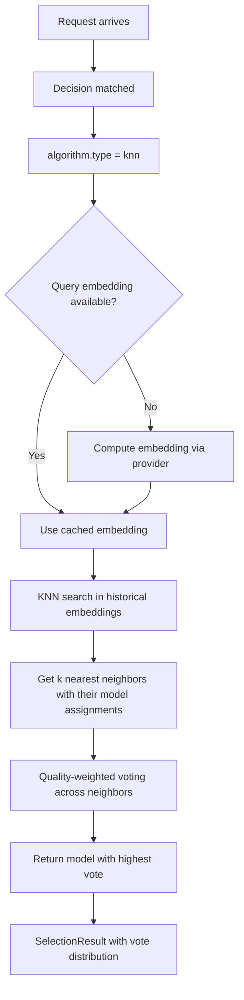

# KNN (K-Nearest Neighbors)

## Overview

`knn` is a selection algorithm that uses **K-Nearest Neighbors** for example-based model selection. It finds the k most similar historical queries and votes on the best model based on their outcomes.

It aligns to `config/algorithm/selection/knn.yaml`.

**Implementation**: Rust via [Linfa](https://github.com/rust-ml/linfa) (`linfa-nn`) for high-performance nearest-neighbor search.

## Key Advantages

- Interpretable: routing decisions can be traced back to similar historical examples.
- No training phase needed — just store and query examples.
- Works well when similar prompts should choose similar models.
- Quality-weighted voting considers the outcome quality of each neighbor.

## Algorithm Principle

1. **Embedding**: Each query is embedded into a dense vector.
2. **Search**: Find the k nearest neighbors in the historical query embedding space.
3. **Voting**: Each neighbor votes for the model that was used. Votes are weighted by the neighbor's outcome quality and inverse distance.
4. **Selection**: The model with the highest weighted vote is selected.

$$\text{score}(m) = \sum_{i \in \text{KNN}(q)} w_i \cdot \mathbb{1}[m_i = m]$$

Where $w_i = \text{quality}_i / \text{distance}_i$ combines outcome quality with distance-based weighting.

## Select Flow



## What Problem Does It Solve?

When routing should follow precedent from similar historical prompts, hand-written rules or fixed priorities lose useful local context. `knn` solves that by selecting models according to the nearest examples and their observed outcomes.

## When to Use

- You have historical prompt-to-model assignment data.
- Similar prompts should usually map to the same candidate model.
- The route should use retrieval-style selection instead of fixed ranking.
- You need interpretable routing decisions.

## Known Limitations

- Inference cost grows with historical data size (mitigated by approximate nearest-neighbor indexing).
- Performance depends on embedding quality — poor embeddings lead to poor matching.
- Cannot capture complex non-linear patterns (unlike MLP or SVM with non-linear kernels).
- Requires pre-computed embeddings for all historical queries.

## Configuration

```yaml
algorithm:
  type: knn
  knn:
    k: 5                                # Number of neighbors
    pretrained_path: .cache/ml-models/knn_model.json  # Pre-trained model
```

### Global ML Settings (optional)

```yaml
model_selection:
  ml:
    models_path: ".cache/ml-models"
    embedding_dim: 768
    knn:
      k: 5
      pretrained_path: .cache/ml-models/knn_model.json
```

### Parameters

| Parameter | Type | Default | Description |
|-----------|------|---------|-------------|
| `k` | int | `5` | Number of nearest neighbors to consider |
| `pretrained_path` | string | — | Path to pre-trained KNN model (JSON format) |

## Training

See [ML Model Selection README](https://github.com/vllm-project/semantic-router/blob/main/src/semantic-router/pkg/modelselection/README.md) for the training pipeline. KNN models are trained by collecting query-to-model assignment data and their outcomes, then serializing to JSON.
