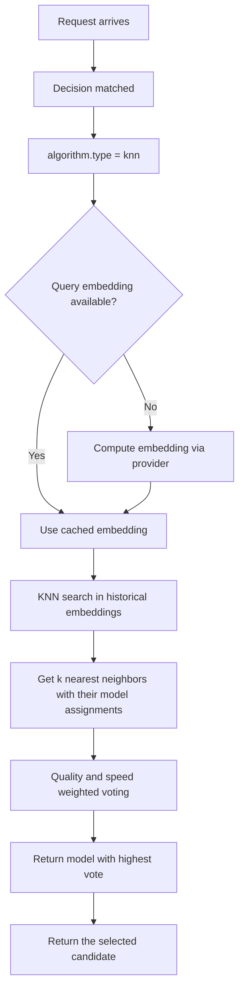

# KNN (K-Nearest Neighbors)

## Overview

`knn` chooses a candidate from the models that performed well on the most
similar recorded requests.

**Implementation**: Rust via [Linfa](https://github.com/rust-ml/linfa) (`linfa-nn`) for high-performance nearest-neighbor search.

## Key Advantages

- Interpretable: routing decisions can be traced back to similar historical examples.
- No online training step; the Router loads an artifact built from historical
  examples.
- Works well when similar prompts should choose similar models.
- Voting gives 90% of each neighbor's weight to outcome quality and 10% to
  relative speed.

## Algorithm Principle

1. **Embedding**: Each query is embedded into a dense vector.
2. **Search**: Find the k nearest neighbors in the historical query embedding space.
3. **Voting**: Each neighbor votes for the model that was used. Distance
   determines which examples enter the neighbor set; it does not change their
   vote weight. The vote combines recorded quality with latency normalized
   across the artifact.
4. **Selection**: The model with the highest weighted vote is selected.

$$\text{score}(m) = \sum_{i \in \text{KNN}(q)} w_i \cdot \mathbb{1}[m_i = m]$$

Where $w_i = 0.9 \cdot \text{quality}_i + 0.1 \cdot
\text{speed\_factor}_i$. The fastest recorded latency has a speed factor of
`1`; the slowest has `0`.

## Select Flow


```mermaid
flowchart TD
    A[Request arrives] --> B[Decision matched]
    B --> C[algorithm.type = knn]
    C --> D{Query embedding available?}
    D -- Yes --> E[Use cached embedding]
    D -- No --> F[Compute embedding via provider]
    F --> E
    E --> G[KNN search in historical embeddings]
    G --> H[Get k nearest neighbors with their model assignments]
    H --> I[Quality and speed weighted voting]
    I --> J[Return model with highest vote]
    J --> K[Return the selected candidate]
```

## What Problem Does It Solve?

When routing should follow precedent from similar historical prompts, hand-written rules or fixed priorities lose useful local context. `knn` solves that by selecting models according to the nearest examples and their observed outcomes.

## When to Use

- You have historical prompt-to-model assignment data.
- Similar prompts should usually map to the same candidate model.
- The route should use retrieval-style selection instead of fixed ranking.
- You need interpretable routing decisions.

## Known Limitations

- The BallTree is rebuilt from the loaded examples for each selection, so
  larger artifacts increase search and allocation cost.
- Performance depends on embedding quality — poor embeddings lead to poor matching.
- Cannot capture complex non-linear patterns (unlike MLP or SVM with non-linear kernels).
- Requires pre-computed embeddings for all historical queries.

## Configuration

```yaml
algorithm:
  type: knn
  ml:
    models_path: ".cache/ml-models"
    model_type: mmbert
    embedding_dim: 768
    knn:
      k: 5
      pretrained_path: .cache/ml-models/knn_model.json
```

`algorithm.ml` belongs to this Decision. Decisions in the same Recipe must
agree on `models_path`, `model_type`, `embedding_dim`, and repeated family
settings; different Recipes can use independent selector artifacts.

### Parameters

| Parameter | Type | Default | Description |
|-----------|------|---------|-------------|
| `k` | int | `5` | Number of nearest neighbors to consider |
| `pretrained_path` | string | — | Path to pre-trained KNN model (JSON format) |

## Training

See [ML Model Selection README](https://github.com/vllm-project/semantic-router/blob/main/src/semantic-router/pkg/modelselection/README.md) for the training pipeline. KNN artifacts are built from query embeddings, model assignments, outcome quality, and latency, then serialized to JSON.

KNN artifacts retain information derived from historical prompts and outcomes.
Apply the same access and retention policy as the source evaluation data. See
a complete example:
[`config/fragments/algorithm/selection/knn.yaml`](https://github.com/vllm-project/semantic-router/blob/main/config/fragments/algorithm/selection/knn.yaml).
