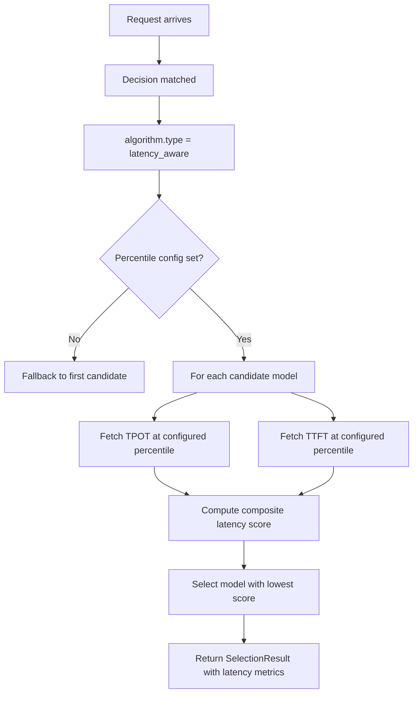

# Latency Aware

## Overview

`latency_aware` is a selection algorithm that prefers the fastest acceptable candidate according to **TPOT and TTFT percentile** statistics.

It aligns to `config/algorithm/selection/latency-aware.yaml`.

## Key Advantages

- Keeps latency SLOs visible at the route level.
- Balances **TPOT** (Time Per Output Token) and **TTFT** (Time To First Token).
- No model state to manage — purely data-driven from runtime metrics.
- Useful for routes where responsiveness matters more than absolute quality.

## Algorithm Principle

Latency-aware selection uses **percentile-based latency statistics** collected from runtime metrics to score each candidate model:

1. **Metric Lookup**: For each candidate model, fetch TPOT and TTFT values at the configured percentile from the metrics store.
2. **Scoring**: Compute a composite latency score. Lower values are better (faster).
3. **Selection**: Return the candidate with the lowest composite latency score.

The scoring combines TPOT and TTFT using min-max normalization:

$$\text{score}(m) = \hat{T}_{\text{TTFT}}(m) + \hat{T}_{\text{TPOT}}(m)$$

Where $\hat{T}$ denotes percentile value at the configured percentile level.

## Select Flow



## What Problem Does It Solve?

Some routes care more about responsiveness than absolute model quality and need to honor runtime latency SLOs. `latency_aware` selects the fastest acceptable candidate using observed TTFT and TPOT statistics instead of static assumptions.

## When to Use

- The route has multiple viable candidates but strict response-time goals.
- TTFT and TPOT should both influence the winner.
- Latency should be the main tie-breaker after the route matches.
- You have reliable latency metrics flowing into the metrics store.

## Known Limitations

- **Requires runtime metrics**: If percentile data is missing for all candidates, falls back to the first candidate with a warning.
- **Ignores quality**: Purely latency-based — may select a lower-quality but faster model.
- **Cold start**: New models without historical latency data are skipped.
- Cannot account for query complexity — uses aggregate percentiles.

## Configuration

```yaml
algorithm:
  type: latency_aware
  latency_aware:
    tpot_percentile: 90        # TPOT percentile (lower = stricter)
    ttft_percentile: 95        # TTFT percentile (lower = stricter)
    description: "Prefer fastest model within P90 TPOT and P95 TTFT"
```

### Parameters

| Parameter | Type | Default | Description |
|-----------|------|---------|-------------|
| `tpot_percentile` | int | `90` | TPOT percentile to use (50–99) |
| `ttft_percentile` | int | `95` | TTFT percentile to use (50–99) |
| `description` | string | — | Human-readable description of the latency policy |
