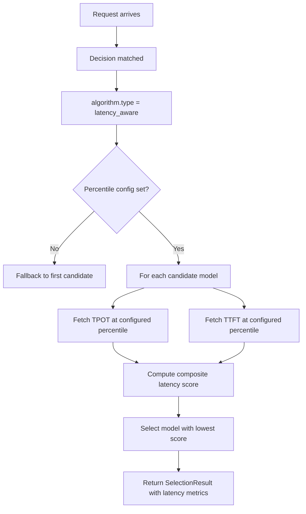

# Latency Aware

## Overview

`latency_aware` ranks eligible candidates using observed TTFT and TPOT
percentiles and selects the lowest relative-latency score.

It aligns to `config/fragments/algorithm/selection/latency-aware.yaml`.

## Key Advantages

- Compares candidates using the latency percentiles that matter to the route.
- Balances **TPOT** (Time Per Output Token) and **TTFT** (Time To First Token).
- No model state to manage — purely data-driven from runtime metrics.
- Useful for routes where responsiveness matters more than absolute quality.

## Algorithm Principle

Latency-aware selection uses **percentile-based latency statistics** collected from runtime metrics to score each candidate model:

1. **Metric Lookup**: For each candidate model, fetch TPOT and TTFT values at the configured percentile from the metrics store.
2. **Scoring**: Compute a composite latency score. Lower values are better (faster).
3. **Selection**: Return the candidate with the lowest composite latency score.

For each enabled metric, the selector divides a candidate's percentile value
by the best value among candidates with complete data, then averages the
ratios:

$$\text{score}(m) = \operatorname{mean}_{x \in M}
\frac{x(m)}{\min_j x(j)}$$

Here $M$ contains the configured TTFT and/or TPOT measurements. Lower scores
are better. These are relative rankings, not SLO ceilings.

## Select Flow


```mermaid
flowchart TD
    A[Request arrives] --> B[Decision matched]
    B --> C[algorithm.type = latency_aware]
    C --> D{Percentile config set?}
    D -- No --> E[Fallback to first candidate]
    D -- Yes --> F[For each candidate model]
    F --> G[Fetch TPOT at configured percentile]
    F --> H[Fetch TTFT at configured percentile]
    G --> I[Compute composite latency score]
    H --> I
    I --> J[Select model with lowest score]
    J --> K[Return SelectionResult with latency metrics]
```

## What Problem Does It Solve?

Some routes care more about responsiveness than absolute model quality.
`latency_aware` compares already eligible candidates using observed TTFT and
TPOT statistics instead of static assumptions. Use `multi_factor` when the
policy needs explicit latency limits alongside other factors.

## When to Use

- The route has multiple viable candidates and latency should determine the
  winner.
- TTFT and TPOT should both influence the winner.
- Latency should be the main tie-breaker after the route matches.
- You have reliable latency metrics flowing into the metrics store.

## Known Limitations

- **Requires runtime metrics**: If percentile data is missing for all candidates, falls back to the first candidate with a warning.
- **Ignores quality**: Purely latency-based — may select a lower-quality but faster model.
- **Cold start**: New models without historical latency data are skipped.
- Cannot account for query complexity — uses aggregate percentiles.

## Configuration

```yaml
algorithm:
  type: latency_aware
  latency_aware:
    tpot_percentile: 90        # Compare each model's observed P90 TPOT
    ttft_percentile: 95        # Compare each model's observed P95 TTFT
    description: "Prefer the lowest relative P90 TPOT and P95 TTFT"
```

### Parameters

| Parameter | Type | Default | Description |
|-----------|------|---------|-------------|
| `tpot_percentile` | int | unset (`0`) | TPOT percentile to compare (`1`–`100`) |
| `ttft_percentile` | int | unset (`0`) | TTFT percentile to compare (`1`–`100`) |
| `description` | string | — | Human-readable description of the latency policy |

Configure at least one percentile. Using both lets the selector consider
generation speed and time to first token together.

Latency observations are held by each Router process, so replicas can make
different choices and a newly started process falls back when it lacks data.
This selector does not enforce latency ceilings or account for model quality
or price. Maintained example:
[`config/fragments/algorithm/selection/latency-aware.yaml`](https://github.com/vllm-project/semantic-router/blob/main/config/fragments/algorithm/selection/latency-aware.yaml).
