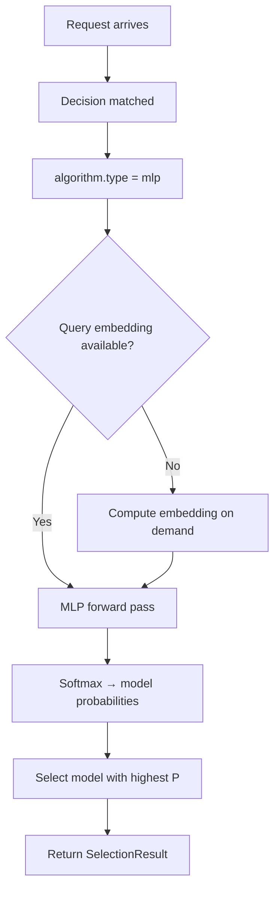

# MLP (Multi-Layer Perceptron)

## Overview

`mlp` is a GPU-accelerated neural network selection algorithm. It uses a Multi-Layer Perceptron to learn non-linear decision boundaries for model selection, trained on historical query-to-model assignment data.

It aligns to `config/algorithm/selection/mlp.yaml`.

**Reference**: This is part of the ML-based model selection family alongside KNN, KMeans, and SVM.

## Key Advantages

- Learns complex, non-linear decision boundaries that linear methods (KNN, SVM with linear kernel) cannot capture.
- GPU-accelerated inference via [Candle](https://github.com/huggingface/candle) for low-latency selection.
- Supports custom hidden layer sizes to balance model capacity and inference speed.
- Integrates into the same `decision.algorithm` surface as other selection algorithms.

## Algorithm Principle

MLP uses a feedforward neural network with configurable hidden layers to classify queries into candidate models:

1. **Feature Engineering**: Query embeddings (precomputed or on-demand) are concatenated with optional category one-hot encoding to form the input feature vector.
2. **Forward Pass**: The feature vector passes through hidden layers with ReLU activations, producing a probability distribution over candidate models.
3. **Selection**: The model with the highest output probability is selected.

```
Input: query_embedding (dim) + category_one_hot (num_categories)
  ↓
Hidden Layer 1: Linear(dim, h1) → ReLU
  ↓
Hidden Layer 2: Linear(h1, h2) → ReLU
  ↓
Output Layer: Linear(h2, num_models) → Softmax
  ↓
Output: P(model_i | query) for each candidate
```

## Select Flow



## What Problem Does It Solve?

Some routing boundaries are non-linear and cannot be captured well by static ordering or simpler linear rules. `mlp` learns those more complex query-to-model boundaries from historical data while keeping inference inside the selection layer.

## When to Use

- You need to capture complex non-linear patterns in query-to-model mapping.
- You have sufficient training data (>1000 labeled query-model assignments).
- GPU resources are available for accelerated inference.
- KNN/KMeans/SVM decision boundaries are insufficient for your workload.

## Known Limitations

- Requires pre-trained model weights; cannot start from scratch without training data.
- GPU dependency for optimal performance (falls back to CPU but slower).
- Unlike KNN, MLP is a "black box" — harder to interpret why a specific model was chosen.
- Training requires the separate `modelselection` training pipeline; see [ML Model Selection](https://github.com/vllm-project/semantic-router/blob/main/src/semantic-router/pkg/modelselection/README.md).

## Configuration

Use this fragment inside `routing.decisions[].algorithm`:

```yaml
algorithm:
  type: mlp
  mlp:
    device: cuda              # Options: cpu, cuda, metal
    pretrained_path: .cache/ml-models/mlp_model.json
```

### Global ML Settings (optional)

```yaml
model_selection:
  ml:
    models_path: ".cache/ml-models"
    embedding_dim: 768
    mlp:
      device: cuda
      pretrained_path: .cache/ml-models/mlp_model.json
```

### Parameters

| Parameter | Type | Default | Description |
|-----------|------|---------|-------------|
| `device` | string | `cpu` | Compute device: `cpu`, `cuda`, or `metal` (Apple Silicon) |
| `pretrained_path` | string | — | Path to pre-trained MLP model weights (JSON format) |

## Feedback

MLP does not support online `UpdateFeedback()`. To improve selection quality, retrain the model with new query-to-model assignment data using the training pipeline.

## Experimental Status

This algorithm is marked as **experimental**. The API may change in future releases.
