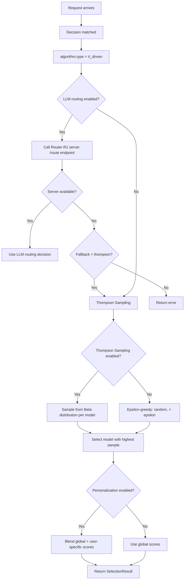
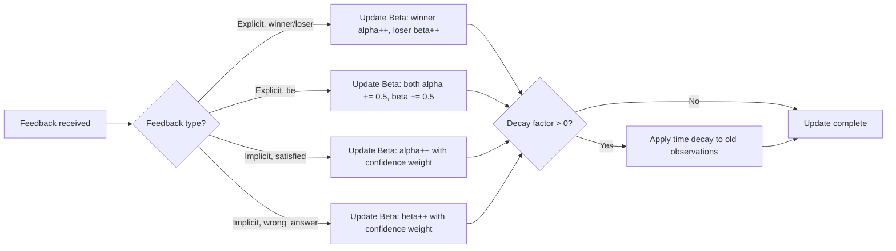

# RL Driven

## Overview

`rl_driven` is a selection algorithm for online exploration and personalization. It supports multiple sub-modes: **Thompson Sampling**, **Router-R1 (LLM-as-router)**, and **Concurrent (arena mode)**.

It aligns to `config/algorithm/selection/rl-driven.yaml`.

**Papers**:
- [Router-R1: Routing with Reinforcement Learning](https://arxiv.org/abs/2506.09033) — multi-round RL routing with reward structure
- [GMTRouter: Personalized LLM Router](https://arxiv.org/abs/2511.08590) — GNN-based personalized routing (related)

## Key Advantages

- Supports exploration instead of always exploiting the current best model.
- Thompson Sampling provides a principled exploration/exploitation balance.
- Router-R1 mode uses an LLM to reason about routing decisions.
- Per-user personalization adapts routing over time.
- Implicit feedback support (auto-detected satisfaction signals).

## Sub-Modes

### 1. Thompson Sampling (default)

Uses **Bayesian posterior sampling** for exploration/exploitation. Each model's success probability is modeled as a **Beta distribution** $\text{Beta}(\alpha, \beta)$:

$$\theta_m \sim \text{Beta}(\alpha_m, \beta_m)$$

At each request, a sample is drawn for each candidate model, and the model with the highest sample is selected:

$$m^* = \arg\max_m \theta_m$$

After feedback, the distribution is updated:
- **Win**: $\alpha_m \leftarrow \alpha_m + 1$
- **Loss**: $\beta_m \leftarrow \beta_m + 1$
- **Tie**: $\alpha_m \leftarrow \alpha_m + 0.5,\ \beta_m \leftarrow \beta_m + 0.5$

When `use_thompson_sampling: false`, falls back to **epsilon-greedy** with `exploration_rate` as $\epsilon$.

### 2. Router-R1 (LLM-as-Router)

When `enable_llm_routing: true`, an external LLM server analyzes the query and selects the optimal model using "think" and "route" actions from the Router-R1 paper.

**Reward structure**: $R = R_{\text{format}} + (1-\alpha) \cdot R_{\text{outcome}} + \alpha \cdot R_{\text{cost}}$

| Component | Description |
|-----------|-------------|
| $R_{\text{format}}$ | -1 for incorrect format, 0 for correct |
| $R_{\text{outcome}}$ | Based on exact match with ground truth |
| $R_{\text{cost}}$ | Inversely proportional to model size × output tokens |
| $\alpha$ | `cost_reward_alpha` — performance-cost tradeoff |

### 3. Concurrent (Arena Mode)

When used as a looper algorithm (`type: "concurrent"`), executes all candidate models concurrently and aggregates results — useful for A/B testing and arena evaluation.

## Select Flow (Thompson Sampling)



## Feedback Flow



## When to Use

- The route should keep exploring candidate models online.
- Personalization should adapt over time per user.
- Thompson Sampling is preferred when you want principled exploration without external dependencies.
- Router-R1 mode is preferred when you have a trained router LLM server.

## Known Limitations

- Thompson Sampling requires sufficient samples before exploiting effectively (`min_samples`).
- Router-R1 LLM routing adds latency (extra LLM call per request).
- Router-R1 mode requires a separate trained router LLM server.
- Exploration incurs short-term cost for long-term gain.

## Configuration

```yaml
algorithm:
  type: rl_driven
  rl_driven:
    # Exploration control
    exploration_rate: 0.3              # Initial exploration rate (epsilon)
    exploration_decay: 0.99            # Decay per 100 selections
    min_exploration: 0.05              # Minimum exploration rate
    use_thompson_sampling: true        # Use Thompson Sampling vs epsilon-greedy

    # Personalization
    enable_personalization: true       # Per-user preference tracking
    personalization_blend: 0.7         # 1.0=fully personalized, 0.0=fully global
    session_context_weight: 0.5        # Within-session feedback weight
    implicit_feedback_weight: 0.5      # Auto-detected feedback weight

    # Cost awareness
    cost_awareness: true               # Prefer cheaper models for exploration
    cost_weight: 0.2                   # Cost influence weight

    # Persistence
    storage_path: /var/lib/vsr/rl_state.json
    auto_save_interval: 30s

    # Router-R1 reward
    use_router_r1_rewards: false       # Enable Router-R1 reward computation
    cost_reward_alpha: 0.3             # Performance-cost tradeoff in reward
    format_reward_penalty: -1.0        # Penalty for incorrect format

    # LLM-as-Router
    enable_llm_routing: false          # Enable LLM-based routing
    router_r1_server_url: ""           # Router-R1 server URL
    llm_routing_fallback: thompson     # Fallback when LLM routing fails

    # Multi-round
    enable_multi_round_aggregation: false
```

### Parameters

| Parameter | Type | Default | Description |
|-----------|------|---------|-------------|
| `exploration_rate` | float | `0.3` | Initial exploration rate (0–1) |
| `exploration_decay` | float | `0.99` | Decay per 100 selections (0–1) |
| `min_exploration` | float | `0.05` | Minimum exploration rate (0–1) |
| `use_thompson_sampling` | bool | `true` | Thompson Sampling vs epsilon-greedy |
| `enable_personalization` | bool | `true` | Per-user preference tracking |
| `personalization_blend` | float | `0.7` | Global vs. personalized blend (0–1) |
| `session_context_weight` | float | `0.5` | Within-session feedback weight (0–1) |
| `implicit_feedback_weight` | float | `0.5` | Implicit feedback weight (0–1) |
| `cost_awareness` | bool | `true` | Prefer cheaper models for exploration |
| `cost_weight` | float | `0.2` | Cost influence weight |
| `use_router_r1_rewards` | bool | `false` | Enable Router-R1 reward structure |
| `cost_reward_alpha` | float | `0.3` | Performance-cost tradeoff (0=outcome, 1=cost) |
| `enable_llm_routing` | bool | `false` | Enable LLM-as-router mode |
| `router_r1_server_url` | string | — | URL of Router-R1 LLM server |
| `llm_routing_fallback` | string | `thompson` | Fallback when LLM routing fails |
| `storage_path` | string | — | Persist RL state to file |
| `auto_save_interval` | string | `30s` | Auto-save interval |
