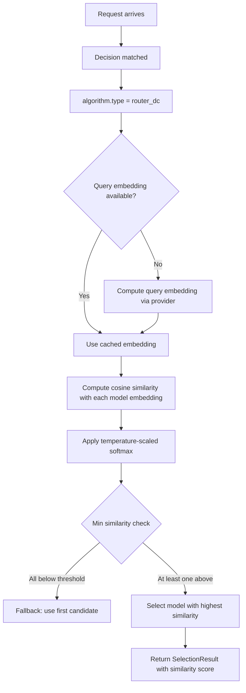

# Router DC (Dual-Contrastive)

## Overview

`router_dc` is a semantic selection algorithm that matches queries to models using **embedding similarity** via dual-contrastive learning.

It aligns to `config/algorithm/selection/router-dc.yaml`.

**Paper**: [Query-Based Router by Dual Contrastive Learning](https://arxiv.org/abs/2409.19886)

## Key Advantages

- Learns a semantic mapping between query embeddings and model capability embeddings.
- No explicit ranking rules needed — selection is driven by learned similarity.
- Supports both query-side and model-side contrastive learning.
- Useful when prompt semantics matter more than static priority or cost.

## Algorithm Principle

Router-DC learns two embedding spaces — one for queries, one for models — and brings matching query-model pairs closer together using **dual contrastive loss**:

1. **Query Embedding**: Each user query is encoded into a dense vector via the configured embedding provider.
2. **Model Embedding**: Each model is represented by an embedding derived from its description and optional capability tags.
3. **Contrastive Learning**: Positive pairs (query, correct model) are pushed together; negative pairs (query, wrong model) are pushed apart.
4. **Matching**: At inference time, the query embedding is compared to all model embeddings using **cosine similarity** with temperature-scaled softmax:

$$P(\text{model}_i \mid \text{query}) = \frac{\exp(\text{sim}(q, m_i) / \tau)}{\sum_j \exp(\text{sim}(q, m_j) / \tau)}$$

Where $\tau$ is the temperature (`temperature`, default 0.07).

## Select Flow



## Model Embedding Initialization

Models need descriptions for embedding-based matching. Configure descriptions in `modelCards`:

```yaml
routing:
  modelCards:
    - name: llama-3.2-1b
      description: "Fast small model for simple tasks, low cost"
      capabilities: ["summarization", "simple_qa"]
    - name: codellama-7b
      description: "Code generation specialist, good at programming tasks"
      capabilities: ["code_generation", "debugging"]
```

When `use_capabilities: true`, capability tags are concatenated with descriptions to enrich embeddings.

## When to Use

- The best candidate depends on semantic similarity between prompt and model profile.
- You want a learned selector without full online exploration.
- One route should route by semantic fit rather than only cost or latency.
- Models have descriptive profiles or capability tags.

## Known Limitations

- **Requires model descriptions**: If models lack descriptions, embedding quality degrades.
- **Cold query problem**: Rare query types may not match well with any model embedding.
- **Affinity matrix**: The query-model affinity matrix (`affinityMatrix` in code) is currently initialized but not actively updated online; it serves as a future extension point for online contrastive learning.
- **Temperature sensitivity**: Very low temperature makes the selector near-greedy; very high temperature makes it near-uniform.

## Configuration

```yaml
algorithm:
  type: router_dc
  router_dc:
    temperature: 0.07           # Softmax temperature (lower = sharper)
    dimension_size: 768         # Embedding dimension
    min_similarity: 0.3         # Minimum similarity threshold
    use_query_contrastive: true # Enable query-side contrastive learning
    use_model_contrastive: true # Enable model-side contrastive learning
    require_descriptions: false # Fail if models lack descriptions
    use_capabilities: true      # Include capability tags in embeddings
```

### Parameters

| Parameter | Type | Default | Description |
|-----------|------|---------|-------------|
| `temperature` | float | `0.07` | Softmax temperature (lower = more confident selection) |
| `dimension_size` | int | `768` | Embedding dimension size |
| `min_similarity` | float | `0.3` | Minimum similarity threshold for valid matches (0–1) |
| `use_query_contrastive` | bool | `true` | Enable query-side contrastive learning |
| `use_model_contrastive` | bool | `true` | Enable model-side contrastive learning |
| `require_descriptions` | bool | `false` | Require all models to have descriptions |
| `use_capabilities` | bool | `true` | Include capability tags in embedding text |

## Feedback

Router-DC supports `UpdateFeedback()` for online affinity updates. When feedback arrives, the query-model affinity matrix is updated to reflect observed preferences:

```bash
curl -X POST http://localhost:8000/api/v1/feedback \
  -H "Content-Type: application/json" \
  -d '{
    "query": "Write a Python function to sort a list",
    "winner_model": "codellama-7b",
    "decision_name": "coding"
  }'
```
