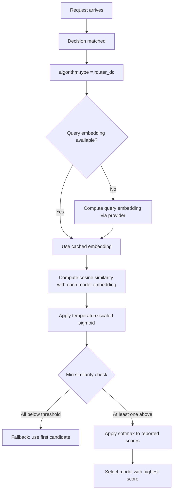

# Router DC

## Overview

`router_dc` embeds the request and each model description, then selects the
candidate with the strongest semantic similarity.

**Paper**: [Query-Based Router by Dual Contrastive Learning](https://arxiv.org/abs/2409.19886)

## Key Advantages

- Uses the configured embedding runtime for both requests and model profiles.
- No explicit ranking rules needed — selection is driven by description
  similarity.
- Useful when prompt semantics matter more than static priority or cost.

## Algorithm Principle

This selector is inspired by RouterDC, but the request path does
not train a dual encoder. It uses the same configured embedding function for
requests and model descriptions:

1. **Query Embedding**: Each user query is encoded into a dense vector via the configured embedding provider.
2. **Model Embedding**: Each model is represented by an embedding derived from its description and optional capability tags.
3. **Similarity**: It computes cosine similarity, divides by `temperature`,
   and applies a sigmoid.
4. **Selection**: It chooses the highest score above `min_similarity`, then
   applies a second temperature-scaled softmax for the returned score map.

$$
s_i = \sigma(\cos(q,m_i)/\tau), \qquad
P_i = \frac{\exp((s_i-\max_j s_j)/\tau)}{\sum_j
\exp((s_j-\max_k s_k)/\tau)}
$$

Where $\tau$ is the temperature (`temperature`, default 0.07).

## Select Flow


```mermaid
flowchart TD
    A[Request arrives] --> B[Decision matched]
    B --> C[algorithm.type = router_dc]
    C --> D{Query embedding available?}
    D -- Yes --> E[Use cached embedding]
    D -- No --> F[Compute query embedding via provider]
    F --> E
    E --> G[Compute cosine similarity with each model embedding]
    G --> H[Apply temperature-scaled sigmoid]
    H --> I{Min similarity check}
    I -- All below threshold --> J[Fallback: use first candidate]
    I -- At least one above --> K[Apply softmax to reported scores]
    K --> L[Select model with highest score]
```

## Model Embedding Initialization

Models need descriptions for embedding-based matching. Put them in each
human-authored Model card:

```yaml
models:
  - name: llama-3.2-1b
    card:
      description: Fast small model for simple tasks, low cost.
      capabilities: [summarization, simple_qa]
    connections:
      - provider: vllm
        endpoint: http://llama-3-2-1b:8000/v1
        model: llama-3.2-1b
  - name: codellama-7b
    card:
      description: Code generation specialist for programming tasks.
      capabilities: [code_generation, debugging]
    connections:
      - provider: vllm
        endpoint: http://codellama-7b:8000/v1
        model: codellama-7b
```

When `use_capabilities: true`, capability tags are concatenated with descriptions to enrich embeddings.

## What Problem Does It Solve?

Some workloads are primarily semantic matching problems where the best model
depends on the request meaning more than explicit heuristics. `router_dc`
matches that request to operator-written model descriptions instead of relying
only on static priority or cost rules.

## When to Use

- The best candidate depends on semantic similarity between prompt and model profile.
- You want a learned selector without full online exploration.
- One route should route by semantic fit rather than only cost or latency.
- Models have descriptive profiles or capability tags.

## Known Limitations

- **Requires model descriptions**: If models lack descriptions, embedding quality degrades.
- **Cold query problem**: Rare query types may not match well with any model embedding.
- **Temperature sensitivity**: Very low temperature makes the selector near-greedy; very high temperature makes it near-uniform.

## Configuration

```yaml
algorithm:
  type: router_dc
  router_dc:
    temperature: 0.07           # Softmax temperature (lower = sharper)
    min_similarity: 0.3         # Minimum similarity threshold
    require_descriptions: false # Fail if models lack descriptions
    use_capabilities: true      # Include capability tags in embeddings
```

### Parameters

| Parameter | Type | Default | Description |
|-----------|------|---------|-------------|
| `temperature` | float | `0.07` | Softmax temperature (lower = more confident selection) |
| `dimension_size` | int | `768` | Accepted compatibility field; the current selector uses the vectors returned by the embedding function |
| `min_similarity` | float | `0.3` | Minimum similarity threshold for valid matches (0–1) |
| `use_query_contrastive` | bool | `true` | Accepted compatibility field; it does not enable request-time training |
| `use_model_contrastive` | bool | `true` | Accepted compatibility field; it does not enable request-time training |
| `require_descriptions` | bool | `false` | Require all models to have descriptions |
| `use_capabilities` | bool | `true` | Include capability tags in embedding text |

## Outcome Feedback

Use the Router Learning outcome endpoint to record replay-linked feedback for
offline analysis and learning diagnostics. The router response includes
`x-vsr-replay-id`; send that value back with the model outcome:

```bash
curl -sS -X POST http://localhost:8899/v1/router/outcomes \
  -H "Authorization: Bearer ${VSR_API_KEY}" \
  -H "Content-Type: application/json" \
  -H "Idempotency-Key: router-dc-feedback-001" \
  -d '{
    "replay_id": "replay_01J...",
    "target": "model",
    "target_ref": "model/codellama-7b",
    "target_revision": 7,
    "verdict": "good_fit",
    "reason": "good_code_response",
    "score": 1.0,
    "metadata": {
      "decision": "coding"
    }
  }'
```

The public endpoint accepts only feedback for a replay owned by the same
logical API key and for the exact Model revision that served it. It records an
immutable outcome and publishes a revisioned, rebuildable learning projection;
it does not mutate RouterDC's similarity model in process memory.

Router DC sends request text through the configured embedding runtime. With a
remote embedding provider, that text crosses the provider boundary. Model-card
descriptions and embedding thresholds must be evaluated together. See a
complete example:
[`config/fragments/algorithm/selection/router-dc.yaml`](https://github.com/vllm-project/semantic-router/blob/main/config/fragments/algorithm/selection/router-dc.yaml).
