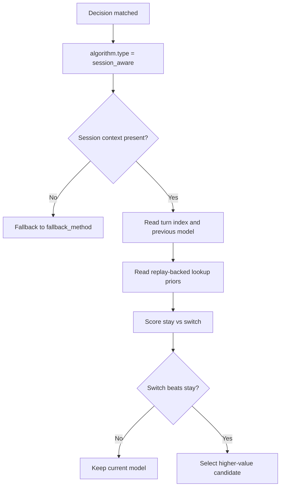

# Session Aware

## Overview

`session_aware` is a selection algorithm for multi-turn conversations. It prefers staying on the current model unless runtime session facts and replay-backed lookup-table priors indicate that switching to another candidate is worth the handoff cost.

It aligns to `config/algorithm/selection/session-aware.yaml`.

## Key Advantages

- Makes mid-session stay-versus-switch behavior explicit in config.
- Uses replay-backed priors instead of hard-coding one-off heuristics per route.
- Preserves a conservative fallback path when session context is missing.
- Keeps multi-turn routing auditable at the same layer as the rest of `decision.algorithm`.

## What Problem Does It Solve?

Plain single-turn selectors only score the current request. In a multi-turn session, switching models also has a continuity cost: cache warmth, handoff penalty, and the loss of the current model's conversational context.

`session_aware` solves that by combining runtime-derived session facts with replay-backed priors so the router can decide whether to stay on the current model or switch to a better candidate.

## When to Use

Use `session_aware` when:

- one decision serves multi-turn traffic
- the current model choice should depend on prior turns
- switching models has a meaningful continuity or cache cost
- you want a conservative fallback such as `static` or `hybrid`

## Configuration

```yaml
algorithm:
  type: session_aware
  session_aware:
    fallback_method: hybrid
    min_turns_before_switch: 2
    stay_bias: 0.3
    quality_gap_multiplier: 1.15
    handoff_penalty_weight: 0.9
    remaining_turn_weight: 0.45
```

### Parameters

| Parameter | Type | Default | Description |
|-----------|------|---------|-------------|
| `fallback_method` | string | `static` | Selector used when session context is unavailable or insufficient |
| `min_turns_before_switch` | int | `1` | Minimum turn depth before the selector considers switching |
| `stay_bias` | float | `0.25` | Baseline preference for keeping the current session model |
| `quality_gap_multiplier` | float | `1.0` | Weight applied to replay-backed quality-gap estimates |
| `handoff_penalty_weight` | float | `1.0` | Weight applied to replay-derived switch penalties |
| `remaining_turn_weight` | float | `0.15` | Extra value for continuity when more turns are expected |

## Select Flow



## Runtime Inputs

`session_aware` depends on runtime-derived facts that the router already injects into the selection context:

- current `session_id`
- `turn_index`
- `previous_model`
- replay-derived quality-gap / handoff-penalty priors
- expected remaining-turn value inferred by the selector

## Known Limitations

- It relies on replay-backed priors, so cold-start data is less informative.
- It is intentionally narrower than the earlier `SESSION_STATE` design; there is no general-purpose DSL state machine here.
- It optimizes stay-versus-switch behavior inside one matched decision, not full fleet-wide RL policy tuning.
