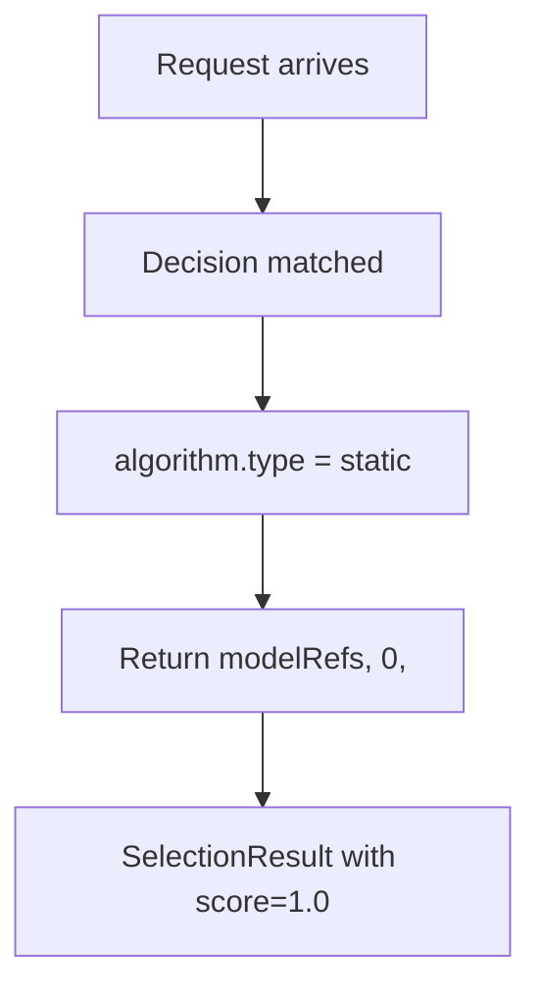

# Static

## Overview

`static` is the simplest selection algorithm: the route keeps its candidate list, and the selection policy stays fixed. The first candidate in `modelRefs` always wins.

It aligns to `config/algorithm/selection/static.yaml`.

## Key Advantages

- **Zero overhead**: No computation, no state, no external dependencies.
- Deterministic and easy to reason about.
- No learned selector state or runtime tuning.
- Good default when the candidate order is already intentional.

## Algorithm Principle

Static selection is trivial — return the first candidate model from the `modelRefs` list:

```
SelectionResult {
  SelectedModel: modelRefs[0].model,
  Score: 1.0,
  Confidence: 1.0,
  Method: "static",
  Reasoning: "Static selection: using first candidate"
}
```

## What Problem Does It Solve?

Some routes already have an intentional candidate order and do not need extra ranking logic, learned state, or runtime metrics. `static` keeps selection deterministic and transparent by always taking the first configured candidate.

## Select Flow



## When to Use

- One candidate should always win after the route matches.
- Model ordering is already curated outside the algorithm layer.
- You want the simplest possible route-local selection policy.
- No learning or adaptation is needed.

## Configuration

```yaml
algorithm:
  type: static
```

No additional parameters. The selected model is always the first entry in `modelRefs`.
