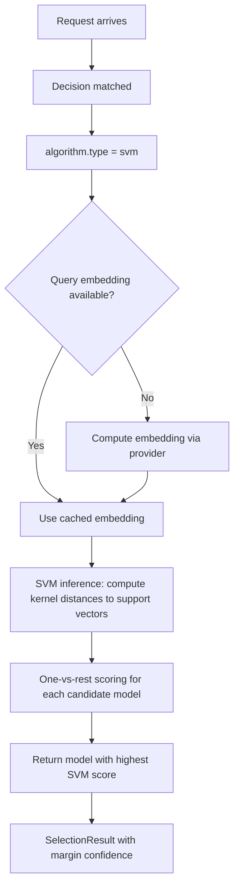

# SVM (Support Vector Machine)

## Overview

`svm` is a selection algorithm that uses a **Support Vector Machine** classifier for model selection. It learns decision boundaries between query types and candidate models.

It aligns to `config/algorithm/selection/svm.yaml`.

**Implementation**: Rust via [Linfa](https://github.com/rust-ml/linfa) (`linfa-svm`).

## Key Advantages

- Learns explicit decision boundaries — interpretable via support vectors.
- **RBF kernel** captures non-linear patterns in query-to-model mapping.
- Lightweight inference compared to neural network approaches.
- Well-understood theoretical guarantees (maximum margin).

## Algorithm Principle

SVM finds the hyperplane that maximizes the margin between different model classes:

$$\min_{w, b} \frac{1}{2} \|w\|^2 + C \sum_{i} \xi_i$$

$$\text{s.t. } y_i(w^T \phi(x_i) + b) \geq 1 - \xi_i, \quad \xi_i \geq 0$$

With the **RBF (Radial Basis Function) kernel**:

$$K(x_i, x_j) = \exp(-\gamma \|x_i - x_j\|^2)$$

Where:
- $\gamma$ controls the kernel width (default 1.0)
- $C$ is the regularization parameter
- $\phi(x)$ is the implicit feature map from the kernel trick

For multi-class selection (more than 2 candidates), the implementation uses one-vs-rest classification.

## Select Flow



## When to Use

- You have an SVM-based selector artifact for the route.
- Lightweight learned classification is enough for model choice.
- You want learned selection with interpretable decision boundaries.
- The query-to-model mapping has clear non-linear patterns.

## Known Limitations

- Requires pre-training from historical query-to-model assignment data.
- RBF kernel hyperparameters (γ, C) need tuning for optimal performance.
- Multi-class SVM uses one-vs-rest, which can be suboptimal for many candidates.
- Does not support online learning — must be retrained for new patterns.

## Configuration

```yaml
algorithm:
  type: svm
  svm:
    kernel: rbf                           # Kernel type: rbf, linear, polynomial
    gamma: 1.0                            # RBF kernel width parameter
    pretrained_path: .cache/ml-models/svm_model.json  # Pre-trained model
```

### Global ML Settings (optional)

```yaml
model_selection:
  ml:
    models_path: ".cache/ml-models"
    embedding_dim: 768
    svm:
      kernel: rbf
      gamma: 1.0
      pretrained_path: .cache/ml-models/svm_model.json
```

### Parameters

| Parameter | Type | Default | Description |
|-----------|------|---------|-------------|
| `kernel` | string | `rbf` | Kernel type: `rbf`, `linear`, or `polynomial` |
| `gamma` | float | `1.0` | RBF kernel width (higher = tighter decision boundaries) |
| `pretrained_path` | string | — | Path to pre-trained SVM model (JSON format) |

## Training

See [ML Model Selection README](https://github.com/vllm-project/semantic-router/blob/main/src/semantic-router/pkg/modelselection/README.md) for the training pipeline. SVM models are trained on labeled query-to-model assignment data using Linfa's SVM implementation.
