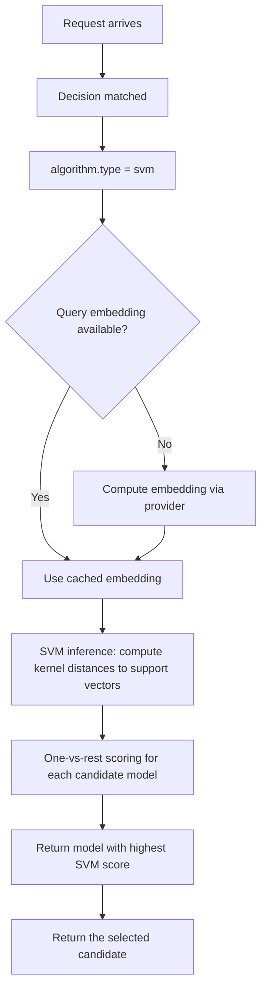

# SVM (Support Vector Machine)

## Overview

`svm` uses a trained linear or RBF support-vector classifier to map request
features to a candidate model.

**Implementation**: Rust via [Linfa](https://github.com/rust-ml/linfa) (`linfa-svm`).

## Key Advantages

- Learns explicit decision boundaries — interpretable via support vectors.
- **RBF kernel** captures non-linear patterns in query-to-model mapping.
- Lightweight inference compared to neural network approaches.
- Well-understood theoretical guarantees (maximum margin).

## Algorithm Principle

SVM finds the hyperplane that maximizes the margin between different model classes:

$$\min_{w, b} \frac{1}{2} \|w\|^2 + C \sum_{i} \xi_i$$

$$\text{s.t. } y_i(w^T \phi(x_i) + b) \geq 1 - \xi_i, \quad \xi_i \geq 0$$

With the **RBF (Radial Basis Function) kernel**:

$$K(x_i, x_j) = \exp(-\gamma \|x_i - x_j\|^2)$$

The loaded RBF artifact contains the gamma used by its classifiers. Training
also determines the support vectors, coefficients, and regularization.

Multi-class selection (more than 2 candidates) uses one-vs-rest classification.

## Select Flow


```mermaid
flowchart TD
    A[Request arrives] --> B[Decision matched]
    B --> C[algorithm.type = svm]
    C --> D{Query embedding available?}
    D -- Yes --> E[Use cached embedding]
    D -- No --> F[Compute embedding via provider]
    F --> E
    E --> G[SVM inference: compute kernel distances to support vectors]
    G --> H[One-vs-rest scoring for each candidate model]
    H --> I[Return model with highest SVM score]
    I --> J[Return the selected candidate]
```

## What Problem Does It Solve?

Some workloads need a lightweight learned classifier with clearer decision boundaries than heuristic routing but less operational cost than deeper neural selectors. `svm` addresses that by learning margin-maximizing query-to-model boundaries over the routing features.

## When to Use

- You have an SVM-based selector artifact for the route.
- Lightweight learned classification is enough for model choice.
- You want learned selection with interpretable decision boundaries.
- The query-to-model mapping has clear non-linear patterns.

## Known Limitations

- Requires pre-training from historical query-to-model assignment data.
- RBF hyperparameters must be tuned while building the artifact; the Router
  does not retune them at request time.
- Multi-class SVM uses one-vs-rest, which can be suboptimal for many candidates.
- Does not support online learning — must be retrained for new patterns.

## Configuration

```yaml
algorithm:
  type: svm
  ml:
    models_path: ".cache/ml-models"
    embedding_dim: 768
    svm:
      kernel: rbf
      gamma: 1.0
      pretrained_path: .cache/ml-models/svm_model.json
```

`algorithm.ml` belongs to this Decision. Decisions in the same Recipe must
agree on shared settings and repeated family settings.

### Parameters

| Parameter | Type | Default | Description |
|-----------|------|---------|-------------|
| `kernel` | string | `rbf` | Empty-selector kernel: `rbf` (or `gaussian`) and `linear` are supported; other values fall back to linear |
| `gamma` | float | `1.0` | RBF-kernel setting recorded with the selector configuration; loaded artifacts retain their trained value |
| `pretrained_path` | string | — | Path to pre-trained SVM model (JSON format) |

## Training

See [ML Model Selection README](https://github.com/vllm-project/semantic-router/blob/main/src/semantic-router/pkg/modelselection/README.md) for the training pipeline. SVM models are trained on labeled query-to-model assignment data using Linfa's SVM implementation.

Training examples and labels can contain sensitive request data; govern them
and the derived artifact accordingly. See a complete example:
[`config/fragments/algorithm/selection/svm.yaml`](https://github.com/vllm-project/semantic-router/blob/main/config/fragments/algorithm/selection/svm.yaml).
