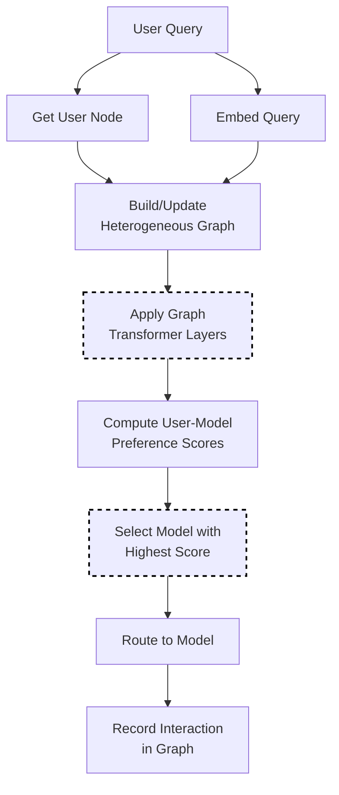

# GMTRouter Selection

GMTRouter uses a heterogeneous graph neural network (GNN) to learn personalized routing decisions based on multi-turn user-model-query interactions. It builds a graph of relationships and learns which models work best for each user over time.

This personalized approach can achieve **0.9% - 21.6% higher accuracy** and **0.006 - 0.309 higher AUC** compared to non-personalized routing, adapting to new users with few-shot data ([GMTRouter](https://arxiv.org/abs/2511.08590)).

## Algorithm Flow



## Mathematical Foundation

### Heterogeneous Graph Structure

The graph contains multiple node types to capture rich interaction patterns:

```text
G = (V, E) where V = V_user ∪ V_query ∪ V_model ∪ V_category ∪ V_feedback
```

Node types:

- **User nodes**: Represent individual users with their preferences
- **Query nodes**: Represent queries submitted by users
- **Model nodes**: Represent available LLMs
- **Category nodes**: Group queries by topic/type
- **Feedback nodes**: Capture user satisfaction signals

### Graph Transformer Layer

Each layer applies multi-head attention:

```text
h'_v = Σ_{u∈N(v)} α_vu · W · h_u

where:
  α_vu = softmax(Q_v · K_u^T / √d)
  Q_v = W_Q · h_v  (query)
  K_u = W_K · h_u  (key)
```

### User-Model Preference Score

Final preference computed via attention:

```text
score(u, m) = σ(h_u^T · W_pref · h_m)

where:
  h_u = user embedding
  h_m = model embedding
  σ = sigmoid activation
```

### Message Passing

Information propagates through the graph:

```text
h_v^(l+1) = ReLU(Σ_{r∈R} Σ_{u∈N_r(v)} 1/|N_r(v)| · W_r^(l) · h_u^(l))
```

## Core Algorithm (Go)

```go
// Select using graph-based preference learning
func (s *GMTRouterSelector) Select(ctx context.Context, selCtx *SelectionContext) (*SelectionResult, error) {
    userID := s.getUserID(selCtx)
    queryEmbed := s.embedQuery(selCtx.Query)
    
    // Update graph with new query node
    s.addQueryNode(userID, queryEmbed)
    
    // Run graph transformer layers
    embeddings := s.runGraphTransformer(userID)
    
    // Compute preference scores
    var bestModel string
    var bestScore float64 = -1
    
    for _, candidate := range selCtx.CandidateModels {
        userEmbed := embeddings.User[userID]
        modelEmbed := embeddings.Model[candidate.Model]
        
        score := s.computePreference(userEmbed, modelEmbed)
        
        if score > bestScore {
            bestScore = score
            bestModel = candidate.Model
        }
    }
    
    return &SelectionResult{
        SelectedModel: bestModel,
        Score:         bestScore,
        Method:        MethodGMTRouter,
    }, nil
}
```

## How It Works

1. Build a heterogeneous graph with 5 node types: users, queries, models, categories, feedback
2. Apply Graph Transformer layers to learn embeddings
3. Compute user-specific model preferences via attention
4. Select the model with highest preference score for the user

## Configuration

```yaml
decision:
  algorithm:
    type: gmtrouter
    gmtrouter:
      num_layers: 2           # GNN depth
      hidden_dim: 64          # Embedding dimension
      num_heads: 4            # Attention heads
      learn_preferences: true # Enable preference learning
      model_path: null        # Optional pre-trained weights

models:
  - name: gpt-4
    backend: openai
  - name: gpt-3.5-turbo
    backend: openai
  - name: claude-3-opus
    backend: anthropic
```

## Key Parameters

| Parameter | Default | Description |
|-----------|---------|-------------|
| `num_layers` | 2 | Number of GNN layers (1-5) |
| `hidden_dim` | 64 | Hidden dimension size |
| `num_heads` | 4 | Number of attention heads |
| `learn_preferences` | true | Enable online preference learning |
| `model_path` | null | Path to pre-trained model weights |

## Graph Structure

GMTRouter builds a graph with these node types:

```
User ←→ Query ←→ Model
  ↓       ↓        ↓
  └─→ Category ←──┘
         ↓
      Feedback
```

Edges represent:

- User-Query: User submitted this query
- Query-Model: Query was routed to this model
- Model-Category: Model specializes in this category
- Feedback: User feedback on model response

## Pre-training (Optional)

For better cold-start performance, pre-train on historical data:

```bash
cd src/training/rl_model_selection
python train_gmtrouter.py --data_path ./data/interactions.json
```

Then reference the model:

```yaml
gmtrouter:
  model_path: /models/gmtrouter_trained.pt
```

## When to Use GMTRouter

**Good for:**

- Multi-user environments with diverse preferences
- Systems with rich interaction history
- Personalization requirements

**Consider alternatives when:**

- Few users (not enough data for personalization)
- No historical data available
- Latency-critical applications (GNN adds ~10ms)

## Best Practices

1. **Start without pre-training**: Online learning works for many cases
2. **Collect interaction data**: More data = better personalization
3. **Monitor per-user metrics**: Verify personalization is working
4. **Use moderate hidden_dim**: 64 balances quality and speed
