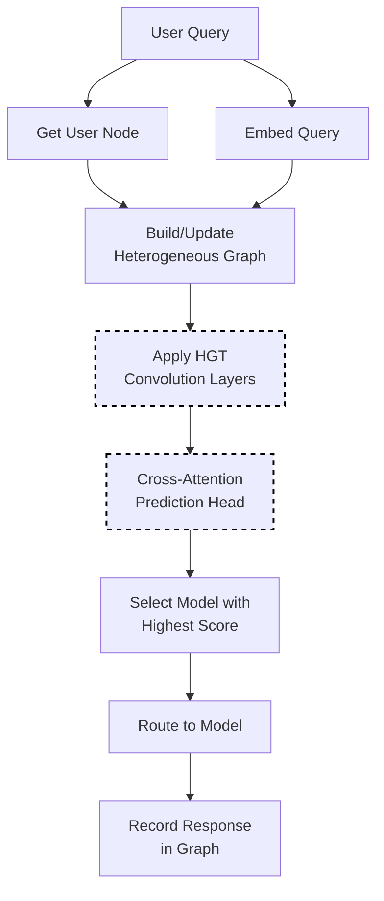

# GMTRouter Selection

GMTRouter uses a heterogeneous graph neural network to learn personalized routing decisions based on multi-turn user interactions. It builds a graph capturing user-LLM-query-response relationships and learns which models work best for each user over time.

This personalized approach can achieve **0.9% - 21.6% higher accuracy** and **0.006 - 0.309 higher AUC** compared to non-personalized routing.

> **Reference**: [GMTRouter: Personalized LLM Router over Multi-turn User Interactions](https://arxiv.org/abs/2511.08590) by Wang et al. Our implementation is inspired by this paper's graph-based personalization approach.

## Algorithm Flow



## Mathematical Foundation

### Heterogeneous Graph Structure

The graph contains 4 node types to capture multi-turn interaction patterns:

```text
G = (V, E) where V = V_user ∪ V_llm ∪ V_query ∪ V_response
```

Node types:

- **User nodes**: Represent individual users with their interaction history
- **LLM nodes**: Represent available language models
- **Query nodes**: Represent queries submitted by users
- **Response nodes**: Capture model outputs and quality signals

Virtual **turn nodes** connect sequential interactions within a conversation.

### HGT Convolution Layer

The paper uses Heterogeneous Graph Transformer (HGT) convolution with layer normalization:

```text
h_v^(l+1) = LayerNorm(h_v^(l) + HGTConv(h_v^(l), {h_u^(l) : u ∈ N(v)}))

HGTConv applies type-specific attention:
  Attention(v, u) = softmax_u(W_τ(v),τ(u) · h_v · h_u^T / √d)
```

where τ(v) denotes the node type of v.

### Cross-Attention Prediction Head

Final user-model preference score uses cross-attention:

```text
s_{u,q,m} = f_pred(h_u^(L), h_q^(0), h_m^(L))

where:
  h_u^(L) = user embedding after L layers
  h_q^(0) = query embedding
  h_m^(L) = model embedding after L layers
```

## Core Algorithm (Go)

```go
// Select using graph-based preference learning
func (s *GMTRouterSelector) Select(ctx context.Context, selCtx *SelectionContext) (*SelectionResult, error) {
    userID := s.getUserID(selCtx)
    queryEmbed := s.embedQuery(selCtx.Query)
    
    // Update graph with new query node
    s.addQueryNode(userID, queryEmbed)
    
    // Run HGT convolution layers
    embeddings := s.runHGTLayers(userID)
    
    // Compute preference scores via cross-attention
    var bestModel string
    var bestScore float64 = -1
    
    for _, candidate := range selCtx.CandidateModels {
        userEmbed := embeddings.User[userID]
        modelEmbed := embeddings.LLM[candidate.Model]
        
        score := s.crossAttentionPredict(userEmbed, queryEmbed, modelEmbed)
        
        if score > bestScore {
            bestScore = score
            bestModel = candidate.Model
        }
    }
    
    return &SelectionResult{
        SelectedModel: bestModel,
        Score:         bestScore,
        Method:        MethodGMTRouter,
    }, nil
}
```

## How It Works

1. Build a heterogeneous graph with 4 node types: users, LLMs, queries, responses
2. Connect nodes to form multi-turn interaction chains (via virtual turn nodes)
3. Apply HGT convolution layers to learn embeddings
4. Use cross-attention prediction head to compute user-specific model preferences
5. Select the model with highest preference score for the user

## Configuration

```yaml
decision:
  algorithm:
    type: gmtrouter
    gmtrouter:
      num_layers: 2           # HGT layer depth
      hidden_dim: 64          # Embedding dimension
      num_heads: 4            # Attention heads
      learn_preferences: true # Enable preference learning
      model_path: null        # Optional pre-trained weights

models:
  - name: gpt-4
    backend: openai
  - name: gpt-3.5-turbo
    backend: openai
  - name: claude-3-opus
    backend: anthropic
```

## Key Parameters

| Parameter | Default | Description |
|-----------|---------|-------------|
| `num_layers` | 2 | Number of HGT layers (1-5) |
| `hidden_dim` | 64 | Hidden dimension size |
| `num_heads` | 4 | Number of attention heads |
| `learn_preferences` | true | Enable online preference learning |
| `model_path` | null | Path to pre-trained model weights |

## Graph Structure

GMTRouter builds a graph capturing multi-turn interactions:

```
User ←→ Query ←→ Response ←→ LLM
         ↑           ↑
         └── Turn ───┘
```

Edges represent:

- User-Query: User submitted this query
- Query-Response: Query received this response
- Response-LLM: Response was generated by this LLM
- Turn edges: Connect sequential interactions in a conversation

## Pre-training (Optional)

For better cold-start performance, pre-train on historical data:

```bash
cd src/training/rl_model_selection
python train_gmtrouter.py --data_path ./data/interactions.json
```

Then reference the model:

```yaml
gmtrouter:
  model_path: /models/gmtrouter_trained.pt
```

## When to Use GMTRouter

**Good for:**

- Multi-user environments with diverse preferences
- Systems with rich multi-turn interaction history
- Personalization requirements across conversations

**Consider alternatives when:**

- Few users (not enough data for personalization)
- No historical data available
- Latency-critical applications (GNN adds ~10ms)

## Best Practices

1. **Start without pre-training**: Online learning works for many cases
2. **Collect interaction data**: More turns = better personalization
3. **Monitor per-user metrics**: Verify personalization is working
4. **Use moderate hidden_dim**: 64 balances quality and speed
