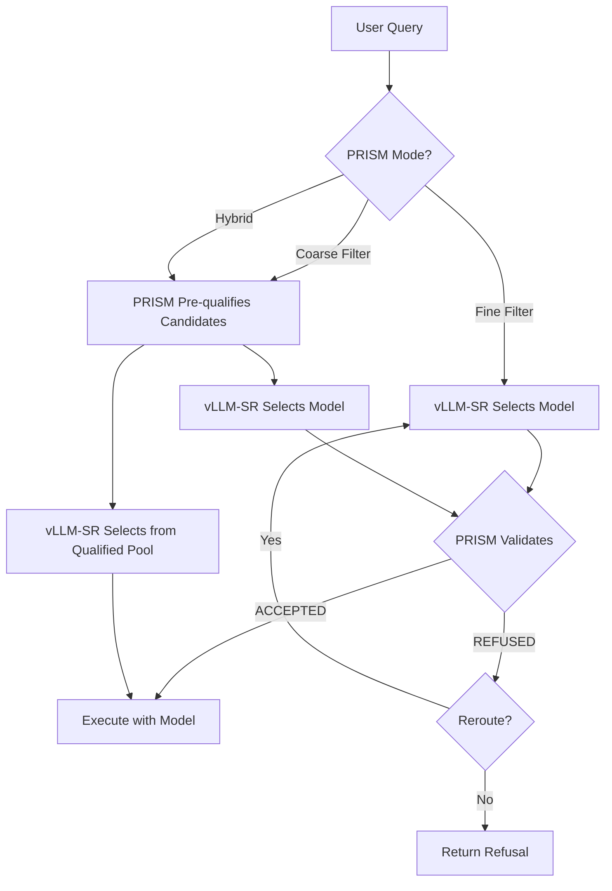

# PRISM 153-Key Legitimacy Verification

PRISM (Protocol for Routed Intelligent Specialized Models) adds a **legitimacy verification layer** to model selection. While vLLM-SR answers *"which model is best suited?"*, PRISM answers *"is this model legitimate to respond?"*

The core mechanism is the **153-key** — a constraint protocol that forces each model to explicitly declare its domain boundaries and formally refuse any out-of-scope query. Refusal is a first-class output, not a fallback.

## How It Works



## Integration Options

PRISM supports three integration modes, configurable per-decision:

| Option | Mode | PRISM Position | Complexity | Ideal For |
|--------|------|---------------|------------|-----------|
| 1 | `fine_filter` | After selection | 🟢 Low | Cloud enterprise |
| 2 | `coarse_filter` | Before selection | 🟡 Medium | Sovereign on-premise (GDPR) |
| 3 | `hybrid` | Both sides | 🔴 High | Critical enterprise (healthcare, legal) |

### Option 1 — Fine Filter (Default)

PRISM validates the selected model **after** vLLM-SR has made its choice. If the model is refused, the system re-routes to the next best candidate.

```yaml
decisions:
  - name: medical
    description: "Medical queries"
    modelRefs:
      - model: "med-llama"
      - model: "general-llama"
    algorithm:
      type: "elo"
      prism:
        enabled: true
        mode: fine_filter
        domain_threshold: 0.3
        refusal_policy: reroute
        max_reroute_attempts: 3
```

### Option 2 — Coarse Filter

PRISM pre-qualifies candidates **before** vLLM-SR selection. Only models whose declared domains match the query enter the selection pool.

```yaml
decisions:
  - name: legal
    description: "Legal compliance queries"
    modelRefs:
      - model: "legal-expert"
      - model: "general-model"
      - model: "code-model"
    algorithm:
      type: "router_dc"
      prism:
        enabled: true
        mode: coarse_filter
        domain_threshold: 0.3
```

### Option 3 — Hybrid

Both coarse and fine filtering applied for maximum legitimacy assurance.

```yaml
decisions:
  - name: healthcare
    description: "Healthcare queries — maximum verification"
    modelRefs:
      - model: "clinical-llm"
      - model: "research-llm"
      - model: "general-llm"
    algorithm:
      type: "hybrid"
      prism:
        enabled: true
        mode: hybrid
        domain_threshold: 0.4
        refusal_policy: reject
```

## Domain Boundaries

Models declare their domain boundaries through existing `model_config` fields:

```yaml
model_config:
  med-llama:
    description: "Specialized in medical diagnosis, clinical reasoning, and healthcare"
    capabilities: ["medical", "clinical", "diagnosis", "healthcare"]
  legal-expert:
    description: "Expert in legal analysis, compliance, and regulatory frameworks"
    capabilities: ["legal", "compliance", "regulatory"]
  general-llama:
    description: "General-purpose language model for diverse tasks"
```

PRISM uses these declarations to:
1. **Keyword matching**: Check if query terms overlap with model capabilities
2. **Embedding similarity**: Compare query embeddings with model description embeddings

Models without declared domain boundaries are accepted by default (generalist models).

## Configuration Reference

| Parameter | Type | Default | Description |
|-----------|------|---------|-------------|
| `enabled` | bool | `false` | Enable PRISM verification |
| `mode` | string | `fine_filter` | Integration mode: `fine_filter`, `coarse_filter`, `hybrid` |
| `domain_threshold` | float | `0.3` | Minimum alignment score for legitimacy (0.0–1.0) |
| `refusal_policy` | string | `reroute` | Behavior on refusal: `reroute` or `reject` |
| `max_reroute_attempts` | int | `3` | Maximum rerouting attempts (when policy is `reroute`) |

## Quality Hypothesis

The combination of vLLM-SR + PRISM may produce higher quality responses than either mechanism alone:

- **vLLM-SR** selects the model most *relevant* to the query
- **PRISM** validates the model is *legitimate* for the query domain

A model that has been both selected for relevance AND validated for domain compliance should statistically improve response quality compared to an unqualified generalist model. This hypothesis merits empirical evaluation.

## Reference

- [PRISM Paper](https://doi.org/10.5281/zenodo.18750029) — Mossaab Saidi, Zenodo 2025
