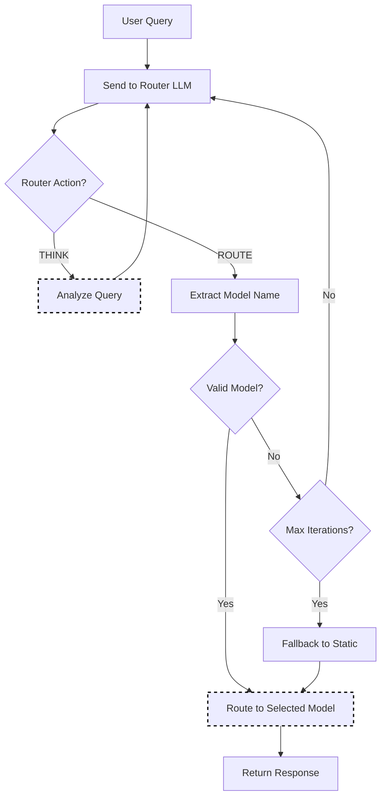

# Router-R1 Selection

Router-R1 uses an LLM as the router itself, performing multi-round "think" and "route" actions to make intelligent routing decisions. Unlike simple routers, it can reason about query requirements, model capabilities, and cost trade-offs before making a selection.

This approach outperforms single-round routing baselines with strong generalization to unseen models and robust cost management ([Router-R1, NeurIPS 2025](https://arxiv.org/abs/2506.09033)).

## Algorithm Flow



## Think/Route Protocol

The Router LLM uses a structured output format with two action types:

| Action | Description |
|--------|-------------|
| `<think>...</think>` | Reasoning step - analyzes the query (can repeat) |
| `<route>model</route>` | Final routing decision |

### Example Output

```text
<think>
Analyzing query: "Debug this Python code"
- Query type: coding task
- Requires: code understanding, debugging
- Best model: code-llama (specialized for code)
</think>
<route>code-llama</route>
```

## How It Works

1. Router LLM receives the user query and model descriptions
2. LLM performs **THINK** actions to analyze query requirements, model capabilities, and cost
3. LLM performs **ROUTE** action to select the best model
4. Selected model processes the request
5. If the route is invalid, retry up to max_iterations

### RL-Based Training

The router is trained using reinforcement learning with a reward structure that optimizes:

- **Format correctness**: Proper use of think/route tags
- **Outcome quality**: Quality of the final response
- **Cost efficiency**: Balance between performance and cost

## Core Algorithm (Go)

```go
// Select using LLM-as-Router
func (s *RouterR1Selector) Select(ctx context.Context, selCtx *SelectionContext) (*SelectionResult, error) {
    if s.routerEndpoint == "" && s.fallbackToStatic {
        return s.staticSelector.Select(ctx, selCtx)
    }
    
    history := []string{}
    
    for i := 0; i < s.maxIterations; i++ {
        response, err := s.callRouterLLM(ctx, selCtx.Query, selCtx.ModelDescriptions, history)
        if err != nil {
            if s.fallbackToStatic {
                return s.staticSelector.Select(ctx, selCtx)
            }
            return nil, err
        }
        
        action := s.parseAction(response)
        
        if action.Type == ActionRoute {
            if s.isValidModel(action.Model, selCtx.CandidateModels) {
                return &SelectionResult{
                    SelectedModel: action.Model,
                    Method:        MethodRouterR1,
                    Reason:        action.Reasoning,
                }, nil
            }
        }
        
        history = append(history, response)
    }
    
    // Max iterations reached
    if s.fallbackToStatic {
        return s.staticSelector.Select(ctx, selCtx)
    }
    return nil, fmt.Errorf("router failed after %d iterations", s.maxIterations)
}
```

## How It Works

1. Router LLM receives the user query
2. LLM performs THINK actions to analyze the query
3. LLM performs ROUTE action to select a model
4. Selected model processes the request
5. (Optional) Iterate if verification fails

## Configuration

```yaml
decision:
  algorithm:
    type: router_r1
    router_r1:
      router_endpoint: http://localhost:8001  # Router LLM server
      max_iterations: 3        # Max think/route cycles
      temperature: 0.7         # Router LLM temperature
      use_cot: true           # Chain-of-thought reasoning
      fallback_to_static: true # Fallback if router unavailable

models:
  - name: gpt-4
    backend: openai
    description: "Complex reasoning and analysis"
  - name: gpt-3.5-turbo
    backend: openai
    description: "Fast general responses"
  - name: code-llama
    backend: local
    description: "Code generation and debugging"
```

## Key Parameters

| Parameter | Default | Description |
|-----------|---------|-------------|
| `router_endpoint` | null | URL of Router-R1 server |
| `max_iterations` | 3 | Maximum think/route iterations |
| `temperature` | 0.7 | Temperature for router LLM |
| `use_cot` | true | Enable chain-of-thought reasoning |
| `fallback_to_static` | true | Use static selection if router unavailable |

## Router-R1 Server

Router-R1 requires a separate server running the router LLM:

```bash
cd src/training/rl_model_selection
python router_r1_server.py --port 8001 --model Qwen/Qwen2.5-3B-Instruct
```

The server exposes:

- `POST /route` - Route a query to a model

## Think/Route Actions

The router LLM outputs structured actions:

```
<think>
This query asks about Python debugging.
The code-llama model specializes in code.
Let me route to code-llama.
</think>
<route>code-llama</route>
```

## Without Router Server

If `router_endpoint` is null and `fallback_to_static: true`, Router-R1 falls back to static selection. This allows gradual adoption:

1. Deploy with `fallback_to_static: true`
2. Start Router-R1 server when ready
3. Configure `router_endpoint`

## When to Use Router-R1

**Good for:**

- Complex routing logic that's hard to encode in rules
- Queries requiring semantic understanding
- Systems with diverse, specialized models

**Consider alternatives when:**

- Latency is critical (LLM routing adds 100-500ms)
- Simple routing rules suffice
- No GPU available for router LLM

## Best Practices

1. **Use a small router model**: 3B-7B is sufficient for routing
2. **Enable fallback**: Graceful degradation if router fails
3. **Limit iterations**: 3 is usually enough
4. **Provide good model descriptions**: Router uses these for decisions
5. **Monitor router latency**: Track `router_r1_decision_latency_seconds`
