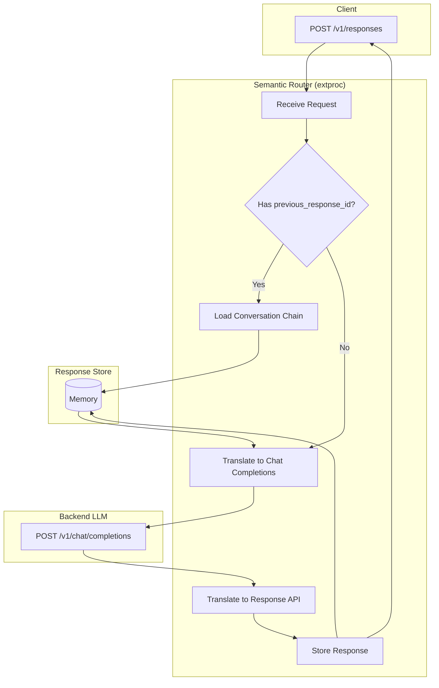

# Router Memory

Router Memory enables stateful conversations via the [OpenAI Response API](https://platform.openai.com/docs/api-reference/responses), supporting conversation chaining with `previous_response_id`.

## Architecture



## Endpoints

| Endpoint | Method | Description |
|----------|--------|-------------|
| `/v1/responses` | POST | Create a new response |
| `/v1/responses/{id}` | GET | Retrieve a stored response |
| `/v1/responses/{id}` | DELETE | Delete a stored response |
| `/v1/responses/{id}/input_items` | GET | List input items for a response |

## Configuration

```yaml
response_api:
  enabled: true
  store_backend: "memory"   # Currently only "memory" is supported
  ttl_seconds: 86400        # Default: 30 days
  max_responses: 1000
```

## Usage

### 1. Create Response

```bash
curl -X POST http://localhost:8801/v1/responses \
  -H "Content-Type: application/json" \
  -d '{
    "model": "openai/gpt-oss-120b",
    "input": "Tell me a joke.",
    "instructions": "Remember my name is Xunzhuo. Then I will ask you!",
    "temperature": 0.7,
    "max_output_tokens": 100
  }'
```

Response:

```json
{
  "id": "resp_7cb437001e1ad5b84b6dd8ef",
  "object": "response",
  "status": "completed",
  "output": [{
    "type": "message",
    "role": "assistant",
    "content": [{"type": "output_text", "text": "Sure thing, Xunzhuo! Why don't scientists trust atoms? Because they make up everything! 😄"}]
  }],
  "usage": {"input_tokens": 94, "output_tokens": 75, "total_tokens": 169}
}
```

### 2. Continue Conversation

Use `previous_response_id` to chain conversations:

```bash
curl -X POST http://localhost:8801/v1/responses \
  -H "Content-Type: application/json" \
  -d '{
    "model": "openai/gpt-oss-120b",
    "input": "What is my name?",
    "previous_response_id": "resp_7cb437001e1ad5b84b6dd8ef",
    "max_output_tokens": 100
  }'
```

Response:

```json
{
  "id": "resp_ec2822df62e390dcb87aa61d",
  "status": "completed",
  "output": [{
    "type": "message",
    "role": "assistant",
    "content": [{"type": "output_text", "text": "Your name is Xunzhuo."}]
  }],
  "previous_response_id": "resp_7cb437001e1ad5b84b6dd8ef"
}
```

### 3. Get Response

```bash
curl http://localhost:8801/v1/responses/resp_7cb437001e1ad5b84b6dd8ef
```

### 4. List Input Items

```bash
curl http://localhost:8801/v1/responses/resp_7cb437001e1ad5b84b6dd8ef/input_items
```

Response:

```json
{
  "object": "list",
  "data": [{
    "type": "message",
    "role": "system",
    "content": [{"type": "input_text", "text": "Remember my name is Xunzhuo."}]
  }],
  "has_more": false
}
```

### 5. Delete Response

```bash
curl -X DELETE http://localhost:8801/v1/responses/resp_7cb437001e1ad5b84b6dd8ef
```

## API Translation

| Response API | Chat Completions |
|--------------|------------------|
| `input` | `messages[].content` (role: user) |
| `instructions` | `messages[0]` (role: system) |
| `previous_response_id` | Expanded to full `messages` array |
| `max_output_tokens` | `max_tokens` |

## Roadmap

- [Milvus Backend](https://github.com/vllm-project/semantic-router/issues/803)
- [Redis Backend](https://github.com/vllm-project/semantic-router/issues/804)
- [E2E Tests](https://github.com/vllm-project/semantic-router/issues/805)

## Reference

- [OpenAI Response API](https://platform.openai.com/docs/api-reference/responses)
- [PR #802](https://github.com/vllm-project/semantic-router/pull/802)
