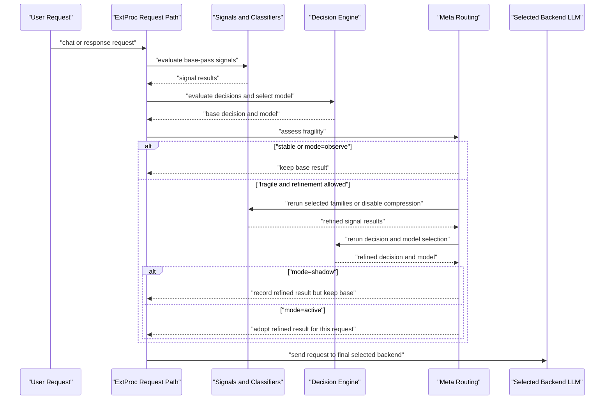

# Meta Routing Design

## Overview

Meta routing is a request-phase orchestrator that sits above the existing routing layers.

It keeps ownership boundaries intact:

- signals still extract facts
- projections still coordinate or derive routing state
- decisions still evaluate boolean route policy
- model selection still picks a model after a decision matches

The meta-routing seam only decides whether the first pass looks fragile enough to justify one bounded refinement pass.

## Key Advantages

- Preserves the existing routing architecture instead of spreading retry logic across lower layers.
- Restricts refinement to selective subgraph recomputation rather than free-form agent loops.
- Emits stable runtime artifacts that later replay, dashboard, and learned-policy workflows can reuse.
- Lets deterministic and artifact-backed policy providers share the same seam.

## What Problem Does It Solve?

The hard part of routing reliability is not just deciding which route won. It is deciding whether the path to that route looked trustworthy.

If retry logic is pushed into decisions, the decision layer stops being pure boolean policy.
If retry logic is pushed into signal extraction, detector code starts owning routing strategy.
If retry logic is pushed into model selection, the router cannot explain why the original pass looked weak.

Meta routing solves that by owning reliability assessment at one explicit seam.

## When to Use

Use this design when you need to:

- extend trigger logic without editing signal or decision packages
- add new bounded refinement actions
- build replay or dashboard views around pass-level routing quality
- plug in calibrated or learned trigger or action overlays behind the same runtime boundary

## Configuration

The public entrypoint remains a small routing-owned config block:

```yaml
routing:
  meta:
    mode: shadow
    max_passes: 2
    trigger_policy:
      decision_margin_below: 0.2
      projection_boundary_within: 0.05
      partition_conflict: true
    allowed_actions:
      - type: disable_compression
      - type: rerun_signal_families
        signal_families: [embedding, fact_check]
```

The config does not expose internal runtime artifacts directly. Those stay inside the router seam.

## Runtime Flow

The current flow is:

1. `BasePassRunner` executes the normal route evaluation.
2. `MetaAssessor` computes a `MetaAssessment` from pass quality plus configured triggers.
3. `RefinementPlanner` converts that assessment into a bounded `RefinementPlan`.
4. `RefinementExecutor` reruns only the affected parts of the routing graph.
5. `FeedbackSink` writes one durable feedback record for later analysis.

That keeps the meta layer orchestration-only.

## Request-Time Sequence

The important point is that this happens **inside one request**. `active` does
not wait for the next similar prompt. It allows the refined pass to replace the
base result for the current request only.



## What It Does Not Call

Meta routing does **not** call the final answer model to ask which route should
win. The route is decided before the request is sent to the selected backend
LLM.

What it can call during routing are the normal routing-time dependencies:

- signal classifiers
- embeddings
- fact-check or preference detectors
- other configured routing-time semantic families

That is why the bounded action list matters. Refinement can rerun selected
signal families, but it is still a routing-time computation, not a
"let the answer model think harder about routing" step.

The repository also has evaluation-oriented APIs for offline classification and
probe runs, but the request-time meta-routing path does not call those APIs.
Those evaluation APIs are for replay, calibration, and testing, not for the
normal extproc hot path.

## Stable Artifacts

Meta routing publishes a stable internal vocabulary:

- `RoutingTrace`
- `PassTrace`
- `MetaAssessment`
- `RefinementPlan`
- `FeedbackRecord`

Those artifacts carry fields such as:

- signal dominance
- average signal confidence
- decision margin
- projection boundary distance
- trigger names
- root causes
- planned and executed actions
- final route, model, and latency delta

## Policy Providers

The runtime keeps deterministic behavior as the default provider.

For calibration or learned-policy experiments, the router can load an internal artifact-backed provider behind the same seam. That provider is deliberately not a second public YAML contract. Public users still author only `routing.meta`; provider loading and rollout guards remain internal to the router runtime.
