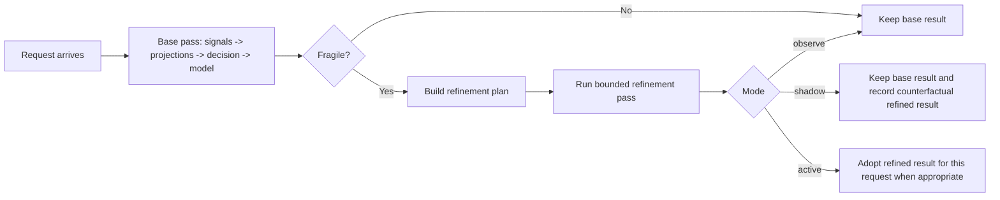

# Meta Routing Modes

## Overview

Meta routing is easiest to understand as a second-check system for routing.

The normal router already:

1. extracts signals
2. computes projections
3. evaluates decisions
4. selects a model

Meta routing asks one extra question after that first pass:

> Did this route look stable, or did it look fragile enough to justify one more bounded check?

That is why the three modes exist. They are not three different routing algorithms. They are three different rollout behaviors for the same assess-and-refine mechanism.

## Key Advantages

- Gives operators a safe rollout ladder instead of forcing decision-changing behavior on day one.
- Separates "this request looked fragile" from "the route was definitely wrong."
- Makes it easier to demo and explain what the feature is doing for real traffic.
- Keeps the runtime bounded to explicit refinement actions instead of turning routing into an open-ended retry loop.

## What Problem Does It Solve?

Without a clear mode model, meta routing is easy to misunderstand:

- `observe` can look like "nothing happened"
- `shadow` can look like "the router did extra work for no reason"
- `active` can sound like "the router rewrites its own config"

This page fixes that mental model.

Meta routing does **not** mean the router retrains itself on every request.

It means:

- run the normal routing pass
- assess whether that pass looked brittle
- optionally run one more bounded routing pass
- decide whether to keep the base result or adopt the refined result

## When to Use

Use this mode ladder when:

- you are enabling meta routing for the first time
- you want evidence before allowing second-pass results to change production routing
- you need to explain the feature to operators, reviewers, or demo audiences
- your routing graph has ambiguous boundaries such as verified versus non-verified, medium versus reasoning, or architecture versus agentic

## Configuration

The same `routing.meta` contract powers all three modes:

```yaml
routing:
  meta:
    mode: observe
    max_passes: 2
    trigger_policy:
      decision_margin_below: 0.18
      projection_boundary_within: 0.07
      partition_conflict: true
    allowed_actions:
      - type: disable_compression
      - type: rerun_signal_families
        signal_families: [embedding, fact_check]
```

Changing the mode does not change your static routing rules. It changes what the router is allowed to do **after** the base pass.

## What Counts as Fragile?

A request is currently treated as fragile when the first routing pass trips one or more assessment triggers.

In plain language, a pass looks fragile when the router does **not** have one clean, consistent winner.

Examples:

- the top decision barely beat the second-best decision
- a projection score landed very close to a threshold band
- different signal groups disagreed
- a required signal family was missing or weak
- the pass already looked shaky and the input had been compressed

That means fragility is about **route stability**, not guaranteed wrongness.

A fragile pass can still be correct. It is just more likely to flip if the router looks again with better evidence or stricter checks.

## What Happens Inside One Request?

The simplest mental model is:

- base pass picks a route and model
- meta routing asks whether that result looks brittle
- if it looks brittle, the router may run one bounded second check
- depending on the mode, the refined result may be ignored, observed, or adopted



This is why `active` is a request-time behavior. It does not wait for a later,
similar question. If a request is fragile now, the router can refine it now.

## Observe Mode

`observe` means:

- run the normal base pass
- assess whether it looked fragile
- record traces and feedback
- do **not** run a refinement pass
- do **not** change the final route or model

This is the safest starting point.

Use it to answer:

- which requests look brittle at all
- which triggers fire most often
- whether the current thresholds are noisy or meaningful

From a demo perspective, `observe` is mainly an observability mode. It usually does not change visible user behavior.

## Shadow Mode

`shadow` means:

- run the normal base pass
- if the pass looks fragile, build a bounded refinement plan
- execute the refinement pass internally
- still keep the original base result as the final route

This is the mode for answering the counterfactual question:

> If I really let the refined pass win, how often would that change the outcome?

So shadow is not "doing nothing." It is a rehearsal mode.

The router is doing the extra work, but it is using that work to measure possible impact before allowing production behavior to change.

## Active Mode

`active` means:

- run the normal base pass
- if the pass looks fragile, execute the bounded refinement plan
- allow the refined pass to replace the base result when appropriate

This is what "turning it on for real" means.

It still does **not** rewrite your YAML or DSL. It changes the selected route or model for the current request only.

In other words:

- static config stays the same
- request-time routing behavior becomes refinement-aware

From the user side, this is the first mode where behavior can actually change:

- a different decision may win
- a different model may be selected
- a verified overlay may be chosen instead of a cheaper base path
- latency may increase slightly because the router spent more effort checking

From the router side, the white-box change is:

- one extra bounded pass may run
- selected signal families may be recomputed
- a refined decision can replace the base decision for the same request
- the trace and feedback record keep both the base and refined evidence

## Is This Learning?

Not yet in the online sense.

Today, the request-time system does two things:

- it can correct the current request
- it can persist `FeedbackRecord` data about what happened

That feedback can later support calibration or learned policy deployment, but the router is not updating its own routing policy after every request automatically.

So the most accurate explanation is:

- request-time refinement is online
- policy evolution is currently offline and staged

## What Persists and What Does Not?

The refinement decision for one request is request-local. Once that request finishes, the live decision is over.

What can persist is the feedback record:

- request summary
- pass traces
- triggers and root causes
- planned and executed actions
- final route and model

If your replay or feedback backend is persistent, that evidence survives restarts and can be analyzed later.

## Practical Rollout

The simplest rollout path is:

1. start with `observe`
2. confirm that fragile requests are meaningful, not random noise
3. move to `shadow`
4. measure how often the refined pass would change routing and what the latency cost is
5. move to `active` only after the tradeoff looks acceptable

Here, `rollout` means changing how much authority the meta-routing mechanism has:

- `observe`: record only
- `shadow`: execute but do not adopt
- `active`: execute and allow adoption

That is different from editing the routing graph itself. Changing YAML or DSL
rules is a routing-config change. Moving from `observe` to `shadow` to `active`
is a meta-routing rollout.

For architecture and runtime details, continue with [Design](./design), [Problems](./problems), and [Usage](./usage).
