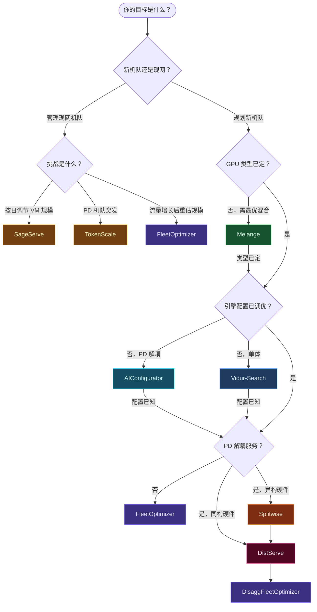

# 研究背景

本页为可选阅读，用于将 `vllm-sr-sim` 置于相邻研究系统与规划工具的背景中；多数用户可直接从 [快速开始](./getting-started.md) 或 [容量规划场景](./use-cases.md) 入手。

`vllm-sr-sim` 处于多条活跃研究线的交汇点；每篇相关工作回答的问题**与本模拟器不同**。

---

## Mélange — 异构 GPU 类型选择

**Griggs et al.，UC Berkeley，2024 · [arXiv:2404.14527](https://arxiv.org/abs/2404.14527)**

Mélange 表明最优 GPU 类型由三类因素共同决定：请求规模（短请求偏向便宜 GPU；长请求偏向高端 GPU）、到达率（低到达率可右尺寸到更便宜硬件）、SLO 紧度（严格延迟几乎总需要快 GPU）。它将 GPU 分配表述为成本感知的装箱问题——GPU 为箱、负载切片为物品——并用 ILP 求最小成本的多 GPU 类型组合。相对单一 GPU 类型最高可降本约 77%。

**与 `vllm-sr-sim` 的主要差异：**

| | Mélange | vllm-sr-sim |
|---|---|---|
| 输入 | 每 (GPU, 请求规模桶, SLO) 的经验吞吐 profile | 由 `HardwareSpec` + `ModelSpec` 推导的物理 `W`/`H`；无需真实 GPU |
| 输出 | 最优 GPU **类型** 组合（多少 A10G、A100、H100 …） | 每池最优 GPU **实例数** + 路由拓扑 |
| 路由 | 无 —— 按规模分箱并映射到 GPU 类型 | 显式路由策略：长度、语义、C+R、模型 |
| 服务模型 | 每 GPU 类型单池，无池间路由 | 多池 + 池间路由与 SLO 校验 |
| SLO 指标 | 平均 TPOT | P99 TTFT（亦可通过 profile 支持 TPOT） |
| 验证 | 真实硬件基准 | 解析 Erlang-C + 离散事件仿真 |

**何时用 Mélange：** 负载相对同质且需决定租哪种云 GPU SKU。Mélange 选类型；`vllm-sr-sim` 在给定长度分布与路由策略下告诉你需要**多少**该类型 GPU。

---

## SageServe — 预测感知的运行时自动扩缩

**Jaiswal et al.，Microsoft O365，2025 · [arXiv:2502.14617](https://arxiv.org/abs/2502.14617)**

SageServe 是面向**已有机队**的运行时控制器。它刻画生产 O365 负载（美国 3 区域、4 模型、日请求 1000 万+），观察到交互式（IW）流量与机会式非交互（NIW）批作业强烈的日周期，并提出：(1) IW 与 NIW 共享统一 GPU VM 池，而非割裂池；(2) ARIMA 小时级流量预测；(3) ILP 计算最优实例数变化 δ，最小化 VM 冷启动开销；(4) 基于实时内存利用率的反应式启发式。节省约 25% GPU 小时，冷启动浪费降约 80%。

**与 `vllm-sr-sim` 的主要差异：**

| | SageServe | vllm-sr-sim |
|---|---|---|
| 问题 | *当前*应运行多少实例 | *总体*需为某流量水平预置多少 GPU |
| 时间尺度 | 分钟到小时（动态扩缩环） | 静态容量规划（峰值时段规模） |
| 流量模型 | 生产轨迹 + ARIMA | Poisson 到达 / CDF 工作负载 / 轨迹回放 |
| 多层负载 | IW-Fast、IW-Normal、NIW 不同 SLA | 每池单一 SLO（多 SLO 通过多池配置） |
| 路由 | 基于内存利用的跨区域路由 | 长度 / 语义 / 模型 / C+R 内容路由 |
| 性能模型 | 每 (模型, GPU) 的经验 TPS profile | 基于规格的屋顶线物理模型 |
| 硬件需求 | 真实生产轨迹 | 自包含；无需硬件或轨迹 |

**何时用 SageServe：** 已有部署机队，需在 24 小时需求周期内上下扩缩。先用 `vllm-sr-sim` 估算峰值机队规模；再套用 SageServe 类策略在低谷时段降规模以节省 20–30% GPU 小时。

---

## AIConfigurator — 解耦集群的核级配置搜索

**Xu et al.，NVIDIA，2025 · [arXiv:2601.06288](https://arxiv.org/abs/2601.06288)**

AIConfigurator 将 LLM 推理分解为基本算子（GEMM、attention、all-reduce、P2P），并在 Ampere/Hopper/Blackwell 与主流模型上维护**校准后的核性能数据库**。给定工作负载描述与 SLA，它在 30 秒内搜索 TP/PP/EP、batch、CUDA graph、KV 比例等组合空间，输出吞吐–延迟 Pareto 前沿及 vLLM、SGLang、TRT-LLM 的可启动配置。稠密模型最高约 40% 提升，MoE（DeepSeek-V3）约 50% 相对默认配置。

**与 `vllm-sr-sim` 的主要差异：**

| | AIConfigurator | vllm-sr-sim |
|---|---|---|
| 输出 | 单集群最优 TP/PP/EP、batch、引擎参数 | **N 个池**上最优 GPU 实例数与路由拓扑 |
| 粒度 | 集群内并行度与运行时标志 | 机队级池数量与路由拓扑 |
| 模型 | 真实硅片上的 GEMM/attention/通信 | 屋顶线 W/H（嵌入 AIConf. 校准常数） |
| 框架 | vLLM、SGLang、TRT-LLM、Dynamo | 框架无关 Python 仿真 |
| SLA | 每集群 TTFT + TPOT | 全多池机队 P99 TTFT |
| MoE 支持 | DeepSeek-V3、Qwen3 MoE 等原生核数据库 | `builder.py` 中嵌入的硅片实测核表 |

**关系：** `vllm-sr-sim` 嵌入 AIConfigurator 的经验常数（`ALPHA_BW = 0.80`、`LAYER_OVERHEAD_US = 3 µs`、MoE 核表等），使 `ProfileBuilder` 在无硬件访问时也能给出校准 W/H。用 AIConfigurator 为单节点组找最优 TP/EP；将结果作为 `ServingConfig.tp` 输入 `ProfileBuilder` 再做全机队规模估算。

---

## DistServe — 解耦 prefill/decode 的基础性工作

**Zhong et al.，北大 + UCSD，OSDI 2024 · [arXiv:2401.09670](https://arxiv.org/abs/2401.09670)**

DistServe 指出将 prefill（算力受限）与 decode（内存带宽受限）共置会相互干扰：单次 prefill batch 可使 TPOT 膨胀 3–10×，decode 任务则抬高 TTFT。它将 prefill 与 decode 路由到物理分离的 GPU，各自采用独立 TP/PP，并用 M/D/1 排队模型求最优 prefill/decode GPU 比。在 A100 上相对 vLLM 可达 4.48× 请求量或 10.2× 更紧 SLO。

**与 `vllm-sr-sim` 的主要差异：**

| | DistServe | vllm-sr-sim |
|---|---|---|
| 输出 | 每相位的最优 (TP, PP, batch 策略) | 机队尺度上的最优 `n_prefill`、`n_decode` GPU 数 |
| 范围 | 单模型副本 / 集群 | N 个复制池组成的机队 |
| 排队模型 | 每相位 M/D/1（均匀请求长度） | M/G/c Erlang-C（W、H、CDF 可变服务时间） |
| KV 传输 | 显式 NVLink/IB 带宽 | 通过经验 `BETA_TTFT = 1.80` 乘子刻画 |
| 路由 | 无内容路由 | 在 PD 拆分之上支持长度、语义、C+R、模型路由 |
| 相位性能 | 经验吞吐测量 | `ProfileBuilder` + `phase=` 的物理推导 |

**组合使用：** DistServe 确定各相位的 TP/PP；`DisaggFleetOptimizer` 在给定 P99 TTFT SLO 与到达率下确定需要多少 prefill 与 decode worker。

---

## Splitwise — PD 拆分集群的异构硬件协同设计

**Patel et al.，华盛顿大学 + 微软，ISCA 2024 · [arXiv:2311.18677](https://arxiv.org/abs/2311.18677)**

Splitwise 观察到 token 生成（decode）不需要最新 GPU 的高 FLOPs，而是受内存带宽约束；H100 算力为 A100 的约 3.4×，带宽仅约 1.6×。因此 H100（prompt）配 A100（token）比双 H100 更具成本效益。它设计三种集群原型（吞吐、成本、功耗），均用高速 InfiniBand 传 KV。可达 1.4× 更高吞吐且成本降 20%，或相同功耗下 2.35× 吞吐。

**与 `vllm-sr-sim` 的主要差异：**

| | Splitwise | vllm-sr-sim |
|---|---|---|
| 核心洞见 | prompt 与 token 相位用不同 GPU 省成本/功耗 | 每池不同 GPU 数量，GPU 类型任意 |
| 硬件 | 单集群内异构 GPU | 跨独立池的异构 GPU |
| 优化 | 集群拓扑（吞吐/成本/功耗） | SLO 约束下的机队规模与最小成本 |
| KV 传输 | 显式 IB 带宽 | 经验 β 乘子 |
| 路由 | 实例间负载均衡 | 长度、语义、模型、C+R 感知 |
| 配置 | 需真实硬件剖析 | 自包含物理模型 |

**组合使用：** 用 Splitwise 的原型在池内选 GPU 搭配（如 H100 prefill + A100 decode），再将各池 GPU 类型输入 `ProfileBuilder` 并运行 `DisaggFleetOptimizer`。

---

## TokenScale — 解耦机队的 Token Velocity 自动扩缩

**Lai et al.，2024 · [arXiv:2512.03416](https://arxiv.org/abs/2512.03416)**

TokenScale 解决 PD 解耦机队在突发流量下的**运行时扩缩**。GPU 利用率与 RPS 是滞后指标，往往在 SLO 违反后才反应。它引入 **Token Velocity**（各阶段最大 token 处理率）作为领先指标，在退化前暴露背压；**Convertible Decoders** 让 decode GPU 在突发时临时承担 prefill，吸收尖峰而无需冷启动新实例。SLO 达成从约 50–88% 提升至 80–96%，相对 DistServe/AIBrix 成本降 4–14%。

**与 `vllm-sr-sim` 的主要差异：**

| | TokenScale | vllm-sr-sim |
|---|---|---|
| 问题 | 已部署 PD 机队如何响应突发 | 部署前机队规模 |
| 时间尺度 | 秒级 | 分钟到小时（规划） |
| 关键指标 | 各阶段 Token Velocity（实时） | P99 TTFT SLO（规划） |
| 扩缩触发 | token 到达率 vs. 阶段速度比 | Erlang-C 等待 ≤ SLO 余量 |
| 硬件假设 | 固定 GPU 集群、动态角色 | GPU 数量为决策变量 |
| 突发模型 | Azure/OpenAI 轨迹经验统计 | Poisson 到达 |

**组合使用：** `vllm-sr-sim` 给出稳态机队规模（P99 TTFT ≤ T 的最小 GPU）；TokenScale 在运行时用 Convertible Decoder 处理高于 λ 的短时突发，避免昂贵过度预置。

---

## Vidur — 高保真单实例 LLM 推理模拟器

**Agrawal et al.，Microsoft Research，2024 · [arXiv:2405.05465](https://arxiv.org/abs/2405.05465)**

Vidur 模拟**单一模型部署**的完整推理栈：算子级剖析（GEMM、attention、MLP、通信）、KV 块管理、连续批处理、分块 prefill、抢占等。用剖析 + ML 回归预测每迭代延迟，误差 &lt;9%。配套 **Vidur-Search** 在约 1 CPU 小时内探索数百种部署配置（TP、PP、batch、chunk、调度器），对比经验搜索约 42 000 GPU 小时。目标为单引擎配置优化，而非多池机队规模。

**与 `vllm-sr-sim` 的主要差异：**

| | Vidur | vllm-sr-sim |
|---|---|---|
| 范围 | 单模型实例 | N 池机队 + 池间路由 |
| 保真度 | 算子级 | 请求级 M/G/c 排队（屋顶线 W、H） |
| 配置搜索 | TP、PP、batch、chunk、调度器 | 池数量、GPU 类型、路由、γ 压缩 |
| 输入需求 | 每模型 GPU 剖析数据 | 仅需模型规格 + 硬件规格 |
| 机队路由 | 无 | 长度、语义、C+R、模型、轮询 |
| 多池分析 | 无 | 双池、N 池、解耦为一等公民 |
| SLO | TTFT、TBT、E2E | P99 TTFT、SLO 达成率、年成本 |

**组合使用：** 用 Vidur-Search 为单副本确定最优调度与 batch 参数；将吞吐/延迟测量写入 `ManualProfile`，再交给 `FleetOptimizer` 做副本机队规模与校验。

---

## 一句话定位

| 工具 | 回答的核心问题 |
|---|---|
| **Vidur** | 何种 batch/调度配置使每 GPU goodput 最大？ |
| **AIConfigurator** | 单集群下何种 TP/EP/引擎标志使吞吐最大？ |
| **Mélange** | 给定 SLO 下何种 GPU 类型组合成本最低？ |
| **Splitwise** | prefill 与 decode 各用哪代 GPU？ |
| **DistServe** | 每集群副本需要多少 prefill vs decode GPU？ |
| **TokenScale** | 突发下如何实时扩缩 prefill/decode 池？ |
| **SageServe** | 24 小时周期内应运行多少 VM 实例？ |
| **vllm-sr-sim** | 需要多少 GPU 池、何种路由策略、何种机队成本以满足 P99 TTFT？ |

---

## 决策树 — 应先用哪个工具

综合阅读包见 [Fleet Sim 指南](./guide.md)，或按下述流程图。

