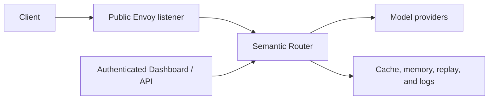

# 安全加固

Semantic Router 位于客户端和模型 provider 之间的请求路径上。将其视为应用信任边界的一部分：它可以检查提示词、选择 provider、改动请求，并可选地保留路由数据。

本指南强调需要显式生产决策的控制项。它不能替代周围平台的身份、网络、密钥管理和数据治理控制。

## 映射信任边界



分别复核每个边界：

- 谁可以调用推理端点；
- Router 信任哪些身份声明；
- 每个角色可以使用哪些模型和工具；
- provider 凭据存储在哪里；
- 哪些请求可以离开本地环境；
- 保留哪些提示词、响应和路由元数据；以及
- 谁可以更改配置或检查已存储的数据。

## 保护公共监听器

维护中的 Envoy 配置会在客户端请求到达 Router 之前移除内部控制标头。在提供自定义 Envoy 或网关配置时也要这样做。内部示例如下：

```yaml
request_headers_to_remove:
  - x-vsr-looper-request
  - x-vsr-looper-secret
  - x-vsr-looper-decision
  - x-vsr-looper-iteration
  - x-authz-user-id
  - x-authz-user-groups
```

不要将 Router 管理、指标、ExtProc 或支撑存储端口作为公共推理端点暴露。在受信任边界终止客户端身份验证，并仅允许该组件提供身份标头。

相关控制面板权限包括：

| 权限 | 用途 | 默认角色 |
| --- | --- | --- |
| `feedback.submit` | 提交路由反馈。 | admin、write |
| `replay.read` | 列出回放记录。 | admin、write、read |
| `logs.read` | 读取有界的本地栈服务日志。 | admin、write |

Router 管理 API 区分回放元数据和回放详情。控制面板服务可以检索完整记录，然后为没有配置写入权限的用户移除已捕获的正文和工具载荷。它没有权限揭示已存储的密钥值。

端点和响应契约见[管理 API 参考](../api/apiserver)。

## 将凭据排除在配置之外

在 canonical YAML 中使用环境引用：

```yaml
api_key: ${MODEL_API_KEY}
```

不要提交字面 API 密钥、密码、授权标头、凭据查询参数，或包含用户信息的 URL。

对于 `vllm-sr serve --target k8s`，CLI 将敏感环境值放入限定到命名空间和 Helm release 的不可变 Secret revision。Helm values 和 Deployment 按名称引用 Secret；它们不包含凭据值。失败的升级会保持先前的工作负载和 Secret 处于活动状态。仅在不再被引用后，才移除 release 拥有的旧 revision。

现有的 chart 原生 Secret 引用（例如控制面板 JWT Secret）仍是外部对象，不会被复制到 CLI 管理的 Secret。对每个手动管理的 Secret 使用相同的命名空间和 release 所有权纪律。

### 隔离 sr-bench 凭据

Dashboard 代理服务器配置的 sr-bench origin，并传递已认证的用户身份。`SR_BENCH_TOKEN_ENV` 指定服务 token 的环境变量名，默认 `SR_BENCH_TOKEN`。服务、模型和 Router 管理凭据应分开。浏览器不能修改已登记目标的地址、价格、凭据引用或执行环境选项。

托管核心 worker 通过继承环境变量接收已登记模型的凭据和服务 token，密钥值不进入命令参数。私有 store 与相邻 token 文件位于 Router/Dashboard 共享挂载之外；worker 不挂载 Docker socket 或 GPU。Dashboard 只接收服务 token，不接收模型密钥。

代码和 Agent 任务应使用单独准备的 worker 主机，通过 `SR_BENCH_URL` 连接已认证且容器可达的地址。独立服务默认监听回环，非回环监听必须设置服务 token。参阅 [sr-bench 1.0](../benchmarking/sr-bench) 的前置条件和限额说明。

## 保护本地栈的存储凭据

`vllm-sr serve` 为本地栈预配 Redis 和 Postgres，因此它也拥有它们的凭据。每个栈在首次启动时生成自己的凭据。本仓库不附带任何值，也不会回退到共享默认值。

材料所在位置：

| 产物 | `<state-root>/.vllm-sr/storage-secrets/` 下的路径 | 模式 |
| --- | --- | --- |
| 凭据状态 | `secrets[.<stack>].json` | `0600` |
| Postgres 密码 | `postgres-password[.<stack>]` | `0600` |
| Redis 配置 | `redis[.<stack>].conf` | `0644` |

目录本身是 `0700` 且已验证所有者，因此其中的每个文件都无法被其他用户到达。Redis 配置有意是 `0644`：Redis 镜像在读取它之前会降到非特权用户，并且绑定挂载在容器内解析，而无需遍历主机的私有父目录。

这些值到达其消费者，而不会进入任何共享表面。Postgres 通过 `POSTGRES_PASSWORD_FILE` 从挂载文件读取密码；Redis 从其挂载配置读取 `requirepass`；Router 以继承的环境名称接收这些值，生成的运行时配置只携带 `${VLLM_SR_STACK_POSTGRES_PASSWORD}` 和 `${VLLM_SR_STACK_REDIS_PASSWORD}`。它们不会出现在 `docker` 命令行、生成的配置文件、日志记录或报告产物中。控制面板不会获得它们。

这些凭据认证网络对等方。它们不约束能够直接到达容器运行时的调用者：Postgres 镜像信任本地套接字连接，因此任何能够 `docker exec` 的人都会绕过密码。相应地限制[容器运行时访问](#limit-container-runtime-access)。

### 网络分层

本地栈运行在两个桥接网络上。

| 容器 | `vllm-sr-network` | `vllm-sr-data-network` |
| --- | --- | --- |
| Redis、Postgres、Milvus | 否 | 是 |
| Router | 是 | 是 |
| Envoy、控制面板 | 是 | 否 |
| Jaeger、Prometheus、Grafana | 是 | 否 |
| OpenClaw 工作负载 | 是 | 否 |

Router 是唯一同时位于两者上的容器。请求通过应用网络到达它；它通过数据网络到达存储。命名栈会为这两个名称加前缀，因此两个栈互不共享。即使 Milvus 目前还没有自己的凭据，它也会加入数据网络。

这关闭了东西向可达性。应用网络上的容器——sidecar 或为 OpenClaw 工作负载选择的镜像——根本无法打开到 `vllm-sr-redis:6379` 或 `vllm-sr-postgres:5432` 的连接。存储端口仅发布在 `127.0.0.1` 上，从而从主机侧关闭相同暴露。

它不约束能够到达容器运行时的调用者。这样的调用者可以将容器附加到任何网络，因此该拆分是工作负载的边界，而不是运行时套接字的边界。

拆分之前创建的栈，其存储位于应用网络上。下一次 `vllm-sr serve` 会将每个正在运行的存储附加到数据网络，并从应用网络分离它。如果该分离失败，`serve` 会停止而不是继续：报告隔离但实际上没有隔离的栈，比拒绝启动更糟。

### 轮换

```bash
vllm-sr storage rotate
```

该命令限定到一个栈，并遵循 `VLLM_SR_STACK_NAME`，与 `serve` 和 `stop` 相同。分别轮换每个栈；有意没有跨栈模式，因为部分失败会让某些栈被撤销而另一些没有。

轮换有短暂的降级窗口。Postgres 就地更改其角色密码，因此现有连接继续，但新连接会失败，直到 Router 重启。Redis 对照其命名卷重建。将轮换安排在可以接受短暂 Router 重启的时刻。

### 恢复

**凭据状态缺失或格式错误。** CLI 会失败关闭，而不是静默重新生成，因为重新生成的凭据会让 CLI 以为自己仍有它已经不再拥有的访问权。删除状态文件并重新运行 `vllm-sr serve`。栈会就地接管：Postgres 通过其受信任的本地套接字重新设置密钥，Redis 对照同一命名卷重建，并且不会丢失数据。

**较旧栈的数据没有被拾取。** 存储数据现在位于命名卷中，并且在接管栈时按名称采用现有容器的卷。被较旧 CLI 移除的容器会留下其卷，但没有记录它属于哪个容器，因此无法自动采用。手动恢复它：

```bash
docker system df -v --format '{{json .Volumes}}'
```

查找 `Links: 0` 的卷。通过其内容识别每个候选——Postgres 数据目录包含 `PG_VERSION`，Redis 目录包含 `dump.rdb`：

```bash
docker run --rm -v <volume>:/v:ro alpine ls /v
```

然后针对已识别的卷启动容器，或将其内容复制到栈的命名卷（`vllm-sr-postgres-data` / `vllm-sr-redis-data`，命名栈带栈前缀）。CLI 不会猜测哪个孤立卷是你的。

**配方激活报告凭据不可读。** 控制面板可以在激活配方时启动托管存储，但它作为单独、信任度更低的账户运行——它持有容器运行时套接字，而这正是这些凭据要远离的对象——因此它不能读取凭据状态，也不会猜测哪个卷保存数据。从拥有该栈的账户运行 `vllm-sr serve` 以预配存储，然后再次激活配方。

**对已轮换的栈使用较旧的 CLI。** 它将无法认证。这是预期结果。升级 CLI，或通过容器运行时手动重置密码。

## 复核已存储的请求数据

回放、响应缓存、记忆、响应历史、服务日志和 provider 日志都可能保留从请求派生的数据。它们的设置独立于模型的放置。到本地模型的路由仍可能将提示词或响应写入共享存储。

对于每个已启用的存储：

- 识别哪些路由向它写入；
- 检查是否捕获请求或响应正文；
- 设置保留和删除策略；
- 限制读取和备份访问；
- 使用与数据相称的加密和传输安全；以及
- 在存储不可用时测试行为。

配方 Model Card 描述每个维护中配方的签入回放和缓存行为。部署指南见[数据与存储](storage-overview)。

## 限制容器运行时访问 {#limit-container-runtime-access}

某些控制面板工作流可以管理本地容器。仅当它是具有安全所有者和组模式的 Unix 套接字时，CLI 才会挂载容器运行时套接字；它拒绝符号链接、全局可访问的套接字和不安全的组所有权。控制面板在容器内重复该检查，并以非 root 用户运行。

当套接字缺失或被拒绝时，Router 和控制面板仍会启动，但容器管理功能会将运行时报告为不可用。不要将套接字设为全局可写以绕过此保护。对非默认的无 root 运行时套接字使用 `VLLM_SR_CONTAINER_SOCKET`，并验证其用户命名空间和补充组映射。

如果部署不需要控制面板管理的容器，不要挂载运行时套接字。

## 生产检查清单

- [ ] 对公共推理监听器和管理表面进行身份验证。
- [ ] 在受信任代理处剥离内部控制和身份标头。
- [ ] 将 Router 管理、ExtProc、指标和存储端口绑定到私有接口。
- [ ] 按角色或租户限制模型访问和速率限制。
- [ ] 将 provider 和存储凭据保留在密钥管理器或 Kubernetes Secret 中。
- [ ] 复核每条路由的 provider 本地性、工具和数据保留行为。
- [ ] 仅向受信任的运维人员授予回放详情、日志和配置写入权限。
- [ ] 在绕过策略不可接受的地方设置严格的失败行为。
- [ ] 按与其他凭据相同的计划轮换本地栈的存储凭据。
- [ ] 测试备份、恢复、凭据轮换、升级和回滚。
- [ ] 除非工作流需要，否则不要挂载容器运行时套接字。
