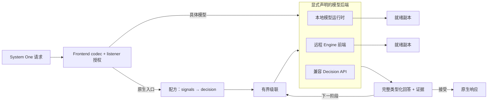

# 组件架构

vLLM-SR 由请求前端、可选的路由决策引擎和模型服务资源组成。可以把它们组合起来路由模型调用，也可以不配置 Chat 后端，直接提供判断模型服务。

这些图展示 native HTTP 前端的逻辑组件，不是容器布局，也不是完整的 Envoy/ExtProc 部署拓扑。部署方式见 [Gateway 模式](../installation/gateway-modes)。

点击图示可打开完整尺寸的 SVG。

## 组合服务路径 {#compose-the-serving-path}

[](/img/architecture/system-one/01-component-composition.svg)

| 组件 | 职责 |
| --- | --- |
| **Frontend（前端）** | 接收请求、执行 listener 访问控制、适配 API 协议。 |
| **Decision Engine（决策引擎）** | 将路由入口解析到配方，执行信号和决策，协调 Chat 或原生判断模型后端。 |
| **Serving Engine / 模型运行时** | 通过受管或附加 worker 运行判断、分类、embedding 和重排序模型。 |
| **Chat 后端** | 通过你部署的 vLLM、Ollama 或提供方服务生成回答。 |

只要 listener 发布了相应模型，两种启动模式都可以提供原生 System One API。Router 模式额外启用配方路由与 Chat 后端；Engine 模式保留前端和模型管理，但不激活已保存的路由配置：

```bash
# Router：MODEL 覆盖默认判断模型；Chat 后端仍在 YAML 中配置。
vllm-sr serve vllm-sr/Vela-2.0-0.3B --config config.yaml

# Engine：不需要 Chat 后端或用户编写的路由 YAML。
vllm-sr serve vllm-sr/Vela-2.0-0.3B --engine --platform cpu
```

每次不带 `--engine`（`-e`）的启动都是 Router 模式。仅传 MODEL 不会选择 Engine 模式。Dashboard 展示启动模式并管理模型部署，不负责切换实例模式。

模型 worker 根据实际使用方准备：原生模型发布、路由任务以及已启用的模型服务。声明但未使用的 deployment 不会启动。因而，纯规则 Chat 路由在没有其他模型使用方时可以不运行模型 worker；语义缓存、embedding、记忆和 RAG 等功能可能引入额外需求。“按需”指配置中的实际需求，不表示每个模型都等到首条请求才开始加载。

## 分开处理协议与路由策略 {#separate-protocol-handling-from-routing-policy}

[](/img/architecture/system-one/02-frontend-and-decision-engine.svg)

经过路由的请求主要遵循以下决策路径：

1. 将公开模型名解析到入口及其配方。
2. 执行所需的 **signals（信号）**，计算 **projections（投影）**。
3. 匹配 **decision（决策）** 及其候选集合。
4. 用 **algorithm（算法）** 选择一个后端或有界的多模型执行方案。
5. 派发请求，通过对应的协议适配器返回响应。

配方插件在各自的请求、执行或响应钩子上运行，并不是全部排在选模后的最后一步。依赖模型的任务通过自己的 binding 解析部署，与它们帮助选择的 Chat 后端分离。策略编写见[路由流水线](signal-driven-decisions)。

Chat Completions、Responses 和 Messages 使用协议 codec；System One 有独立的类型化请求 handler。具体原生模型 ID 直接调用模型，不执行配方；显式发布的原生入口则进入其 System One 配方。具体 Chat 后端 ID 也会绕过配方信号、决策和插件。原生配方支持的信号和算法范围比 Chat 配方更窄，见[级联指南（英文）](https://vllm-sr.ai/docs/tutorials/algorithm/native/cascade)。

### 区分公共 API 与 worker API {#keep-public-and-worker-apis-distinct}

| 接口 | 端点 | 访问方式与用途 |
| --- | --- | --- |
| 公共 Chat API | `/v1/chat/completions`、`/v1/responses`、`/v1/messages`；通过 `/v1/models` 发现模型 | Router 模式；受 listener 授权及对应 API 服务要求约束。 |
| 公共 System One API | `/v1/systemone`，别名 `/v1/decisions`；通过 `/v1/systemone/models` 发现模型 | 两种启动模式均可用；需要 `listeners[].systemone.models` 显式发布，配置了 API key 时还需相应凭据。 |
| Worker API | 已加载模型支持的 classify、embeddings、rerank、decisions 和 bundle API | 独立运行的 `vllm-srun` 端点或受管 worker 的私有 socket；前端不会自动发布这些接口。 |

Dashboard session 不能替代公共 listener 凭据。原生模型授权与 Chat 的 `models` allowlist 相互独立。完整请求见 [System One 快速开始](../model-runtime/quickstart.md)。

## 用副本扩展部署 {#scale-a-deployment-through-replicas}

[](/img/architecture/system-one/03-serving-engine-and-workers.svg)

模型选择回答“**哪个模型适合这项任务？**”；副本调度回答“**该 deployment 的哪个就绪 worker 执行它？**”。这是两个独立层次。

受管副本各有独立进程，由 vLLM-SR 启停和监管。附加副本连接由其他服务管理的运行时。同一池中的兼容 worker 共享模型身份、revision、profile 和能力。图中的 GPU 放置是示例，也支持 CPU worker。

当前调度优先选择未完成请求字节数最少的就绪 worker；相同时选择最久未被分配的 worker。每个 worker 最多接收 32 个在途 HTTP 请求，池满直接报告过载，不在池内维护等待队列。这些观测不是实测 token 数，也不是 GPU forward 并发数。

Worker 内部由 model family 定义输入和类型化输出，profile 规划任务及数值策略，执行引擎与 accelerator 完成计算。多个问题可以共享请求或兼容的计算，但一次 API 调用仍可能需要多次 forward。这些是软件接口，不是神经网络层。

```bash
# 在两块宿主机 GPU 上运行两个独立副本。
vllm-sr serve vllm-sr/Vela-2.0-4B -e --platform rocm -dp 2 --device-ids 0,1
```

DP 复制模型，不通过张量并行或流水线并行拆分权重。增加副本前，应针对实际输入长度测量吞吐和尾延迟，尤其是多个 worker 共用一块 GPU 时。参见[前端与运行时部署](../model-runtime/deploy)和 [Profiles](../model-runtime/profiles)。

## 在判断模型之间路由 System One {#route-system-one-across-decision-models}



显式声明的 `api: systemone` 入口选择独立的原生配方。配方的信号和决策选择实验性的
`cascade` 算法。每个级联保持 Choice / Score / Noul 问题包完整，在自己的 deadline
和调用次数预算内访问已声明的判断模型后端。信号先于算法执行，使用自己的超时和
请求取消机制，不消耗随后选中算法的预算。后端可以是本地 deployment、独立的
vLLM-SR Engine 服务，或兼容的外部 System One API。

配方负责选模型；每个 deployment 再选择自己的副本。级联先运行快速阶段，只有
接受条件不满足时才继续。可选的 LLM judge 可以选择完整的已有候选或弃权，不能
制造原生概率。完整配置见 [System One 级联（英文）](https://vllm-sr.ai/docs/tutorials/algorithm/native/cascade)。

原生模型发现区分具体模型（`routing: false`）和已发布的原生配方
（`routing: true`），两者都需要 listener 显式授权。默认 Chat 入口
`vllm-sr/auto` 不会隐式启用原生 auto；Engine 模式继续直接服务具体模型，
不执行配方。

## 下一步 {#next}

- [系统概览](semantic-router-overview)：配置与部署背景。
- [快速开始](../installation/installation.md)：发送经过路由的 Chat 请求。
- [模型运行时快速开始](../model-runtime/quickstart.md)：直接提出类型化问题。
- [前端与运行时部署](../model-runtime/deploy)：绑定、副本放置和就绪状态。
