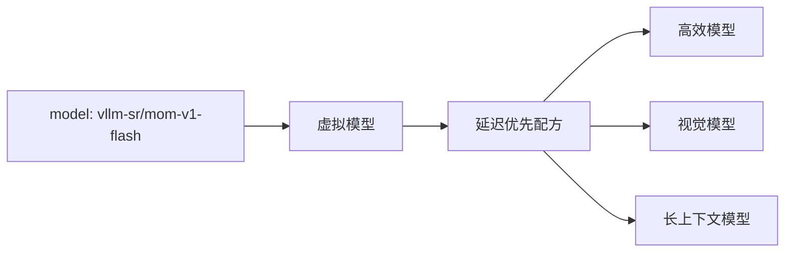

# 多模型混合

**Mixture of Models（MoM）** 是一种服务架构：若干独立部署的模型作为一个系统工作。路由策略决定由哪个模型、级联、评审组或工作流处理每次请求。

客户端不必知道哪个物理后端胜出。它请求的是代表期望行为的稳定虚拟模型。



## MoM 不是 Mixture of Experts

Mixture of Experts（MoE）是模型架构：门控机制在推理时激活同一检查点的部分参数。Mixture of Models 是服务系统架构：独立训练、独立服务的模型在请求时被选择或协调。

MoM 可以组合稠密模型、MoE 模型、托管 API 和本地模型。它们的内部架构不改变路由抽象。

## 系统中的三类模型

| 种类 | 示例 | 角色 |
| --- | --- | --- |
| **提供方模型** | vLLM、Ollama 或托管模型端点 | 生成应用响应。 |
| **虚拟模型** | `vllm-sr/mom-v1-flash` | 为客户端给出稳定目标，并选择配方。 |
| **Router 系统模型** | 嵌入或分类器资产 | 帮助检测意图、风险、相似度或其他路由信号。 |

Router 系统模型支撑决策过程；它们本身不是面向客户端的 Mixture of Models 产品。

## 执行模式

### 选择一个模型

大多数请求应走直达路径。策略缩小合格集合，算法再按语义匹配、延迟、相对成本、反馈或固定顺序选出一个后端。

### 级联

先用高效模型，检查有界的置信度或校验信号，只在需要时升级。级联用更高的最坏延迟换更低的平均成本。

### 编排多个模型

并行比较、多轮推理和工作流可以在产出一条响应前使用多个模型。这些路径适合选定的高精度任务，不应作为全部流量的默认行为。

## 虚拟模型与配方

入口把一个或多个公开模型名映射到隔离的配方：

```yaml
entrypoints:
  - model_names: ["acme/assistant-fast"]
    recipe: fast

recipes:
  - name: fast
    routing:
      strategy: priority
      decisions:
        - name: default-fast-route
          description: Route eligible requests through the fast model pool.
          priority: 10
          rules:
            operator: AND
            conditions: []
          modelRefs:
            - model: local/small
              use_reasoning: false
            - model: local/vision
              use_reasoning: false
          algorithm:
            type: static
```

在生产配方中，信号和决策会在选择之前守护模态、上下文、工具、本地性及其他要求。公开模型名不会到达后端；它解析为被选中的提供方模型。

完整 schema 和隔离规则见[虚拟模型](../tutorials/global/entrypoints-and-recipes)。

## MoM V1

MoM V1 是内置的 MoM 示例。它在共享的 7 个逻辑提供方别名池上暴露 5 个公开模型：

| 虚拟模型 | 目标 |
| --- | --- |
| `vllm-sr/mom-v1-blend` | 在质量、延迟、成本和答案恢复之间取平衡。 |
| `vllm-sr/mom-v1-lite` | 优先给出经济的直达回答。 |
| `vllm-sr/mom-v1-flash` | 优先交互延迟，同时保留能力。 |
| `vllm-sr/mom-v1-ultra` | 优先准确度，并允许有界编排。 |
| `vllm-sr/mom-v1-vault` | 把流量留在已配置的本地池，并采用更严的隔离。 |

MoM 是路由策略，不是检查点或模型安装器。其参考后端必须已经运行，并在已配置的别名下可用。工具执行仍由客户端负责；“本地”隐私仍取决于部署的网络、后端、日志、缓存和存储。

在控制面板中打开 **Models**，连接并验证物理推理端点。然后选择维护中的 **配方**，为每个决策分配一个或多个已连接模型，并发布 **Mixture-of-Model** 入口。控制面板把后端凭据留在配方之外，并在上线前展示结果拓扑。

用一条命令启动或恢复协议栈：

```bash
vllm-sr serve
```

完整的[MoM V1 Model Card](https://github.com/vllm-project/semantic-router/blob/main/config/recipes/built-in/latest/mom-v1/README.md)说明了预期用途、后端角色、数据处理、评估和限制。

## 何时 MoM 不是合适的抽象

当一个后端就能满足工作负载，且策略不太可能变化时，请直接使用模型端点。多模型系统会增加配置、评估、可观测性和运维成本。它的价值应来自清晰的能力边界、目标，或可度量的路由改进。

## 下一步

- [模型、入口与服务](../tutorials/global/models-entrypoints-serving)：完整的 CLI 与后端绑定工作流。
- [使用场景](use-cases)：实用模式。
- [路由流水线](signal-driven-decisions)：策略如何组合。
- [算法](../tutorials/algorithm/overview)：选择与编排选项。
