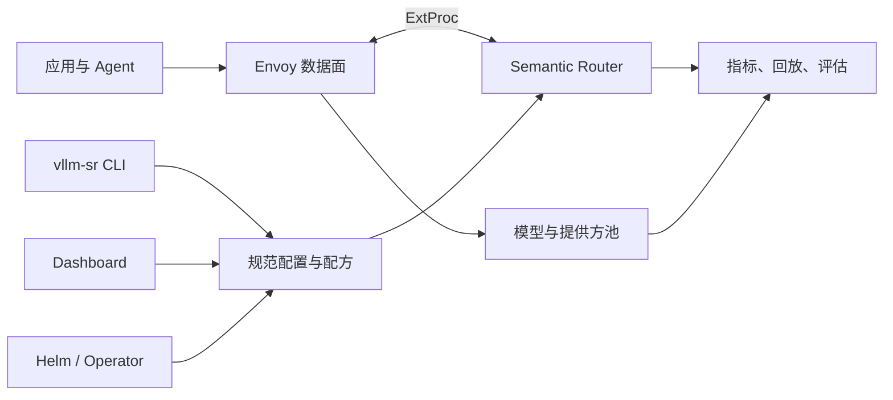

# 系统概览

vLLM Semantic Router 是 AI 客户端与模型后端之间的决策层。它按显式路由策略评估每次请求，再把请求转发到一个模型，或协调一条有界的多模型路径。

项目把高吞吐请求路径与用于配置和运维的工具分开。

## 架构

### 数据面

- **Envoy** 接受客户端流量，通过 External Processing 协议调用 Router，再把结果请求转发到上游。
- **Semantic Router** 提取信号、评估策略、应用路由特定行为，并选择或协调模型候选。
- **后端** 是 OpenAI 兼容的模型服务或提供方端点。Router 不加载它们的模型权重。

### 控制面

- **规范 YAML** 是路由行为的可移植来源。
- **入口** 把一个或多个公开模型别名映射到配方。
- **配方** 是完整的策略与运行时状态隔离边界。一个或多个入口可以选择同一配方。
- **CLI 和控制面板** 支持本地搭建、校验、模型发现、配置和运维。
- **Helm 和 Operator** 把 Router 部署到 Kubernetes 环境。
- **评估与可观测性** 暴露路由结果，便于运维人员测试和改进策略。

## 核心对象

| 对象 | 用途 |
| --- | --- |
| **入口** | 把一个或多个公开模型别名映射到配方。 |
| **配方** | 完整的路由策略与运行时状态隔离边界。 |
| **信号** | 关于请求、身份、对话或内容的具名事实。 |
| **投影** | 由信号导出的可复用分数、分区或区间。 |
| **决策** | 选择合格路由和候选集的策略规则。 |
| **插件** | 路由特定处理，例如请求控制、记忆、检索或响应处理。 |
| **算法** | 用于选择或协调候选模型的方法。 |
| **提供方模型** | 可供一个或多个配方使用的物理推理端点。 |

这种分离很重要。检测可以跨策略复用，策略可以在不重写模型选择的情况下变更，物理池也可以演进而不改变公开入口。

## 请求生命周期

1. 客户端使用 OpenAI Chat Completions、OpenAI Responses 或 Anthropic Messages 发送请求。
2. Envoy 把请求交给 Router。
3. 请求的模型解析为入口及其配方。
4. Router 提取相关信号并计算投影。
5. 决策强制约束并选出合格候选集。
6. 路由的算法选择一个模型，或执行有界的多模型策略。
7. 路由插件在已配置的请求、执行或响应钩子处运行。
8. Envoy 把提供方形态的请求发送到所选后端，并返回规范化响应。

运维人员若希望直接选择，仍可暴露显式物理模型名。这些请求会直通，不经过配方信号、决策、路由插件、缓存、学习或会话路由。当客户端应选择目标、由 Router 负责物理路由时，虚拟模型名更有用。若所选配方内没有决策匹配，则使用已配置的默认提供方模型。

## 协议与部署边界

Semantic Router 可以位于直接的 Envoy listener 之后，也可以与 Kubernetes 网关和推理平台部署集成。同一路由模型适用于本地 Docker、Kubernetes 和混合环境，但模型供给和容量管理仍由所选后端平台负责。

Router 可以考虑请求语义和已配置的运行时观测；它不替代后端调度器。因此，一次部署可以用 Semantic Router 选择模型类别，再用另一个组件选择该模型的健康副本。

客户端和所选后端不必使用相同的线格式。支持的客户端端点、后端格式和成对转换矩阵见[协议兼容性](../installation/protocol-compatibility)。

## 下一步

- [使用场景](use-cases)：实用部署模式。
- [路由流水线](signal-driven-decisions)：策略分层。
- [Mixture of Models](mom-model-family)：虚拟模型与多模型执行。
- [快速开始](/zh-Hans/docs/installation)：运行本地协议栈。
