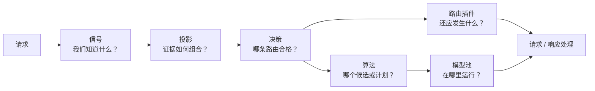

# 路由流水线

Semantic Router 把请求理解、策略和模型执行分开。每一层回答不同的问题，从而让路由规则可读，并避免某个分类器或优化分数变成全部策略。

## 信号：提取事实

信号给从请求、对话、身份或内容中检测到的事物命名。有些信号是确定性的，例如关键词、元数据谓词或上下文长度区间。另一些使用嵌入或分类器模型，用于语义意图、领域、复杂度、PII 或越狱检测。

信号描述事实，不选择后端。同一信号可被同一配方内的多个决策复用。

维护中的启发式与学习型家族见[信号概览](../tutorials/signal/overview)。

## 投影：协调证据

投影把若干信号输出变成可复用结果：

- **分区** 在重叠匹配中选出一个连贯的胜者；
- **分数** 组合加权输入；
- **映射** 把分数转换成具名路由区间。

例如，领域证据可以形成互斥的领域分区，复杂度、上下文和校验证据可以形成难度分数。多个决策随后可以引用这些结果，而不必重复组合逻辑。

见[投影](../tutorials/projection/overview)。

## 决策：应用策略

决策用布尔规则组合信号和投影输出。其优先级以及配方的策略决定哪条匹配路由胜出。匹配的决策提供候选模型、可选算法和路由局部插件。

在这里把硬要求写清楚。授权、仅本地处理、模态、上下文容量和工具兼容性应在优化器比较成本或延迟之前，决定路由是否合格。

见[决策](../tutorials/decision/overview)。

## 算法：选择或协调模型

决策匹配后，其算法处理候选集。

- **选择算法** 按固定顺序、语义匹配、延迟、反馈或其他有界策略选出一个候选。
- **Looper 算法** 通过级联、评审组、多轮过程或工作流协调多次调用。

当决策只有一个候选时，最简单的静态行为往往就是正确选择。编排应留给额外延迟和算力已有可度量价值的任务。

见[算法](../tutorials/algorithm/overview)。

## 插件：应用路由特定行为

插件为所选路由附加行为。按插件不同，该行为可能在提供方请求之前、执行期间或处理响应时运行。示例包括请求参数变更、上下文压缩、检索、记忆、回放、响应缓存和响应控制。

检测和执行是不同的。例如，PII 信号报告一次匹配；决策和插件策略决定是拦截、改路、转换，还是仅观察。

见[插件](../tutorials/plugin/overview)。

## 模型池：执行请求

提供方把逻辑模型名绑定到物理推理端点。池中可以包含本地 vLLM 或 Ollama 服务、Kubernetes 托管模型，或远程 OpenAI 兼容提供方。Semantic Router 选择模型路径；模型服务器或后端调度器执行它，并拥有副本放置。

能力和运行时元数据只在策略边界内有用。如果快速后端无法满足请求的模态、上下文、工具或本地性要求，它就不合格。

## 配方保持策略隔离

入口选择一个配方。该配方拥有自己的信号、投影、决策、算法、插件、缓存命名空间和路由状态。提供方、存储和 Router 自有的模型资产可以共享，但不能让一个配方的策略泄漏到另一个配方。

具体后端模型名是直通请求。它们绕过配方信号、决策、路由局部插件、缓存、学习和会话路由。若虚拟入口的配方没有匹配决策，Router 使用已配置的默认提供方模型。

完整配置约定见[虚拟模型](../tutorials/global/entrypoints-and-recipes)。

## 工作负载、Router 与模型池

有用的路由决策把三种视角合在一起：

| 视角 | 示例 |
| --- | --- |
| **工作负载** | 意图、语言、复杂度、上下文、工具、模态、身份 |
| **Router 策略** | 资格、优先级、目标、插件、算法 |
| **模型池** | 能力、本地性、健康、延迟、负载、相对成本 |

工作负载说明需要什么。策略说明允许什么、偏好什么。模型池说明当前可用什么。把这些视角分开，系统更容易变更和评估。
