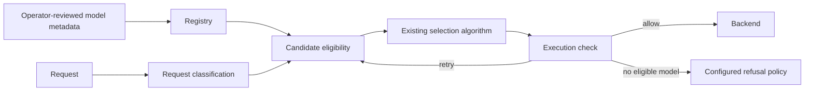

> **状态：** 提案 · **创建日期：** 2026-03-20

## 问题 {#problem}

语义相关性不等于资格。模型可能看起来适合某个领域，却缺少运营方批准的角色、所需来源，或回答某类请求的权限。

PRISM 提出围绕模型选择的可选合法性检查。它不替代配方的信号、决策或选择算法。

## 提案 {#proposal}

PRISM 将检查分成三个键：

| 键 | 问题 | 输出 |
| --- | --- | --- |
| Qualification | 该模型批准了哪些领域和约束？ | 一条注册表条目。 |
| Classification | 该请求适用哪些领域和约束？ | 带置信度的请求分类。 |
| Execution | 所选模型在两条记录下是否有资格？ | 允许、用另一候选重试，或拒绝。 |

## 资格注册表 {#qualification-registry}

153 键 schema 用于描述领域资格、范围限制和证据。注册表应在请求时确定且可检查。

模型生成的自我描述可以帮助填充草稿条目，但不是权威证据。生产资格应来自签名元数据、运营方审阅，或其他可信控制面来源。注册表条目需要版本、来源、激活状态，以及过期或审阅策略。

## 请求分类 {#request-classification}

分类把请求映射到与注册表相同的词汇。结果包含领域、置信度，以及策略要求的任何约束。低置信度或未知结果遵循显式回退策略；它们不得悄悄变成高置信度的通用分类。

分类应尽可能复用现有信号基础设施。PRISM 不应创建并行的请求解析器或隐藏的决策引擎。

## 候选与执行检查 {#candidate-and-execution-checks}

候选检查在现有选择算法运行前移除明显不合格的模型。执行检查用同一注册表条目确认所选模型。

重试受原始候选集约束。它不得重新匹配决策、扩大配方的模型池，或无限循环。当没有合格模型剩余时，路由在拒绝、运营方声明的回退，或透传策略之间选择。

透传对逐步采用有用，但当 PRISM 代表强制合规控制时不安全。因此默认值不能独立于部署策略来选择。

## 失败与可观测性 {#failure-and-observability}

注册表就绪、分类器失败和缺失模型条目是不同状态，应产生不同诊断。有用事件包括：

- 注册表版本和就绪情况；
- 请求分类和置信度；
- 带原因码的被排除候选；
- 重试次数；以及
- 最终的允许、回退或拒绝结果。

诊断不得在响应头中暴露敏感请求文本或资格证据。

## 范围与非目标 {#scope-and-non-goals}

初始提案覆盖组合后的资格、请求分类和执行路径。它不：

- 定义模型训练主张的真实性；
- 替代安全过滤器或授权；
- 在已匹配决策之外选择新模型；
- 在没有显式存储设计的情况下持久化注册表状态；或
- 为每个领域建立通用阈值。

## 评估 {#evaluation}

使用运营方审阅的请求与合格模型矩阵。测量错误允许、错误拒绝、未知领域行为、注册表不可用行为，以及额外路由延迟。包含对抗性模型元数据和过期注册表条目。

## 待决问题 {#open-questions}

- 谁签名或批准资格记录？
- 153 键 schema 中哪些部分是最小条目所必需的？
- 内存中的注册表状态是否足够，还是更新必须在重启后存活？
- 哪些路由需要失败即关闭行为？
- 重叠或层级领域如何表示？

## 参考资料 {#references}

- [跟踪议题 #1422](https://github.com/vllm-project/semantic-router/issues/1422)
- [PRISM 白皮书](https://github.com/user-attachments/files/25750911/PRISM-Vllm-SR-whitepaper-COMPLET-EN.pdf)
- [信号、决策与模型选择](../overview/signal-driven-decisions)
