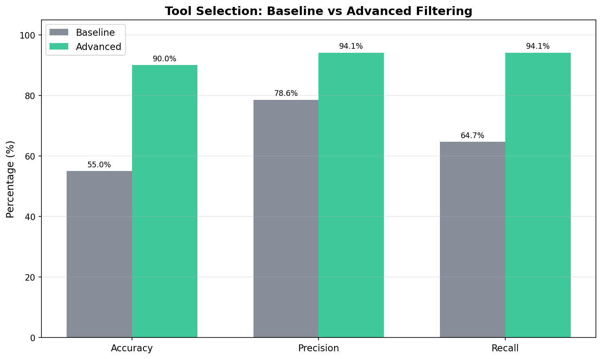
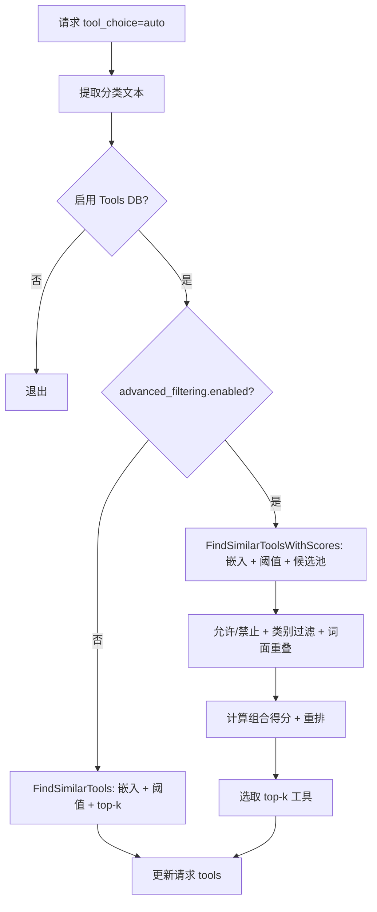

---
translation:
  source_commit: "5f14781c"
  source_file: "docs/proposals/advanced-tool-filtering.md"
  outdated: false
---

# 工具选择的高级工具过滤

Issue: [#1002](https://github.com/vllm-project/semantic-router/issues/1002)

---

## 现状

当前工具选择仅使用嵌入相似度、相似度阈值与 top-k。当嵌入相近但意图不一致时，可能选到错误领域的工具。

[#1002](https://github.com/vllm-project/semantic-router/issues/1002) 提议引入高级工具过滤能力，通过更精细的相关性过滤减少误选，同时保持默认行为不变。

## 方案

在嵌入候选集合检索之后，增加**可选的高级过滤阶段**。该阶段应用确定性过滤（允许/禁止列表、可选类别门控、词面重叠阈值）以及融合嵌入相似度与词面、标签、名称、类别信号的**组合得分重排器**。若 `advanced_filtering.enabled=false`，行为与现有实现一致。

方案优点：延迟可控、不引入新模型依赖、可通过配置完整解释。

## 对比测试结果

测试配置：

- 查询集：20 条（17 正例、3 负例），覆盖天气、邮件、搜索、计算、日历等场景
- 工具库：5 个工具（get_weather、search_web、calculate、send_email、create_calendar_event）
- 迭代：10 次
- 高级过滤配置：`min_lexical_overlap=1`、`min_combined_score=0.35`、`weights={embed:0.7, lexical:0.2, tag:0.05, name:0.05}`

评估结果：



| 指标 | 基线 | 高级 | 增量 |
|------|------|------|------|
| **准确率** | 55.00% | 90.00% | **+35.00%** |
| **精确率** | 78.57% | 94.12% | **+15.55%** |
| **召回率** | 64.71% | 94.12% | **+29.41%** |
| **假阳性率** | 100.00% | 33.33% | **-66.67%** |
| 平均延迟 | 0.0162 ms | 0.0197 ms | +0.0036 ms |
| P95 延迟 | 0.0256 ms | 0.0288 ms | +0.0032 ms |

## 数据流



## 配置变更

高级过滤默认关闭。启用时下列字段生效。

| 字段 | 类型 | 默认 | 范围 / 说明 |
|------|------|------|-------------|
| `enabled` | bool | `false` | 启用高级过滤。 |
| `candidate_pool_size` | int | `max(top_k*5, 20)` | 若设置且 >0 则直接使用。 |
| `min_lexical_overlap` | int | `0` | 查询与工具词表之间的最小唯一 token 重叠数。 |
| `min_combined_score` | float | `0.0` | 组合得分阈值，范围 [0.0, 1.0]。 |
| `weights.embed` | float | `1.0` | 未设置权重时 embed 默认为 1.0。 |
| `weights.lexical` | float | `0.0` | 可选权重，范围 [0.0, 1.0]。 |
| `weights.tag` | float | `0.0` | 可选权重，范围 [0.0, 1.0]。 |
| `weights.name` | float | `0.0` | 可选权重，范围 [0.0, 1.0]。 |
| `weights.category` | float | `0.0` | 可选权重，范围 [0.0, 1.0]。 |
| `use_category_filter` | bool | `false` | 为 true 时在置信度足够时按类别过滤。 |
| `category_confidence_threshold` | float | `nil` | 若设置，仅当决策置信度 ≥ 阈值时才应用类别过滤。 |
| `allow_tools` | []string | `[]` | 工具名白名单；非空时仅保留这些工具。 |
| `block_tools` | []string | `[]` | 工具名黑名单。 |

## 打分与过滤实现

### 分词

规则：转小写并在非字母数字处切分。仅 Unicode 字母与数字计为 token。  
实现见：[src/semantic-router/pkg/tools/relevance.go#L240](https://github.com/samzong/semantic-router/blob/feat/advanced-tool-filtering/src/semantic-router/pkg/tools/relevance.go#L240)。

### 词面重叠

词面重叠统计下列**唯一 token** 的交集：

- 工具名
- 工具描述
- 工具类别

不包含标签。标签为单独信号。

### 组合得分公式

对每个候选工具：

```
combined = (w_embed * embed + w_lexical * lexical + w_tag * tag + w_name * name + w_category * category) / (w_embed + w_lexical + w_tag + w_name + w_category)
```

- `embed` 为相似度得分，限制在 [0,1]。
- `lexical` 与 `tag` 为重叠得分，按查询 token 数 / 标签 token 数归一化。
- `name` 与 `category` 为二元得分（0 或 1）。
- 若未设置权重，embed 默认为 1.0。
- 若所有权重显式为 0，则组合得分为 0；当 `min_combined_score > 0` 时所有候选都会被滤掉。

### 类别置信门控

仅当同时满足以下条件时类别过滤才生效：

- `use_category_filter` 为 true，
- 存在类别，且
- 决策置信度 ≥ `category_confidence_threshold`（若已设置）。

## 错误处理与回退

- 工具选择失败且 `tools.fallback_to_empty=true`：请求在**无工具**的情况下继续，并记录警告。
- 若 `fallback_to_empty=false`：返回分类错误。
- 无效的高级配置在加载阶段被拒绝（`validator.go` 中的范围校验）。

## API 变更

新增或修改的 API：

```go
// src/semantic-router/pkg/tools/tools.go
func (db *ToolsDatabase) FindSimilarToolsWithScores(query string, topK int) ([]ToolSimilarity, error)

// src/semantic-router/pkg/tools/relevance.go
func FilterAndRankTools(query string, candidates []ToolSimilarity, topK int, advanced *config.AdvancedToolFilteringConfig, selectedCategory string) []openai.ChatCompletionToolParam
```
