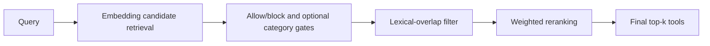

> **状态：** 已实现 · **创建日期：** 2026-01-14

## 问题 {#problem}

嵌入相似度可能检索到语言接近但不符合用户意图的工具。返回过多近似匹配会增加工具选择歧义，并可能暴露无关领域的工具。

工具相关性不是授权，但相关性仍应可检查、可配置。

## 已实现设计 {#implemented-design}

高级过滤是 `tool_selection` 插件 add 模式中的可选阶段：

```mermaid
flowchart LR
  Query --> Retrieve["Embedding candidate retrieval"]
  Retrieve --> Rules["Allow/block and optional category gates"]
  Rules --> Lexical["Lexical-overlap filter"]
  Lexical --> Score["Weighted reranking"]
  Score --> TopK["Final top-k tools"]
```

禁用时，工具选择保持普通嵌入检索路径。

## 评分 {#scoring}

重排序器可以组合归一化嵌入相似度与词汇重叠，以及工具标签、名称和类别上的匹配。运营方选择权重和最低组合分数。

该分数是相关性启发式，不是概率。权重和阈值应在部署自己的工具目录和请求集上校准。

## 配置边界 {#configuration-boundary}

主要控制项为：

| 控制项 | 用途 |
| --- | --- |
| `candidate_pool_size` | 限制最终 top-k 选择前考虑的更广池。 |
| `min_lexical_overlap` | 要求最少数量的共享归一化词项。 |
| `min_combined_score` | 拒绝低于最终重排序分数的候选。 |
| `weights` | 平衡嵌入、词汇、标签、名称和类别证据。 |
| `allow_tools` / `block_tools` | 应用确定性目录限制。 |
| `use_category_filter` | 在有类别证据时启用类别门控。 |

精确字段类型和默认值请使用维护中的工具选择片段和当前配置 schema。

## 失败与安全行为 {#failure-and-security-behavior}

无效权重和阈值在配置校验时被拒绝。运行时失败遵循插件配置的回退行为。

允许和阻止列表不替代授权。调用方或执行层仍须验证用户有权调用所选工具。

## 范围与非目标 {#scope-and-non-goals}

高级过滤对有界的工具候选集重排序。它不执行工具、推断用户权限、保证意图正确，或增加另一模型依赖。

## 评估 {#evaluation}

在版本化目录和带标签的请求集上评估。报告精确率、召回率、空选择率、目录覆盖率和增加的延迟。百分比改进需要可复现数据集、基线配置和评估产物。

## 参考资料 {#references}

- [工具选择插件指南](../tutorials/plugin/tool-selection)
- [维护中的 add 模式片段](https://github.com/vllm-project/semantic-router/blob/main/config/fragments/plugin/tool-selection/add-from-database.yaml)
- [相关议题 #1002](https://github.com/vllm-project/semantic-router/issues/1002)
