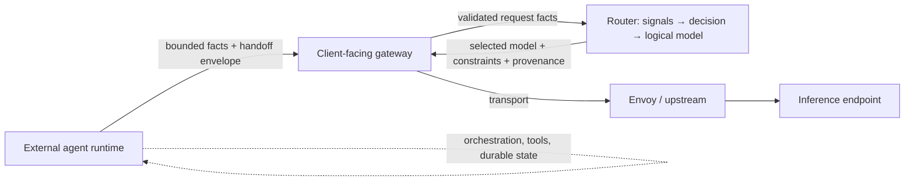

> **状态：** 提案 · **创建日期：** 2026-08-29 · **Epic：** [#2994](https://github.com/vllm-project/semantic-router/issues/2994)

## 问题 {#problem}

外部智能体运行时通过普通推理使用的同一 OpenAI 兼容网关委托工作。这些请求携带角色、谱系、预算、能力和驻留约束，仅从提示词文本推断是不安全的。Router 必须在选择**逻辑模型**时使用该信息，而又不变成智能体编排器。

[Agent Routing 配方](https://github.com/vllm-project/semantic-router/blob/main/config/recipes/agent/README.md) 将智能体**工作负载路由到模型通道**。[Router Flow](./router-flow-workflows) 编排有界的多**模型**工作流。[会话感知选择](https://github.com/vllm-project/semantic-router/blob/main/src/semantic-router/pkg/selection/session_aware.go) 已在模型切换期间应用工具循环和交接策略。这些都没有定义跨越 Router、网关和外部运行时接缝的版本化、有界事实和交接契约。

## 提案 {#proposal}

定义智能体感知的**事实**和**交接信封**，使 Router 能为外部智能体运行时安全地选择逻辑模型。保持 v0.3 契约：

- Router 选择逻辑 **Model**；
- Envoy 和面向客户端的网关拥有上游传输；
- 配方的 **决策保持与模型无关**，而 **入口拥有 `model_names`**；
- 可选智能体服务位于 Router **之外**。

本文为维护者审阅确定所有权、契约字段和分阶段交付。实现 PR 在契约达成一致后跟进；它们不先于契约。

## 所有权边界 {#ownership-boundary}

| 层 | 拥有 | 不拥有 |
| --- | --- | --- |
| **Router** | 语义决策、配方执行、逻辑模型选择、配方范围插件、有界智能体事实的校验与投影、内容最小化诊断 | 智能体身份、任务编排、工具执行、持久任务状态、递归委托、智能体端点调用 |
| **面向客户端的网关 / 数据面** | 部署特定代理、传输、信封的认证入站、下游确认 | 语义模型选择、配方策略 |
| **外部智能体运行时** | 智能体身份、编排、工具、持久状态、委托图、不透明上下文引用 | Router 配方决策、模型卡片或提供商清单 |
| **Envoy / 上游传输** | Router 决策后到所选模型端点的物理路由 | 智能体发现、混合模型/智能体候选池 |



当事实缺失、过期、不可信或超出范围时，不受支持的集成**回退到普通逻辑模型路由**，并给出显式诊断。

## 契约表面 {#contract-surfaces}

Epic #2994 定义两个版本化、内容最小化的表面。它们与 [#2546](https://github.com/vllm-project/semantic-router/issues/2546) 中的可信网关上下文信封相关，但不阻塞独立实现切片。

### 1. 选择事实信封（[#3379](https://github.com/vllm-project/semantic-router/issues/3379)） {#1-selection-facts-envelope-3379}

事实从已配置、已认证的入站到达**信号边界**。Router 在它们影响硬资格或选择之前进行校验。

| 字段组 | 用途 | Router 用法 |
| --- | --- | --- |
| **Lineage** | 根和父调用标识符、委托深度 | 连续性保护、来源、冲突检测 |
| **Delegated role** | 当前子任务的有界角色标签 | 信号投影和资格 |
| **Task phase** | 粗粒度生命周期阶段（例如 `plan`、`execute`、`review`） | 策略和选择偏向；不是工作流图 |
| **Budget** | 剩余 token、时间或成本计数器 | 硬资格和降级 |
| **Capability requirements** | 所选模型必须满足的已声明技能或约束 | 对照 `routing.modelCards` 元数据过滤 |
| **Context portability** | 会话中是否可以发生模型切换 | 复用会话感知和上下文可移植锁 |
| **Residency / trust** | 租户范围、数据驻留、信任标签 | 隐私和隔离信号 |

校验规则（所有阶段）：

- 限制大小、深度、基数和生命周期；
- 拒绝或降级缺失、畸形、过期、冲突和不可信数据；
- **从不扩大**已配置候选集，或削弱授权、安全或驻留策略；
- 只把已接受事实投影到类型化信号；把被拒绝事实排除在选择之外。

决策继续声明 **`modelRefs`**（或带 `minimum_candidates` 的无模型资产）。事实可以**缩小**资格；它们不引入智能体目标或混合候选种类。

示意入站（传输形态由网关拥有；schema 可移植）：

```yaml
# Request extension presented at the signal boundary after gateway authn/authz
agentic_facts:
  version: "1"
  lineage:
    root_invocation_id: inv-root-abc
    parent_invocation_id: inv-parent-def
    depth: 2
  delegated_role: security_review
  task_phase: execute
  budget:
    remaining_tokens: 12000
  required_capabilities: [code_review, structured_output]
  context_portability: sticky
  trust_boundary: tenant_scoped
```

### 2. 跨模型交接信封（[#3380](https://github.com/vllm-project/semantic-router/issues/3380)） {#2-cross-model-handoff-envelope-3380}

当外部运行时在任务中途更改逻辑模型时，它在受支持边界上传递**有界交接信封**。Router 只检查已校验的**选择可读**字段；不透明运行时引用留在 Router 存储之外。

| 字段组 | 用途 |
| --- | --- |
| **Identity** | 交接 ID、幂等键、根/父调用 ID |
| **Selection-readable summary** | 委托角色、所需能力、剩余预算、粗粒度任务/结果摘要 |
| **Tool continuation** | 对已授权工具状态的引用，不是原始工具载荷 |
| **Lifecycle** | 过期、取消令牌、版本兼容性 |
| **Receipts** | 已接受、已拒绝、已过期、重复或部分支持的结果 |

网关或数据面按其部署契约携带信封。在交接影响选择或会话连续性之前，Router 校验边界、脱敏、完整性和策略兼容性。交接**不**重新匹配语义决策，也**不**调用外部智能体。

与 [#2546](https://github.com/vllm-project/semantic-router/issues/2546) 的协调：

- 在重叠处复用已审阅的网关上下文字段（身份、预算阶段、工具标识符、保留、逻辑模型提示）；
- 保持 Router 记忆回执在诊断中无内容；
- 把部署特定传输语义从可移植 schema 中推迟。

## v0.3 中保持不变的内容 {#what-stays-unchanged-in-v03}

本提案**不**添加：

- Router 配置中的 `providers.agents`、`routing.agentCards` 或智能体后端清单；
- `decisions[].targetRefs` 或任何混合模型/智能体候选池；
- Router 原生的智能体端点调用、发现或组合；
- 模型配置中的智能体端点，或选择智能体而不是逻辑模型的决策；
- 路由字段中不受限的工作流图、完整转录、凭证或隐藏推理。

[Router Flow](./router-flow-workflows) worker 池仍是**仅模型**的 `modelRefs`。多模型协作算法属于 [#3037](https://github.com/vllm-project/semantic-router/issues/3037)，不属于本 epic。

## 外部协作表面 {#external-collaboration-surfaces}

可选协作路径（如 ClawOS room 工作流）仍位于 Router 编排**之外**。Epic 工作使它们生命周期安全且有界：

- 传输竞态和关闭后发送行为（[#1521](https://github.com/vllm-project/semantic-router/issues/1521)）；
- 集成接缝上的显式失败、重试、取消和可观测性；
- 不把 room 转录或编排状态嵌入 Router 决策。

当协作表面通过网关承接推理时，Router 可以消费同一有界事实和交接信封，但它不托管 room、worker 或委托图。

## 分阶段交付 {#phased-delivery}

每一阶段都是独立实现 PR，以前一阶段的维护者审阅为门控。

| 阶段 | 交付物 | Epic 完成标准 |
| --- | --- | --- |
| **0** | 本提案、执行计划 PL-0041、GitHub 子议题对齐 | 研究毕业门 |
| **1** | 所有权边界文档、选择事实 schema、校验、失败/降级策略 | 事实有界、版本化且不可执行 |
| **2** | 信号投影、资格缩小、#3379 的回放来源 | 智能体事实改进或保持选择结果 |
| **3** | 交接信封 schema、回执、幂等性，以及 #3380 的模型切换 E2E | 受支持边界上的有界交接 |
| **4** | 一个带生命周期、失败和可观测性覆盖的外部协作表面 | 协作接缝有界且可测试 |
| **5** | 对照延迟、成本、连续性损失、安全的评估；不受支持集成的回退 | 从 `research` 毕业到已排期交付 |

阶段 0 仅为提案。阶段 1–5 仅在契约达成一致后开启。

## 评估 {#evaluation}

每一阶段交付可复现证据：

- **阶段 2：** 有无已校验事实时的选择质量、延迟、成本和策略拒绝率；证明事实从不扩大候选。
- **阶段 3：** 对照声明基线的交接往返、重试/幂等、取消和模型切换连续性。
- **阶段 4：** 所选协作表面的生命周期和失败覆盖。
- **阶段 5：** 影子或离线比较，表明智能体感知事实在不把编排移入 Router 的前提下保持或改进结果。

## 范围与非目标 {#scope-and-non-goals}

本提案覆盖：

- 跨 Router、网关和外部运行时的所有权文档；
- 有界选择事实和交接信封；
- 校验、来源和不受支持集成的回退。

它**不**：

- 在 Router 内调用、托管、发现或递归组合外部智能体；
- 实现智能体工具、记忆、内部推理或持久任务编排；
- 将 Router Flow 或 MoM 算法扩展到智能体参与者；
- 替代面向客户端的网关、数据面或外部智能体运行时。

## 已决议的设计选择 {#resolved-design-choices}

这些选择固定在本提案中，使实现阶段不会悄悄重开它们：

| 问题 | 决策 |
| --- | --- |
| 候选池形态 | 决策中**仅 `modelRefs`**；没有 `targetRefs` 或混合种类 |
| 智能体清单位置 | **外部运行时**；不是 Router 配置中的 `providers.agents` |
| 组合所有权 | 多智能体编排由**外部运行时**负责；仅模型协作由 **Router Flow / MoM（#3037）** 负责 |
| Router 输出 | 所选**逻辑模型**、适用约束、来源和内容最小化诊断 |
| 不受支持的集成 | 带显式诊断的普通逻辑模型路由 |

## 待决问题 {#open-questions}

- 每个选择事实字段的精确信号名称和投影映射。
- 阶段 3 的最小交接信封字段，以及对与 #2546 重叠部分的推迟。
- 每个网关配置文件支持哪些入站认证器和头/体载体。
- 将 Epic #2994 从 `research` 移到已排期交付的毕业标准。
- 面向用户响应安全的轨迹字段，与仅运营方回放的字段。

## 参考资料 {#references}

- [Epic #2994：定义智能体感知的 Router 契约和有界外部协作](https://github.com/vllm-project/semantic-router/issues/2994)
- [功能 #3379：将外部智能体谱系和委托角色事实带入模型选择](https://github.com/vllm-project/semantic-router/issues/3379)
- [功能 #3380：在外部运行时边界定义有界跨模型交接信封](https://github.com/vllm-project/semantic-router/issues/3380)
- [Epic #2546：可信网关上下文信封](https://github.com/vllm-project/semantic-router/issues/2546)
- [Epic #3037：有界多模型协作算法](https://github.com/vllm-project/semantic-router/issues/3037)
- [Agentic & Context 工作组 #2987](https://github.com/vllm-project/semantic-router/issues/2987)
- [统一配置契约 v0.3](./unified-config-contract-v0-3)
- [Router Flow 工作流](./router-flow-workflows)
- [模型执行回退](./model-execution-fallback)
- [Agent Routing 配方](https://github.com/vllm-project/semantic-router/blob/main/config/recipes/agent/README.md)
