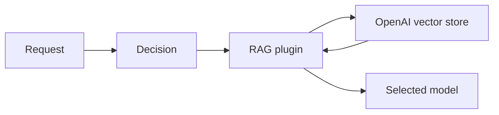

> **状态：** 已实现 · **创建日期：** 2026-01-23

## 问题 {#problem}

已经把文档放在 OpenAI vector store 中的应用，不应只为了在已路由请求中使用这些文档而再需要一套检索服务。RAG 插件需要一个后端：在把文档搜索委托给 OpenAI 的同时，保留路由的检索、注入、缓存和失败策略。

## 已实现设计 {#implemented-design}

`rag` 决策插件接受 `backend: openai`，以及标识 vector store 和凭证的后端配置。仅在决策匹配之后才运行检索。

## 工作流模式 {#workflow-modes}

| 模式 | Router 行为 | 适用场景 |
| --- | --- | --- |
| `direct_search` | 在推理前搜索 vector store，并注入有界的检索内容。 | 路由需要同步、由路由器控制的检索。 |
| `tool_based` | 向请求添加 OpenAI `file_search` 工具定义。 | 所选提供商和请求协议支持该工具工作流。 |

`direct_search` 是默认值。在 `tool_based` 模式下，Semantic Router 会改写请求；它目前不会把响应注解变成注入上下文，以进行第二次模型调用。

## 配置边界 {#configuration-boundary}

后端特定字段为：

| 字段 | 用途 |
| --- | --- |
| `vector_store_id` | 选择 OpenAI vector store。 |
| `api_key` | 认证 OpenAI 请求；从密钥获取。 |
| `base_url` | 需要时覆盖 API 源。 |
| `max_num_results` | 限制返回的搜索结果。 |
| `max_response_bytes` | 限制每次直接搜索响应；`0` 使用 4 MiB。 |
| `file_ids` 和 `filter` | 在工作流支持时缩小搜索范围。 |
| `workflow_mode` | 选择直接搜索或工具改写。 |
| `timeout_seconds` | 限制远程请求。 |

通用 RAG 设置仍拥有上下文限制、注入模式、结果缓存、最低置信度和 `on_failure` 行为。完整形态请使用规范插件指南，不要从本记录复制冻结的完整配置。

## 数据与安全 {#data-and-security}

搜索查询和任何已配置过滤器会发送到 OpenAI 兼容端点。检索到的文档内容随后可能发送到所选模型提供商。运营方必须确认这两次传输满足数据驻留、保留和访问要求。

API 密钥必须来自密钥源，不得提交到配置中。vector store 访问控制仍是 OpenAI 账户问题；语义相关性不是文档授权。

## 失败行为 {#failure-behavior}

空搜索结果、认证失败、超时和无效过滤器都是检索失败。路由的 `on_failure` 策略决定是跳过检索、带警告继续，还是阻断。

缓存的检索结果会减少重复搜索，但也可能提供过期内容。选择与文档更新预期匹配的 TTL。

## 范围与非目标 {#scope-and-non-goals}

该集成搜索现有 vector store，或添加 `file_search` 工具。它不管理文档摄入、vector store 生命周期、用户级文档权限，或所选提供商对工具调用的实现。

## 评估 {#evaluation}

测试检索相关性、空结果、过滤器、上下文截断、凭证失败、超时行为，以及跨身份的数据泄漏。分别验证直接搜索和基于工具的路径。

## 参考资料 {#references}

- [当前 RAG 插件指南](../tutorials/plugin/rag)
- [OpenAI vector-store search API](https://developers.openai.com/api/reference/resources/vector_stores/methods/search)
- [OpenAI File Search guide](https://developers.openai.com/api/docs/guides/tools-file-search)
