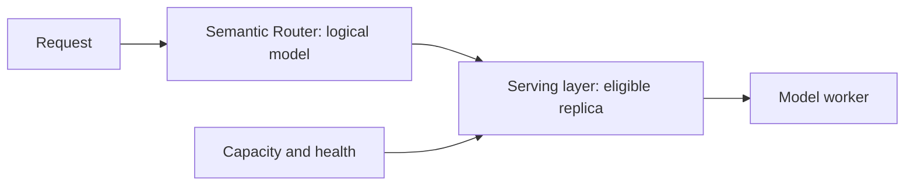

> **状态：** 决策记录 · **创建日期：** 2026-07-14

## 问题 {#problem}

批次级路由可以在共享预算和每模型容量限制下联合分配多条请求。这对批量工作负载有吸引力，但与必须为每条到达请求独立决策的内联路由器冲突。

架构问题是：在线容量应属于语义决策内部，还是在其下方的服务层。

## 决策 {#decision}

Semantic Router 保持逐查询。它根据请求含义、策略和已配置算法输入选择逻辑模型。

容量、队列深度、副本健康和 worker 本地缓存状态仍是服务与负载均衡关注点：

当算法显式支持时，路由器可以消费有界、对请求安全的性能信号。它不会在 ExtProc 热路径上收集批次并求解联合分配。

## 理由 {#rationale}

- **延迟：** 等待组成批次会在路由开始前增加排队延迟。
- **状态：** 容量是易变的，应靠近拥有队列和 worker 的组件。
- **故障隔离：** 服务层过载不应要求语义策略重新匹配。
- **可组合性：** 同一配方可以运行在不同调度器和推理平台之上。
- **评估：** 模型选择质量和副本调度可以独立测量。

本决策不包含任何基准主张。合成路由结果不能确立生产容量行为，也不应表述为产品保证。

## 后果 {#consequences}

Semantic Router 不能保证首选模型有即时容量。服务层可能排队、拒绝，或使用显式兼容的回退。跨模型回退仍需要自己的安全契约，因为更换逻辑模型不等于选择另一副本。

机队规模和容量规划仍是离线关注点。Fleet Simulator 可以评估候选机队形态，而不把优化器放进请求路径。

## 范围与非目标 {#scope-and-non-goals}

本决策适用于通过网关的交互式路由。它不排除有意批处理工作并接受求解器延迟的独立异步或批量 API。

它也不禁止延迟感知或负载知情算法。这些算法必须基于有界遥测运行，并保持已匹配决策的候选集。

## 何时重新审视 {#revisit-when}

在以下情况下重新考虑该边界：

- 引入了专用批量接口；
- 生产证据表明主导路由失败的是逻辑模型容量，而不是副本调度；
- 服务层无法表达所需的准入或溢出策略；或
- 有界分配方法能够满足内联延迟和失败预算。

## 参考资料 {#references}

- [Fleet Simulator 概览](../fleet-sim/overview)
- [延迟感知选择](../tutorials/algorithm/selection/latency-aware)
- [模型执行回退](./model-execution-fallback)
