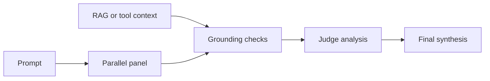

> **状态：** 提案 · **创建日期：** 2026-06-17

## 问题 {#problem}

Fusion 可以把同一提示词交给多个模型，让评判者比较响应，再综合出一个答案。这可以暴露矛盾和互补覆盖，但也会增加调用，并不能使多数意见正确。

设计问题是：如何改进审议，而不把模型一致性变成虚假的事实性信号。

## 当前基线 {#current-baseline}

已实现的 Fusion looper 有三个阶段：

1. 并行运行有界面板；
2. 请评判者做结构化分析；以及
3. 综合最终答案。

部分面板失败遵循配置的错误策略。评判者和面板仍留在已匹配决策声明的模型池和配置内。

## 提案 {#proposal}

在综合之前使用依据证据：

当有权威上下文时，将面板响应与该上下文比较。否则，跨模型一致性可以识别分歧，但不能确立真相。默认策略应标注或软加权证据，而不是仅因少数异议与多数不一致就丢弃它。

## 候选扩展 {#candidate-extensions}

| 扩展 | 用途 | 主要风险 |
| --- | --- | --- |
| Adaptive gating | 先用单个模型，仅在证据需要时才审议。 | 弱门控可能跳过困难请求。 |
| Multi-agent debate | 在综合前用有界轮次质疑主张。 | 额外成本、延迟和收敛失败。 |
| Panel composition | 为请求选择多样且路由批准的面板。 | 多样性启发式可能变成不透明策略。 |
| Grounding-aware synthesis | 向评判者提供关于支持和矛盾的证据。 | 有依据不等于真相。 |

每个扩展都应是类型化算法或 Fusion 选项，而不是隐藏的提示词逻辑。

## 范围与非目标 {#scope-and-non-goals}

提案将决策匹配、候选策略、超时和并发保持在现有路由器契约中。它不主张更多模型总是更好、共识能证明正确，或一个面板适用于每个领域。

网络搜索和检索仍是独立工具。审议可以消费其证据，但不应悄悄启用它们。

## 评估 {#evaluation}

将普通 Fusion 与一次只改一项的版本比较。报告任务质量、事实错误、最终答案中保留的被反驳主张、延迟、token、上游调用、部分失败和评判者敏感性。保留提示词、模型版本、面板组成和原始输出，以便结果可复现。

## 待决问题 {#open-questions}

- 哪些请求值得自适应升级？
- 依据失败时应回退到普通 Fusion，还是使路由失败？
- 如何在不引入隐藏模型策略的情况下测量面板多样性？
- 当面板响应包含敏感数据时，哪些轨迹可以安全暴露？

## 参考资料 {#references}

- [当前 Fusion 指南](../tutorials/algorithm/looper/fusion)
- [TruthLens 提案](./hallucination-mitigation-milestone)
- [SelfCheckGPT](https://arxiv.org/abs/2303.08896)
- [Multiagent debate](https://arxiv.org/abs/2305.14325)
