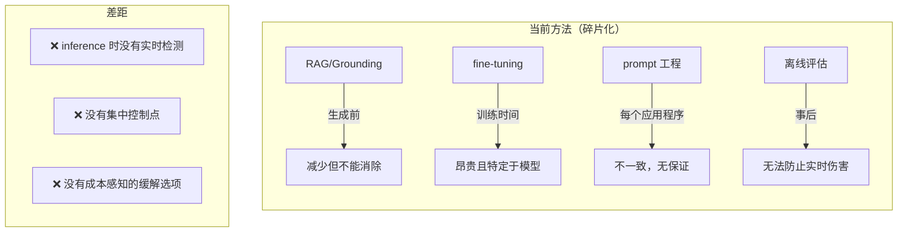
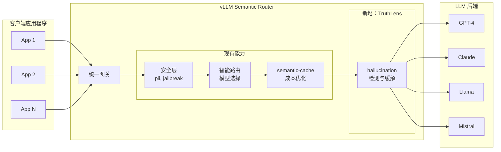
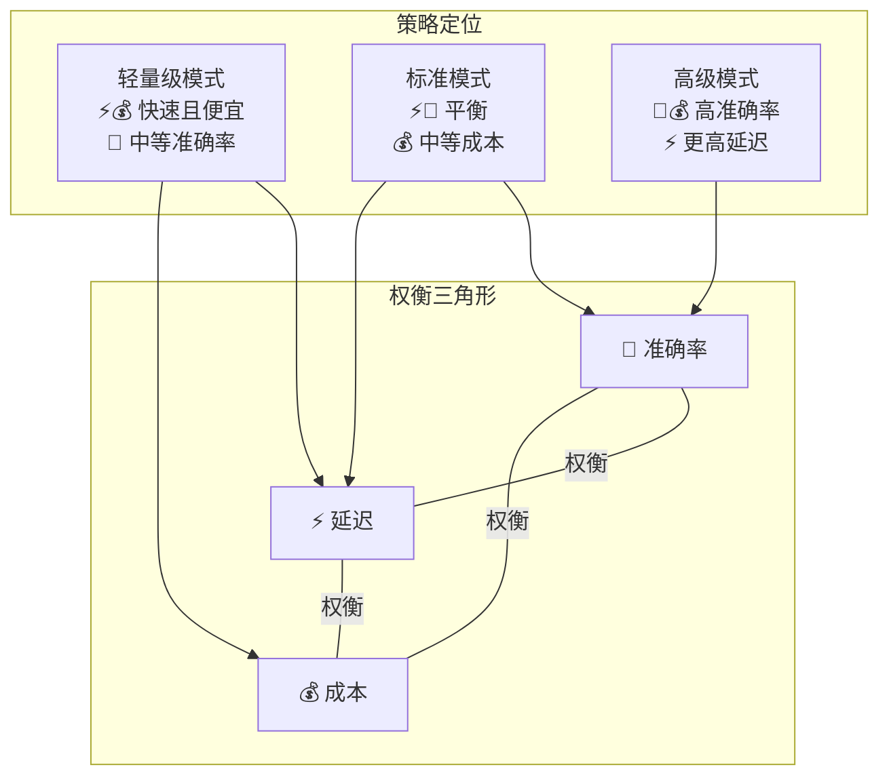
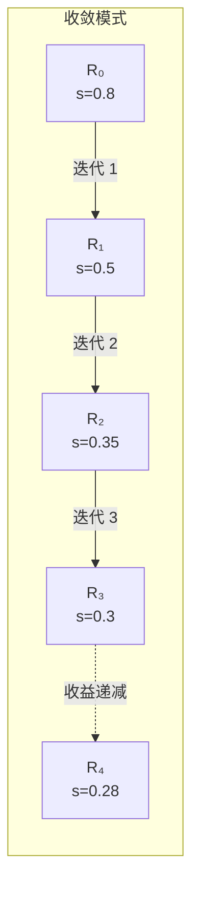
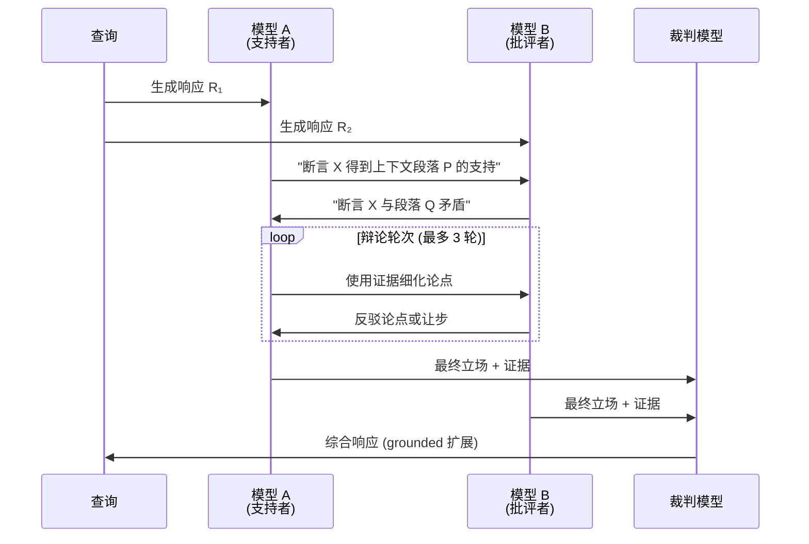
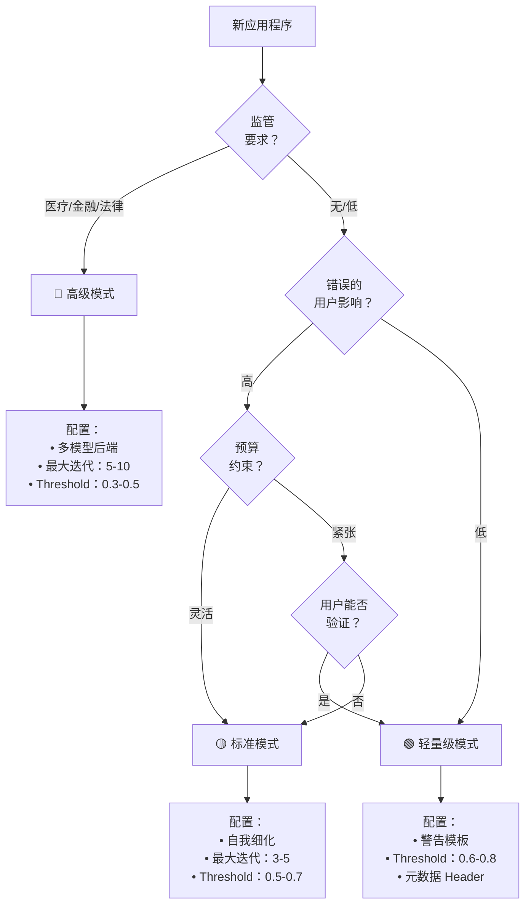
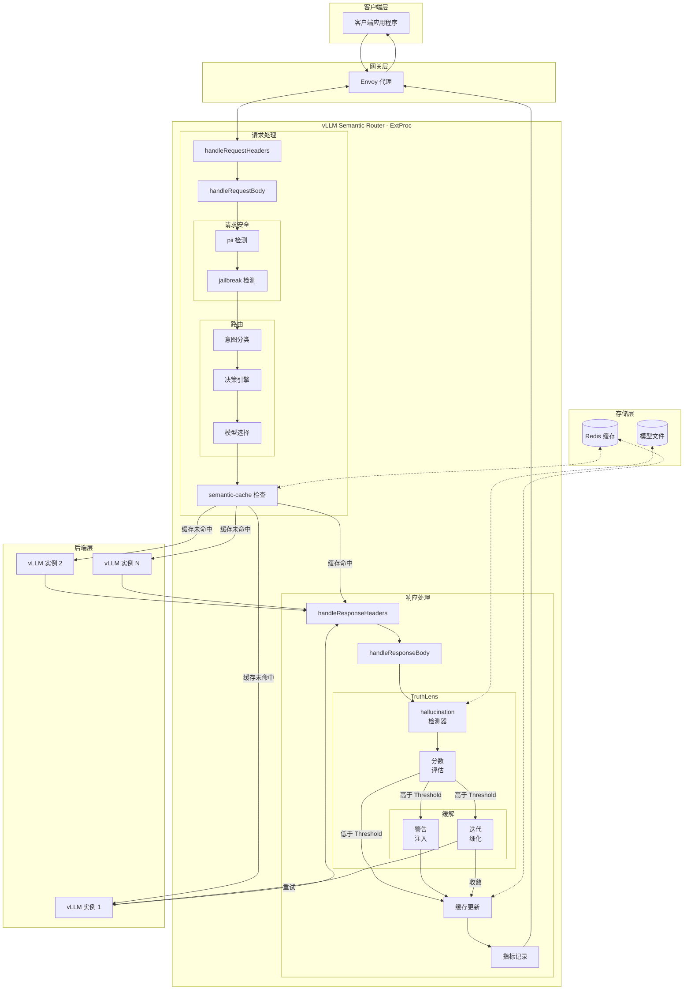

---
translation:
  source_commit: "bac2743"
  source_file: "docs/proposals/hallucination-mitigation-milestone.md"
  outdated: false
---

# TruthLens：实时 hallucination 缓解

**版本：** 1.0
**作者：** vLLM Semantic Router 团队
**日期：** 2025 年 12 月

---

## 摘要

大语言模型 (LLM) 展示了卓越的能力，但其产生 hallucination（流畅但事实错误或无根据的内容）的倾向仍然是企业采用 AI 的关键障碍。行业调查一致表明，hallucination 风险是阻止组织在生产环境中部署 LLM 驱动的应用程序的首要担忧，特别是在医疗保健、金融和法律服务等高风险领域。

我们提出了 **TruthLens**，这是一个集成到 vLLM Semantic Router 中的实时 hallucination 检测和缓解框架。通过在 inference 网关层定位 hallucination 控制，TruthLens 提供了一个与模型无关的集中式解决方案，通过可配置的缓解策略解决“准确率-延迟-成本”三角形问题。用户可以根据对成本和准确率权衡的容忍度从三种操作模式中进行选择：(1) **轻量级模式**——带有警告注入的单轮检测，(2) **标准模式**——使用相同模型的迭代自我细化，以及 (3) **高级模式**——多模型交叉验证和协作纠错。这种设计使组织能够部署值得信赖的 AI 系统，同时保持对运营成本和响应延迟的控制。

---

## 1. 引言：企业级 AI 中的 hallucination 危机

### 1.1 核心问题

hallucination 是当今企业采用 AI 的最重要障碍。与传统的软件错误不同，LLM 的 hallucination 是：

- **不可预测的**：它们在不同的查询和上下文中随机发生
- **具有说服力的**：hallucination 内容通常看起来流畅、自信且似乎合理
- **高风险的**：在医疗、法律或金融领域的一次 hallucination 可能会造成不可逆转的损害
- **隐形的**：如果没有专门的检测，用户无法区分 hallucination 和准确的响应

**按领域划分的行业影响：**

| 领域 | hallucination 风险容忍度 | 典型的缓解方法 |
|--------|------------------------------|----------------------------|
| 医疗保健 | 接近于零（生命至关重要） | 强制人工验证、责任担忧 |
| 金融服务 | 极低（监管） | 合规驱动的审查流程 |
| 法律 | 极低（责任） | 仅限于内部研究和起草 |
| 客户支持 | 中等 | 对不确定响应的升级协议 |
| 创意/营销 | 高容忍度 | 需要最少的干预 |

*注：基于行业调查中观察到的企业部署模式（麦肯锡 2024、高德纳 2024、Menlo Ventures 2024）。*

### 1.2 为什么现有解决方案不足

目前的 hallucination 缓解方法在 AI 堆栈的错误层级运行：



### 1.3 为什么 vLLM Semantic Router 是理想的解决方案点

vLLM Semantic Router 在 AI 基础设施堆栈中处于独特的位置，使其非常适合 hallucination 缓解：



**网关级 hallucination 控制的关键优势：**

| 优势 | 描述 |
|-----------|-------------|
| **模型无关** | 适用于任何 LLM 后端，无需修改 |
| **集中策略** | 所有应用程序的单一配置点 |
| **成本控制** | 全组织范围内对准确率与成本权衡的可视化 |
| **增量采用** | 启用按决策、按领域的策略 |
| **可观测性** | 针对 hallucination 事件的统一指标、日志和警报 |
| **深度防御** | 补充（而非取代）RAG 和 prompt 工程 |

### 1.4 正式问题定义

我们将检索增强生成 (RAG) 系统中的 hallucination 检测形式化为 **token 级序列标注**问题。

**定义 1 (RAG 上下文)。** 设 RAG 交互定义为元组 *(C, Q, R)*，其中：

- *C = \{c₁, c₂, ..., cₘ\}* 是检索到的上下文（文档/段落集）
- *Q* 是用户查询
- *R = (r₁, r₂, ..., rₙ)* 是作为 *n* 个 token 序列生成的响应

**定义 2 (Grounded 与 hallucination token)。** 响应 *R* 中的 token *rᵢ* 是：

- **Grounded**：如果在 *C* 中存在支持包含 *rᵢ* 的断言的证据
- **hallucination**：如果 *rᵢ* 贡献于以下断言：
  - (a) 与 *C* 中的信息矛盾（矛盾 hallucination），或
  - (b) 无法从 *C* 中验证且不是常识（无根据 hallucination）

**定义 3 (hallucination 检测函数)。** 检测任务是学习一个函数：

*f: (C, Q, R) → Y*

其中 *Y = (y₁, y₂, ..., yₙ)* 且 *yᵢ ∈ \{0, 1\}* 表示 token *rᵢ* 是否为 hallucination。

**定义 4 (hallucination 分数)。** 给定预测 *Y* 和置信度分数 *P = (p₁, ..., pₙ)*，其中 *pᵢ = P(yᵢ = 1)*，我们定义：

- **token 级分数**：*s_token(rᵢ) = pᵢ*
- **片段 (span) 级分数**：对于连续片段 *S = (rᵢ, ..., rⱼ)*，*s_span(S) = max(pᵢ, ..., pⱼ)*
- **响应级分数**：对于所有满足 *pᵢ > τ_token* 的 *i*，*s_response(R) = 1 - ∏(1 - pᵢ)*

**定义 5 (缓解决策)。** 给定 threshold *τ*，系统采取行动：

```text
Action(R) =
  通过 (PASS)        如果 s_response(R) < τ
  缓解 (MITIGATE)    如果 s_response(R) ≥ τ
```

---

## 2. 相关工作：hallucination 缓解的最前沿技术

### 2.1 hallucination 类型的分类

在回顾检测方法之前，我们建立了 hallucination 类型的分类：

**类型 1：内在 (Intrinsic) hallucination** —— 生成的内容与提供的上下文矛盾。

*示例*：上下文说“会议在周二”。响应说“会议安排在周三”。

**类型 2：外在 (Extrinsic) hallucination** —— 生成的内容无法从上下文中验证，且不是常识。

*示例*：上下文讨论公司的第三季度收益。响应包含了随处都未提及的第四季度预测。

**类型 3：捏造 (Fabrication)** —— 完全虚构的实体、引用或事实。

*示例*：“根据 Smith 等人 (2023) 的说法……”而实际上不存在这样的论文。

| 类型 | 检测难度 | 缓解方法 |
|------|---------------------|---------------------|
| 内在 | 较易（直接矛盾） | 上下文重新 ground |
| 外在 | 中等（需要知识边界） | 不确定性表达 |
| 捏造 | 较难（需要外部验证） | 交叉引用检查 |

### 2.2 检测方法

| 类别 | 代表性工作 | 机制 | 准确率 | 延迟 | 成本 |
|----------|---------------------|-----------|----------|---------|------|
| **基于编码器** | LettuceDetect (2025), Luna (2025) | 使用 ModernBERT/DeBERTa 进行 token 分类 | F1: 75-79% | 15-35ms | 低 |
| **自洽性 (Self-Consistency)** | SelfCheckGPT (2023) | 多次采样 + 一致性检查 | 变化 | Nx 基础 | 高 |
| **跨模型** | Finch-Zk (2025) | 多模型响应比较 | F1: +6-39% | 2-3x 基础 | 高 |
| **内部状态** | MIND (ACL 2024) | 隐藏层激活分析 | 高 | \&lt;10ms | 需要仪器化 |

#### 2.2.1 基于编码器的检测（深度探索）

**LettuceDetect** (Kovács 等人, 2025) 将 hallucination 检测框架化为 **token 级序列标注**：

- **架构**：带有分类头的 ModernBERT-large（3.95 亿参数）
- **输入**：连接 [上下文, 查询, 响应] 并带有特殊 token
- **输出**：每个 token 的 hallucination 概率
- **训练**：在 RAGTruth 数据集（1.8 万个示例）上进行 fine-tuning
- **关键创新**：长上下文处理（8K token）能够包含完整的 RAG 上下文

**在 RAGTruth 基准测试中的性能：**

| 模型 | token F1 | 示例 F1 | 延迟 |
|-------|----------|------------|---------|
| LettuceDetect-large | 79.22% | 74.8% | ~30ms |
| LettuceDetect-base | 76.5% | 71.2% | ~15ms |
| Luna (DeBERTa) | 73.1% | 68.9% | ~25ms |
| GPT-4 (zero-shot) | 61.2% | 58.4% | ~2s |

**为什么 TruthLens 选择基于编码器**：高准确率、低延迟和固定成本的结合使得基于编码器的检测成为网关级部署的理想选择。

#### 2.2.2 自洽性方法

**SelfCheckGPT** (Manakul 等人, 2023) 利用了 hallucination 在不同样本中不一致的观察结果：

- **机制**：生成 N 个响应，衡量一致性
- **直觉**：事实内容是可重复的；hallucination 则各不相同
- **局限性**：需要 N 次 LLM 调用（通常 N=5-10）

**理论基础**：如果 *P(事实)* 很高，该事实会出现在大多数样本中。如果每个样本的 *P(hallucination)* 较低，它很少会重复。

#### 2.2.3 跨模型验证

**Finch-Zk** (2025) 利用了模型多样性：

- **机制**：比较来自不同模型家族的响应
- **关键见解**：不同的模型以不同的方式产生 hallucination
- **片段级纠错**：用置信度更高的版本替换不一致的片段

### 2.3 缓解策略

| 策略 | 代表性工作 | 机制 | 有效性 | 开销 |
|----------|---------------------|-----------|---------------|----------|
| **自我细化 (Self-Refinement)** | Self-Refine (NeurIPS 2023) | 迭代反馈循环 | 减少 40-60% | 2-4x 延迟 |
| **验证链 (Chain-of-Verification)** | CoVe (ACL 2024) | 生成验证问题 | 减少 50-70% | 3-5x 延迟 |
| **多智能体辩论** | MAD (2024) | 多个智能体辩论并收敛 | 减少 60-80% | 5-10x 延迟 |
| **跨模型纠错** | Finch-Zk (2025) | 有针对性的片段替换 | 准确率提升高达 9% | 3x 延迟 |

#### 2.3.1 自我细化（深度探索）

**Self-Refine** (Madaan 等人, NeurIPS 2023) 证明了 LLM 可以改进其自身的输出：

```text
循环：
  1. 生成初始响应 R₀
  2. 对 R₀ 生成反馈 F（使用相同模型）
  3. 使用 F 生成细化后的响应 R₁
  4. 重复直到收敛或达到最大迭代次数
```

**关键发现**：

- 当反馈是**具体的**（而不仅仅是“改进这个”）时效果最好
- 2-3 次迭代后收益递减
- 要求模型具备纠正自身所需的知识

**对 hallucination 的局限性**：如果模型缺乏正确的知识，自我细化可能没有帮助，甚至可能引入新的错误。

#### 2.3.2 验证链 (CoVe)

**CoVe** (Dhuliawala 等人, ACL 2024) 生成验证问题：

```text
1. 生成响应 R
2. 从 R 中提取事实断言
3. 为每个断言生成验证问题
4. 使用上下文回答验证问题
5. 根据验证结果修订 R
```

**优点**：显式的验证步骤可以捕捉到细微的错误。
**缺点**：由于多步骤过程，延迟较高 (3-5x)。

#### 2.3.3 多智能体辩论

**多智能体辩论** (Du 等人, 2024) 使用多个 LLM 实例：

```text
1. 多个智能体生成响应
2. 智能体相互评价对方的响应
3. 智能体根据评价进行修订
4. 重复 N 轮
5. 综合最终响应
```

**理论优势**：多元化的视角可以捕捉到盲点。
**实际挑战**：高成本 (5-10x) 和高延迟。

### 2.3 准确率-延迟-成本三角形

研究一致表明存在一个基本的权衡：



**关键见解**：没有任何一种方法能同时优化这三个维度。TruthLens 通过提供**用户可选择的操作模式**来解决这个问题，让组织在这一权衡三角形中选择自己的位置。

---

## 3. 理论基础

本节建立了 TruthLens 三模式架构的理论基础，借鉴了序列标注、迭代优化、集成学习和多智能体系统理论。

### 3.1 作为序列标注的 hallucination 检测

#### 3.1.1 token 分类架构

现代 hallucination 检测利用针对 token 分类进行了 fine-tuning 的基于 transformer 的编码器。给定输入序列 *X = [CLS] C [SEP] Q [SEP] R [SEP]*，编码器产生上下文表示：

*H = Encoder(X) ∈ ℝ^(L×d)*

其中 *L* 是序列长度，*d* 是隐藏维度。对于响应中的每个 token *rᵢ*，我们计算：

*P(yᵢ = 1|X) = σ(W · hᵢ + b)*

其中 *W ∈ ℝ^d*, *b ∈ ℝ* 是学习到的参数，*σ* 是 sigmoid 函数。

#### 3.1.2 为什么选择 ModernBERT 进行检测

编码器架构的选择会显著影响检测质量。我们采用 ModernBERT (Warner 等人, 2024) 是因为它具有以下理论优势：

| 属性 | ModernBERT | 传统 BERT | 对检测的影响 |
|----------|------------|------------------|---------------------|
| **上下文长度** | 8,192 token | 512 token | 无需截断即可处理完整的 RAG 上下文 |
| **注意力机制** | 旋转位置嵌入 (RoPE) | 绝对位置 | 更好的长程依赖建模 |
| **架构** | GeGLU 激活，无 bias | GELU，有 bias | 改进了细粒度分类的梯度流 |
| **效率** | Flash Attention, Unpadding | 标准注意力 | 2x inference 加速，实现实时检测 |

#### 3.1.3 评分函数设计

从 token 级到响应级分数的聚合需要仔细设计。我们提出了一个 **Noisy-OR** 聚合模型：

*s_response(R) = 1 - ∏ᵢ(1 - pᵢ · 𝟙[pᵢ > τ_token])*

**理论依据**：Noisy-OR 模型假设不同 token 处的 hallucination 事件之间相互独立。虽然这是一个近似，但它提供了：

1. **单调性**：增加一个 hallucination token 绝不会降低响应分数
2. **敏感性**：单个高置信度的 hallucination 就会触发检测
3. **校准**：分数近似于 *P(R 中存在 hallucination)*

**替代方案：基于片段 (Span) 的聚合**

对于相关的 hallucination（在捏造实体中很常见），我们首先将连续的 hallucination token 分组为片段，然后进行聚合：

*s_response(R) = max\{s_span(S₁), s_span(S₂), ..., s_span(Sₖ)\}*

这减少了对分词 (tokenization) 人为因素的敏感性，并专注于语义单元。

#### 3.1.4 threshold 选择理论

检测 threshold *τ* 控制着精确率与召回率的权衡。根据决策理论：

**命题 1 (最优 threshold)。** *给定成本比 λ = C_FN / C_FP（假阴性与假阳性的成本比），最优 threshold 满足：*

*τ* = 1 / (1 + λ · (1-π)/π)*

*其中 π 是 hallucination 的先验概率。*

**实际意义：**

| 领域 | λ (成本比) | 推荐的 τ | 理由 |
|--------|----------------|---------------|-----------|
| 医疗 | 10-100 | 0.3-0.5 | 遗漏 hallucination 是灾难性的 |
| 金融 | 5-20 | 0.4-0.6 | 虚假信息带来的监管风险 |
| 客户支持 | 1-2 | 0.6-0.7 | 平衡用户体验和准确率 |
| 创意 | 0.1-0.5 | 0.8-0.9 | 过度标记会损害创造力 |

### 3.2 自我细化理论

#### 3.2.1 作为不动点迭代的迭代细化

标准模式采用迭代自我细化，这可以形式化为寻找细化算子的不动点。

**定义 6 (细化算子)。** 设 *T: R → R* 为细化算子，其中：

*T(Rₜ) = LLM(Prompt_refine(C, Q, Rₜ, Detect(Rₜ)))*

迭代过程为：*R₀ → R₁ → R₂ → ... → R**

**定理 1 (收敛条件)。** *细化序列 \{Rₜ\} 收敛到不动点 R\*，如果：*

1. *hallucination 分数序列 \{s(Rₜ)\} 是单调不增的*
2. *分数有下界 (s(R) ≥ 0)*
3. *LLM 表现出一致性：相似的 prompt 产生相似的输出*

**证明梗概**：条件 1 和 2 确保分数序列根据单调收敛定理收敛。条件 3 (LLM 一致性) 确保响应序列本身收敛，而不仅仅是分数。

#### 3.2.2 收敛速度分析

**经验观察**：自我细化通常表现出**次线性收敛**：

*s(Rₜ) - s(R*) ≤ O(1/t)*

这是因为：

1. **容易的 hallucination**（显式矛盾）在早期迭代中被纠正
2. **困难的 hallucination**（微妙的无根据断言）可能会持续存在或震荡
3. 实践中 2-3 次迭代后**收益递减**



#### 3.2.3 纠错的 prompt 工程原则

有效的细化 prompt 必须满足几个理论特性：

**原则 1 (特异性)**：prompt 必须识别出*哪些*片段产生了 hallucination，而不仅仅是指出存在 hallucination。

**原则 2 (Grounding)**：prompt 必须提供原始上下文 *C* 以启用事实核查。

**原则 3 (保留)**：prompt 必须指示模型保留准确的内容。

**原则 4 (不确定性)**：当无法纠正时，模型应该表达不确定性，而不是捏造替代方案。

**细化 prompt 模板结构：**

```text
给定：
- 上下文：[检索到的段落 C]
- 查询：[用户问题 Q]
- 响应：[带有标注出的 hallucination 片段的当前响应 Rₜ]

以下片段可能存在 hallucination：[ (片段, 置信度) 列表]

指令：
1. 对于每个标记出的片段，根据上下文进行验证
2. 如果存在矛盾：使用上下文证据进行纠正
3. 如果无法验证且不是常识：删除或使用不确定性词汇修饰
4. 保留所有准确且 grounded 的内容
5. 保持连贯的叙事流
```

### 3.3 多模型协作理论

高级模式利用多个 LLM 进行交叉验证。我们将此建立在集成学习和多智能体辩论理论的基础上。

#### 3.3.1 集成学习视角

**定理 2 (多样性-准确率权衡)。** *对于一个由 M 个模型组成的集成，其个体错误率为 ε，两两相关性为 ρ，在多数投票下的集成错误率为：*

*ε_ensemble ≈ ε · (1 + (M-1)ρ) / M*    *当 ε < 0.5 时*

**推论**：只有当 ρ < 1（模型是多样化的）时，集成错误率才会随着 M → ∞ 趋于零。

**对 TruthLens 的启示：**

| 模型组合 | 预期多样性 (1-ρ) | 错误减少 |
|-------------------|--------------------------|-----------------|
| 相同模型家族 (GPT-4 变体) | 低 (0.2-0.4) | 10-20% |
| 不同家族 (GPT-4 + Claude) | 中 (0.4-0.6) | 30-50% |
| 不同架构 (Transformer + 其他) | 高 (0.6-0.8) | 50-70% |

#### 3.3.2 多智能体辩论框架

除了简单的投票，多智能体辩论还允许模型对事实断言进行**辩论**并收敛到真相。

**定义 7 (论证框架)。** 一个论证框架是一个二元组 *AF = (A, →)*，其中：

- *A* 是一组论点（来自每个模型的事实断言）
- *→ ⊆ A × A* 是一个攻击关系（论点之间的矛盾）

**定义 8 (Grounded 扩展)。** AF 的 grounded 扩展 *E* 是最大的无冲突论点集，它能抵御所有攻击。

**多智能体辩论协议：**



#### 3.3.3 共识机制

**机制 1：多数投票**

*y_final(token) = argmax_y |\{m : f_m(token) = y\}|*

- 简单、快速
- 需要奇数个模型
- 未考虑模型置信度

**机制 2：加权置信度聚合**

*p_final(token) = Σₘ wₘ · pₘ(token) / Σₘ wₘ*

其中 *wₘ* 是模型 m 经过校准的可靠性权重。

- 考虑了不同的模型专业知识
- 需要校准后的置信度分数

**机制 3：片段级替换 (Finch-Zk)**

对于响应 *R₁* 中的每个断言片段 *S*：

1. 将 R₁ 分割为断言 \{S₁, S₂, ..., Sₖ\}
2. 对于每个 Sᵢ，检查与 R₂ 的一致性
3. 如果不一致：用更可靠模型的版本替换 Sᵢ
4. 输出：具有最高置信度片段的混合响应

#### 5.5.5 准确率-成本权衡分析

| 配置 | 模型 | 预期准确率提升 | 成本倍数 |
|---------------|--------|----------------------|-----------------|
| 双模型投票 | 2 | +15-25% | 2x |
| 三模型投票 | 3 | +25-35% | 3x |
| 双模型 + 裁判 | 2+1 | +30-40% | 3x |
| 全面辩论 (3 轮) | 2+1 | +40-50% | 5-6x |

#### 5.5.6 理想用例

- **医疗诊断辅助**：生命攸关的决策
- **法律文件分析**：法律责任影响
- **财务顾问**：需要合规性
- **安全关键系统**：航空航天、核能等

### 5.6 模式选择决策树



---

## 6. 配置设计

### 6.1 全局配置

```yaml
# 全局 hallucination 检测设置
hallucination:
  enabled: true

  # 检测模型（基于 ModernBERT）
  model_id: "models/lettucedetect-large-modernbert-en-v1"
  use_cpu: false

  # 默认操作模式
  default_mode: "standard"  # lightweight | standard | premium

  # 检测 threshold (0.0 - 1.0)
  # 越低 = 越严格，越高 = 越宽松
  threshold: 0.6

  # 轻量级模式的警告模板
  warning_template: |
    ⚠️ **提示**：此响应可能包含无法根据提供的上下文完全验证的信息。
    请在采取行动前验证关键事实。

  # 标准模式设置
  standard:
    max_iterations: 3
    convergence_threshold: 0.4  # 如果分数降至此值以下则停止

  # 高级模式设置
  premium:
    verification_models:
      - "claude-3-sonnet"
      - "gpt-4-turbo"
    judge_model: "llama-3.1-70b"
    max_iterations: 5
    require_consensus: true
```

### 6.2 按决策的插件配置

```yaml
decisions:
  # 医疗领域 - 需要最高准确率
  - name: "medical_assistant"
    description: "医疗信息查询"
    priority: 100
    rules:
      operator: "OR"
      conditions:
        - type: "domain"
          name: "healthcare"
        - type: "keyword"
          name: "medical_terms"
    modelRefs:
      - model: "gpt-4-turbo"
    plugins:
      - type: "hallucination"
        configuration:
          enabled: true
          mode: "premium"
          threshold: 0.3           # 非常严格
          max_iterations: 5
          require_disclaimer: true

  # 金融服务 - 高准确率
  - name: "financial_advisor"
    description: "财务分析与建议"
    priority: 90
    rules:
      operator: "OR"
      conditions:
        - type: "domain"
          name: "finance"
    plugins:
      - type: "hallucination"
        configuration:
          enabled: true
          mode: "standard"
          threshold: 0.5
          max_iterations: 4

  # 通用客户支持 - 平衡
  - name: "customer_support"
    description: "通用客户咨询"
    priority: 50
    rules:
      operator: "OR"
      conditions:
        - type: "domain"
          name: "support"
    plugins:
      - type: "hallucination"
        configuration:
          enabled: true
          mode: "standard"
          threshold: 0.6
          max_iterations: 2

  # 内部工具 - 成本优化
  - name: "internal_assistant"
    description: "内部知识库查询"
    priority: 30
    rules:
      operator: "OR"
      conditions:
        - type: "domain"
          name: "internal"
    plugins:
      - type: "hallucination"
        configuration:
          enabled: true
          mode: "lightweight"
          threshold: 0.7

  # 创意写作 - 禁用检测
  - name: "creative_writing"
    description: "创意内容生成"
    priority: 20
    rules:
      operator: "OR"
      conditions:
        - type: "domain"
          name: "creative"
    plugins:
      - type: "hallucination"
        configuration:
          enabled: false  # 在此处，"hallucination" 是一项特性
```

### 6.3 响应 Header

当启用 hallucination 检测时，以下 Header 会添加到所有响应中：

| Header | 描述 | 示例值 |
|--------|-------------|----------------|
| `X-TruthLens-Enabled` | 是否执行了检测 | `true`, `false` |
| `X-TruthLens-Mode` | 使用的操作模式 | `lightweight`, `standard`, `premium` |
| `X-TruthLens-Score` | hallucination 置信度分数 | `0.0` - `1.0` |
| `X-TruthLens-Detected` | hallucination 是否超过 threshold | `true`, `false` |
| `X-TruthLens-Iterations` | 细化迭代次数 | `0`, `1`, `2`, ... |
| `X-TruthLens-Latency-Ms` | 检测/缓解延迟 | `35`, `450`, `2100` |

### 6.4 指标与可观测性

**Prometheus 指标：**

| 指标 | 类型 | 标签 | 描述 |
|--------|------|--------|-------------|
| `truthlens_detections_total` | Counter | `decision`, `mode`, `detected` | 总检测操作数 |
| `truthlens_score` | Histogram | `decision`, `mode` | 分数分布 |
| `truthlens_latency_seconds` | Histogram | `mode`, `operation` | 处理延迟 |
| `truthlens_iterations` | Histogram | `decision`, `mode` | 细化迭代次数 |
| `truthlens_models_used` | Counter | `model`, `role` | 高级模式中使用的模型 |

---

## 7. 参考文献

1. Kovács, Á., & Recski, G. (2025). *LettuceDetect: A Hallucination Detection Framework for RAG Applications*. arXiv:2502.17125

2. Goel, A., Schwartz, D., & Qi, Y. (2025). *Finch-Zk: Zero-knowledge LLM hallucination detection and mitigation through fine-grained cross-model consistency*. arXiv:2508.14314

3. Lin, Z., Niu, Z., Wang, Z., & Xu, Y. (2024). *Interpreting and Mitigating Hallucination in MLLMs through Multi-agent Debate*. arXiv:2407.20505

4. Tran, K.T., et al. (2025). *Multi-Agent Collaboration Mechanisms: A Survey of LLMs*. arXiv:2501.06322

5. Manakul, P., Liusie, A., & Gales, M.J. (2023). *SelfCheckGPT: Zero-Resource Black-Box Hallucination Detection for Generative Large Language Models*. arXiv:2303.08896

6. Tang, L., et al. (2024). *MiniCheck: Efficient Fact-Checking of LLMs on Grounding Documents*. EMNLP 2024

7. Madaan, A., et al. (2023). *Self-Refine: Iterative Refinement with Self-Feedback*. NeurIPS 2023

8. Dhuliawala, S., et al. (2024). *Chain-of-Verification Reduces Hallucination in Large Language Models*. ACL Findings 2024

9. Su, W., et al. (2024). *Unsupervised Real-Time Hallucination Detection based on LLM Internal States (MIND)*. ACL Findings 2024

10. Belyi, M., et al. (2025). *Luna: A Lightweight Evaluation Model to Catch Language Model Hallucinations*. COLING 2025

---

## 附录 A：完整系统流程图



---

## 附录 B：术语表

| 术语 | 定义 |
|------|------------|
| **hallucination** | LLM 生成的事实错误或不受上下文支持的内容 |
| **内在 (Intrinsic) hallucination** | 源自模型内部参数化知识的虚假事实 |
| **外在 (Extrinsic) hallucination** | 未 grounded 在所提供上下文中的内容（在 RAG 中常见） |
| **ExtProc** | Envoy 外部处理器 - 允许在网关处修改请求/响应 |
| **token 级检测** | 识别产生 hallucination 的特定 token/片段 |
| **自我细化 (Self-Refinement)** | 相同模型纠正自身产生的 hallucination 的迭代过程 |
| **跨模型验证** | 使用多个不同的模型来验证事实一致性 |
| **多智能体辩论** | 多个 LLM 智能体通过辩论立场以收敛到事实真相 |
| **RAG** | 检索增强生成 (Retrieval-Augmented Generation) - 使用检索到的文档来 ground LLM |
| **ModernBERT** | 支持 8K 上下文的最先进编码器架构 |
| **准确率-延迟-成本三角形** | hallucination 缓解策略中的基本权衡 |
| **收敛 threshold** | 低于该分数的 hallucination 被视为已解决 |

---

**文档版本：** 1.0 | **最后更新：** 2025 年 12 月
