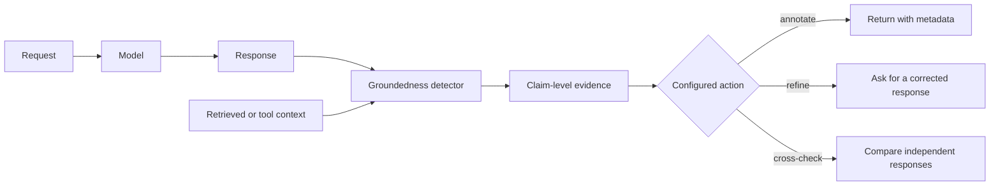

> **状态：** 提案 · **创建日期：** 2025-12-02

## 问题 {#problem}

模型可以生成流畅但请求所附上下文并不支持的文本。应用特定检查可以抓住部分失败，但在每个客户端实现它们会重复策略，并使行为难以审计。

路由器是有用的策略边界，因为它可以看到请求、检索上下文、所选模型和响应。但它不是真相来源。检测器可以估计有依据程度；它不能证明开放域陈述在事实上正确。

## 提案 {#proposal}

TruthLens 将检测与响应策略分开：


```mermaid
flowchart LR
  Request --> Model
  Model --> Response
  Response --> Detector["Groundedness detector"]
  Context["Retrieved or tool context"] --> Detector
  Detector --> Evidence["Claim-level evidence"]
  Evidence --> Policy{"Configured action"}
  Policy -->|"annotate"| Return["Return with metadata"]
  Policy -->|"refine"| Refine["Ask for a corrected response"]
  Policy -->|"cross-check"| Verify["Compare independent responses"]
```

当有证据时，检测器应将跨度或主张标识为受支持、不受支持或被反驳。策略再决定是标注、重试、修订、阻断还是升级。

## 运行模式 {#operating-modes}

提案将策略分成三种面向运营方的模式：

| 模式 | 行为 | 主要权衡 |
| --- | --- | --- |
| Lightweight | 运行一次检测器，并暴露结果或应用简单动作。 | 额外工作最少，没有自动纠正保证。 |
| Standard | 请模型修订被标记的主张，再运行有界验证。 | 额外延迟和 token；可能重复同一模型的偏差。 |
| Cross-verification | 在综合或升级前比较独立选择的模型响应。 | 资源使用最高，失败处理更复杂。 |

这些是策略形态，不是基准层级。部署应根据测得的检测器行为，以及假阳性和假阴性的后果来选择动作。

## 证据契约 {#evidence-contract}

每次检测结果应包括：

- 正在评估的响应跨度或主张；
- 相关上下文跨度（若存在）；
- 检测器分数和配置阈值；
- 如受支持、不受支持或被反驳的分类；
- 检测器版本；以及
- 策略采取的动作。

路由器应在有界诊断或回放元数据中保留该证据，且不在默认响应头中暴露敏感上下文。

## 策略边界 {#policy-boundaries}

- 仅检测不得悄悄阻断流量。
- 路由显式选择其动作。
- 修订和交叉验证使用有界尝试和模型允许列表。
- 流式响应需要声明策略，因为字节已提交后不能安全替换响应。
- 检测器失败遵循显式的跳过、标注或阻断策略。
- 检索上下文和工具输出仍是不受信任的输入，不得提升为系统指令。

## 范围与非目标 {#scope-and-non-goals}

TruthLens 面向可对照所提供证据检查的响应，尤其是检索和工具辅助工作流。它不是通用事实数据库、领域审阅的替代，也不保证受支持上下文本身为真。

当前路由本地插件从其下方的规范模块路径读取模型依赖。详尽参考配置拥有检测器和解释器细节：

```yaml
global:
  model_catalog:
    modules:
      hallucination_mitigation:
        enabled: true

routing:
  decisions:
    - name: grounded_answers
      plugins:
        - type: hallucination
          configuration:
            enabled: true
            hallucination_action: header
```

提案不要求一种检测器架构或一家模型供应商。当前幻觉插件文档仍是实际已实现行为的事实来源。

## 评估 {#evaluation}

评估应使用与部署领域匹配的版本化、带标签集合。报告：

- 每个证据类别的主张级精确率和召回率；
- 所选阈值下的假阳性和假阴性率；
- 按模式增加的延迟、token 和上游调用；
- 修订后的纠正成功率；
- 上下文缺失、矛盾或恶意时的行为；以及
- 流式和检测器失败情形的结果。

没有数据集、基线、阈值、模型版本、提示词模板和原始评估产物，不要发布改进百分比。

## 待决问题 {#open-questions}

- 不受支持和被反驳的主张是否应始终产生不同动作？
- 哪些证据可以保留用于回放，保留多久？
- 路由应如何处理无法对照所提供上下文检查的主张？
- 第二个模型何时足够独立以用于交叉验证？
- 流式开始后哪些动作是安全的？

## 参考资料 {#references}

- [当前幻觉插件指南](../tutorials/plugin/hallucination)
- [LettuceDetect](https://arxiv.org/abs/2502.17125)
- [SelfCheckGPT](https://arxiv.org/abs/2303.08896)
- [Self-Refine](https://arxiv.org/abs/2303.17651)
- [Finch-Zk](https://arxiv.org/abs/2508.14314)
