> **状态：** 已实现 · **创建日期：** 2026-02-18

## 结果 {#outcome}

无论客户端或所选后端线格式如何，Router 都评估一份协议中立的语义请求。线 JSON 在入站解码一次，在提供商边界编码一次。响应体和流式事件沿相反路径返回给客户端。

Envoy 仍是生产传输。它拥有监听器、上游集群、连接生命周期、重试和请求转发。ExtProc 服务拥有语义模型选择以及请求或响应策略。编解码层只在线契约与 Router 的中立类型之间映射。

```mermaid
flowchart LR
  Client["Client wire format"] --> Ingress["Ingress codec"]
  Ingress --> Request["Neutral request"]
  Request --> Router["Signals, decisions, algorithms, plugins"]
  Router --> Provider["Provider codec"]
  Provider --> Envoy["Envoy upstream transport"]
  Envoy --> ProviderResponse["Provider response codec"]
  ProviderResponse --> Response["Neutral response or event stream"]
  Response --> ClientResponse["Client response codec"]
```



## 中立契约 {#neutral-contract}

`pkg/llmprotocol` 是编解码器和 Router 策略共享的唯一语义契约。它表示：

- 有序指令、消息和多模态内容块；
- 工具定义、工具调用、工具结果、托管图像生成控制，以及工具选择；
- 采样和结构化输出约束；
- 推理控制和推理内容；
- 响应备选和停止原因；
- 提供商请求身份和类型化传输错误；
- 带来源的 token 用量，覆盖标准输入、缓存读取、缓存写入、推理输出、其他输出和总计；以及
- 编解码器不能从客户端输入填充的可信传输元数据。

原始线对象不进入语义路由。信封可以保留有界的同格式表示细节，但它不是路由状态，也不能用于绕过校验。

## 编解码契约 {#codec-contracts}

每个已注册编解码器是无状态的，并安全用于并发。它声明其线格式和能力，并实现四项缓冲操作：

1. 将请求解码为中立请求；
2. 为后端编码中立请求；
3. 将响应解码为中立响应；以及
4. 为客户端编码中立响应。

传输错误使用单独的类型化契约，因为 HTTP 错误不是失败的模型响应资源。流式编解码器创建请求范围的解码器和编码器，交换中立事件。注册表中不存储可变流状态。

注册表在构造后不可变。添加线格式需要一个缓冲编解码器、一个流式编解码器、已声明能力和矩阵测试。添加编解码器时，Router 策略不会获得协议分支。

## 支持的矩阵 {#supported-matrix}

| 线格式 | 缓冲请求 | 缓冲响应 | 流式 | 工具 | 图像 | 结构化输出 | 用量 |
| --- | --- | --- | --- | --- | --- | --- | --- |
| OpenAI Chat Completions | 解码与编码 | 解码与编码 | SSE 解码与编码 | 是 | 输入 | JSON 对象和 schema | 存在时为权威 |
| OpenAI Responses | 解码与编码 | 解码与编码 | 事件解码与编码 | 是 | 输入加托管图像生成生命周期 | JSON schema | 存在时为权威 |
| Anthropic Messages | 解码与编码 | 解码与编码 | 事件解码与编码 | 是 | 输入 | 支持的 schema 子集 | 存在时为权威 |

完整的成对请求、响应、传输错误和流式矩阵已经过测试。请求可以以任何受支持的客户端格式进入，并以所选提供商模型声明的格式离开。响应以原始客户端格式返回。

顶层请求和响应清单也对照已发布的 OpenAI OpenAPI schema 和生成的 Anthropic Messages 类型封闭。新发布的字段不能通过无类型 JSON 桶透传：它必须映射到中立契约、作为显式不支持功能失败，或记录为有意从客户端表示中省略的有界提供商元数据。

## 验证契约 {#verification-contract}

schema 契约固定到已发布的上游修订。测试将每个顶层字段、嵌套对象字段和已发布联合判别器对照显式语义、仅传输、扩展或不支持处置封闭。当前固定为 OpenAI OpenAPI `690521b1753dce0c6d6b275f583d22537679cff9` 和 Anthropic SDK `d19dea9ed85bbb5fdb2d6f20fb6f903920ed23fa`。

E2E 提供商模拟器是同一契约的一部分。它们的原生 Chat、Responses 和 Messages 边界使用修订固定的封闭清单，用提供商原生错误拒绝未知顶层字段，并在没有无类型归一化步骤的情况下保留嵌套线对象。Go 一致性测试将这些模拟器清单直接与编解码器请求、响应和用量线清单比较。模拟器测试重放每一个已发布的顶层请求字段，而编解码器黄金文件封闭嵌套字段和联合判别器。这防止宽松的 mock 隐藏 ExtProc 丢弃或发明的字段。

人类可读夹具使用稳定的输入/输出约定：

```text
NNN-{client-protocol}-{case}-in.json
NNN-{client-protocol}-{case}-{backend-protocol}-out.json
```

每个请求、响应、传输错误、流、能力边界和类型化拒绝输入，对每个内置目标协议都恰好有一个预期输出。流夹具保留精确 SSE 转录，并再按逐字节重放，以证明传输分块边界不改变语义。语料包括畸形和截断 JSON、重复字段、无效联合和枚举、有序多模态内容、工具和工具结果、结构化输出、推理、用量、取消、超时、不完整流、流中失败、身份变更、序列违规、托管图像生成和资源限制。图像生成夹具保留每一个已发布选项，区分 `null` 结果与空载荷，并覆盖有序进度、连续部分图像索引、终端成功或失败、畸形 base64，以及目标能力拒绝。

部署级覆盖是必需的 18 单元矩阵：

```text
3 client protocols x 3 native backend protocols x 2 modes = 18 E2E cells
```

每个单元遍历 Envoy 和 ExtProc，校验客户端原生缓冲信封或 SSE 生命周期，要求翻译输出中有确定性后端标记，并拒绝泄漏的后端线形态。额外 E2E 契约覆盖结构化输出、缓冲提供商错误、工具调用延续、不完整流，以及每个后端协议在部分输出后的错误。

## 翻译规则 {#translation-rules}

翻译是语义的，不是逐字段复制：

- 具有等价中立含义的字段被保留；
- 目标不支持的字段以类型化 `unsupported_feature` 错误失败；
- 未知字段只能在未修改的同格式缓冲往返中存活；
- 跨格式翻译和语义改写拒绝未知字段，而不是悄悄丢弃它们；
- 语义改写后，请求和响应世代前进；
- 诊断有界，并通过现有 Router 可观测性契约返回；以及
- 编解码器从不获取 URL、解析文件、认证调用方或调用提供商。

能力检查发生在编码之前。这使不支持的工具、媒体、多个候选、严格 schema、推理或流式行为显式且可测试。

## 流式 {#streaming}

每个提供商事件在策略或客户端编码之前先解码为中立事件。流引擎强制顺序、终端状态唯一性、有界诊断和最终用量结算。拆分的网络帧由线解码器缓冲；Router 策略从不解析部分 JSON 或 SSE 记录。

托管图像生成遵循同一流引擎。输出项从 `in_progress` 开始，进度可以经过 `generating` 和有序部分图像推进，并且该项恰好一次以 `completed` 或 `failed` 结束。反向转换、稀疏部分索引、冲突终端状态，以及进度事件上的结果数据，会在客户端成功终端发布之前失败。

Router 产生的响应直接使用中立事件编码器。它们不创建中间的提供商形态流。取消和反压留在 Envoy 和 ExtProc 的请求生命周期中。

## 用量与成本 {#usage-and-cost}

token 计数保留来源，以便账务可以区分权威提供商用量与派生、估计或不可用值。流终止时，最终提供商用量替换中间估计。

定价是部署元数据，仍位于每个提供商模型上：

```yaml
providers:
  models:
    - name: local/fast
      pricing:
        currency: USD
        prompt_per_1m: 0.20
        cached_input_per_1m: 0.02
        cache_write_per_1m: 0.25
        completion_per_1m: 0.80
```

`routing.modelCards` 描述语义能力；它不拥有连接或定价数据。货币可选，省略时账务解析为 USD。配置费率必须有限且非负，显式零表示免费费率。

## 安全边界 {#security-boundary}

客户端控制的头和体元数据不受信任。只有 ExtProc 边界可以在传输确立之后填充可信身份、会话、任务和关联字段。编解码器不能把线元数据提升为可信元数据。

公开推理监听器和管理监听器保持分开。本设计不添加直接的 Router HTTP 代理、智能体服务、产品管理面或第二套上游传输。

## 扩展清单 {#extension-checklist}

新编解码器仅在提供以下内容时才完整：

- 稳定的线格式标识符；
- 显式能力声明；
- 严格的缓冲请求、响应和传输错误编解码器；
- 请求范围的流解码和编码；
- 畸形输入和不支持功能测试；
- 对照每个内置格式的成对矩阵覆盖；
- 权威用量和终端事件测试；以及
- 证明路由行为未变的 ExtProc 回归覆盖。

## 参考资料 {#references}

- [Router API](../api/router)
- [Semantic Router 系统概览](../overview/semantic-router-overview)
- [网关部署选项](../installation/k8s/gateways)
